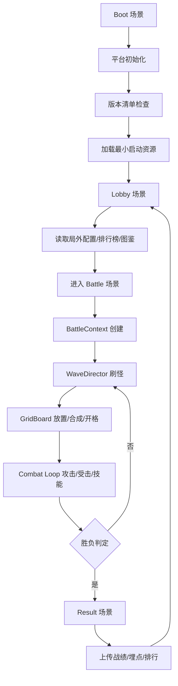

# 《赵云与阿斗》微信小游戏复刻分析报告

## 执行摘要

《赵云与阿斗》公开资料能够确认的核心定位，是一款“文字合成策略塔防”产品：玩家通过文字配对升级士兵、合成三国武将，在上下分区的对称战场中抵御敌军、守护己方阿斗，直至对方守护失败即获胜。TapTap 官方页、应用宝与 Google Play 的产品描述彼此一致，说明“文字单位 + 对称塔防 + 守护阿斗”并非营销包装，而是产品的真实主玩法框架。citeturn1view0turn21search5turn24search8turn1view3

从第三方玩法拆解、社区攻略与媒体观察看，这款游戏真正让人上头的，不是单纯塔防，而是三层循环的叠加：其一，基础兵种“刀、枪、骑、弓”的格子运营与二合一升级；其二，武将“单字收集→完整成词→上场作战”的组合成就感；其三，馒头资源、铲子开格、武将经验、武器配置、主动/被动技能选择共同形成的“局内 build 构筑”。这也是复刻项目必须保留的最小可行体验。citeturn30view1turn30view0turn30view2turn30view3

如果目标是用 Unity 复刻并最终落地到微信小游戏，我的结论是：**优先做“高还原单局体验 + 伪 PVP/AI 对手 + 数据热更新 + 排行榜运营”，而不是一开始就追求真联机。** 这样做与原作当前公开体验更接近，也更符合微信小游戏环境对主包大小、资源远程化、单线程 CPU、内存占用、文件系统与网络接口的现实约束。官方文档明确指出，小游戏主包受限，分包也有大小上限；同时 WebAssembly 单线程、内存和文件系统开销显著高于原生 App。citeturn16view2turn37view0turn17view0

技术路线方面，若团队以中国大陆微信小游戏首发为主，推荐优先使用**团结引擎 1.9 / Unity 中国版的 WeixinMiniGame 方案**；若团队已有成熟的 Unity 2022.3 LTS 生产线，也可以走 **Unity WebGL + 微信小游戏适配 SDK**。前者在小游戏 Build Target、AutoStreaming、UOS CDN、平台导出与文档支持上更顺手；后者更适合已有 Unity 代码资产的团队平滑迁移。citeturn32search0turn32search1turn32search4turn16view0turn31view0

以“玩法等价、商业化可验证、适配微信小游戏”的项目目标估算，建议把项目拆成两个版本：**Alpha 原型版**聚焦单局战斗、合成、武将、技能、波次、AI 对手；**Beta 运营版**再补齐关卡编辑、排行榜、热更新、广告位、埋点、AB 测试、性能压测和上线流程。一个 5–7 人的中小团队，做出可评审的高保真 MVP，经验值合理区间约为 **4.5–5.5 个月**；若加入更完整的内容生产和运营能力，整体项目会更接近 **5.5–7 个月**。这一节后的工时表会展开。综合看，这个项目**可立项，但前提是把“真联机”和“大规模元养成”后置**。citeturn17view0turn16view2turn38view0turn31view1

## 原作玩法拆解与复刻范围

### 原游戏玩法与核心机制详解

公开来源能较稳定确认，《赵云与阿斗》采用竖屏、上下对称双战区布局，双方各自守护一个“阿斗”目标，战斗主线是波次推进下的防守对抗。TapTap 官方描述说明了“页面上下两部分”“保卫阿斗”“对方保卫失败即我方胜利”；第三方媒体进一步补充了“触碰阿斗会扣命、生命值率先归零则失败”的机制性描述。需要强调的是，**阿斗总血量、扣血公式、敌军对阿斗的撞击伤害是否固定**，并无官方数值公开，因此精确战斗值应标记为“未指定”。citeturn1view0turn22search4turn30view0

第三方玩法拆解对基础单位的描述相对一致：局内存在四类基础兵种——**刀、枪、骑、弓**。媒体观察给出的职责是：刀兵偏近距离单体输出，枪兵偏中距离穿刺，骑兵偏近距离范围清场，弓兵负责远距离单体消耗。两两相同等级、相同种类单位可合成为更高阶单位。由于这部分信息主要来自媒体实机拆解而非开发者文档，建议在复刻设计中视作“高可信玩法事实、低可信精确参数”。citeturn30view1turn28search10

iturn4image1turn4image3turn4image4turn4image2

游戏最有辨识度的系统是“**文字武将合成**”。武将不是直接抽到整卡，而是先获得若干“单字”卡，如“赵”“云”“刘”“备”“张”“飞”等；单字本身不能直接担任战斗单位，必须凑成完整武将名后才会转化为正式武将上场。第三方来源普遍给出可上阵武将约 12 位，常见名单为赵云、刘备、关羽、张飞、马超、黄忠、关平、关兴、张苞、张翼、黄盖、黄祖。由于官方尚未公开完整图鉴表，这一名单也应在报告中保留“待实机校验”备注。citeturn26search9turn21search10turn30view1

武将不仅替代兵种上场，还拥有额外技能与更复杂的成长逻辑。媒体拆解指出，武将延续四类基础攻击模板，但会附带眩晕、击退等专属控制特性；同时，武将除了常规的同类合成升级外，还可通过击杀积累经验进行自主升级。这个“双升级路径”非常关键，因为它解释了为什么原作的局内运营比普通 merge TD 更有层次：你既能通过格子合成提高天花板，也能通过前中期站位和吃怪效率提高成长速度。citeturn30view1

技能系统的公开资料较一致地指出：**主动技能位 2 个、被动技能位 6 个**。常被提及的主动技能包括神兵符、攻速符、毛笔、砚台；常见被动技能包括农民、招贤令、陨石、洛阳铲、摸金校尉、升职令、淤泥等。第三方攻略对其效果描述也较稳定，例如神兵符用于升级目标、农民用于产出馒头、招贤令加快武将刷新、陨石偏全屏清怪。这里的问题在于：**技能具体解锁规则、稀有度、刷新权重、冷却时间、叠加上限、战斗前选择方式**，公开资料都不完整，因此这些精确数据必须标记为“未指定”。citeturn30view2turn30view3turn27search0turn27search9

资源体系中，局内主资源基本可以确认是**馒头**。媒体观察指出，每击杀一个敌人可获得一份馒头；己方阿斗每受到一次伤害，会在短时间内一次性获得十份馒头。社区攻略和第三方新手向内容则进一步说明：农民技能和铲子开地是中后期资源滚雪球的关键。由此可知，原作的经济不是单纯“无伤最好”，而是存在一定的“卖血换资源”张力，这恰恰是数值平衡的敏感点。citeturn30view0turn30view1turn29search5turn29search6

关卡节奏方面，多个中文攻略的整理结果高度接近：**前 1–5 波偏发育，6–12 波进入阵容成型，中后期出现更高压的精英/BOSS 波次**。不过“BOSS 首次出现的精确波次”并不完全一致：媒体拆解给出第 6 波出现首个 BOSS，而部分攻略只笼统描述“后期 BOSS 关卡”或“10 波后进入毕业攻坚”。因此，本报告对首个 BOSS 波次标记为“未指定”，但可把“中期出现首个显著强敌，后期波次压力明显上升”当成高可信设计结论。citeturn30view0turn29search1turn22search6

武器系统同样是原作的重要差异点。公开截图和攻略普遍列出了龙胆亮银枪、丈八蛇矛、落日弓、霸王弓、方天画戟、倚天剑、古锭刀、神臂弓等装备，并指出部分武器与特定武将构成“专武”关系，例如赵云与龙胆亮银枪、张飞与丈八蛇矛、黄忠与落日弓/霸王弓。公开资料还描述了一些典型被动，比如龙胆亮银枪可召唤飞枪、丈八蛇矛能形成灵蛇拦路。由于官方没有公开装备词条表，本报告只把“武器存在、专武存在、武器对站位和 build 有重要影响”列为已确认玩法，把具体概率、倍率、成长表全部标记为“未指定”。citeturn26search1turn26search0turn4image2

从平衡层面，公开攻略与评论已明显暴露原作的几个“强核点”：赵云、黄忠常被视为主 C，张飞与关羽承担控场/拦截，农民、招贤令、神兵符、攻速符则是强势技能组合。另一方面，Google Play 评论与社区帖子集中反映：**15 波以后敌人堆积、血量过高、控场过强、局面拖长并引发严重卡顿**，这意味着原作在“长局时长”和“单位膨胀”上已经触发性能与平衡的双重问题。复刻时不应照抄这些缺陷，而应把它们当作反向需求。citeturn2search0turn30view3turn1view3turn4image0

### 未指定数据、合理假设与验证方法

下面这一小表，把“公开能确认”和“必须自行补完”的信息分开。表中的“合理假设”不是建议直接拍脑袋上线，而是建议用于原型阶段快速闭环；“验证方法”则用于之后做高还原修正。表格所依据的原作信息，主要来自 TapTap 官方说明、媒体实机拆解、攻略汇总与社区截图。citeturn1view0turn30view0turn30view1turn30view2turn26search1

| 项目 | 当前结论 | 状态 | 原型期合理假设 | 验证方法 |
| --- | --- | --- | --- | --- |
| 战场布局 | 上下双区、竖屏对称 | 可确认 | 9×6 或 10×6 主战格 | 录屏逐帧统计可放置格数 |
| 初始可部署地块 | 第三方媒体称开局固定 6 格 | 半确认 | 固定 6 格起步 | 首战录屏核对初始地块 |
| 基础兵种 | 刀、枪、骑、弓四类 | 可确认 | 四类全做 | 战斗录屏与 UI 图鉴核对 |
| 武将数量 | 常见资料为 12 位 | 半确认 | MVP 先做 8 位，Beta 补齐 12 位 | 图鉴/论坛/实机交叉验证 |
| 主动技能槽位 | 2 个 | 半确认 | 固定 2 个 | 技能 UI 截图确认 |
| 被动技能槽位 | 6 个 | 半确认 | 固定 6 个 | 技能 UI 截图确认 |
| 局内主资源 | 馒头 | 可确认 | 击杀+卖血双获取 | 帧录制统计收益 |
| 每击杀收益 | 1 馒头 | 半确认 | 固定 1 | 录屏逐杀计数 |
| 阿斗受击补偿 | 单次受击 +10 馒头 | 半确认 | 固定 +10 | 卖血流录屏验证 |
| 阿斗生命值 | 第三方媒体称 3 点 | 半确认 | 固定 3 点 | 录屏核对多次受击结果 |
| 首个 BOSS 波次 | 资料不一致 | 未指定 | 第 6 波首 BOSS，后续每 4–5 波一个 | 实机多局记录 |
| 装备掉落/生成规则 | 公开缺失 | 未指定 | 独立装备池，局内刷新获得 | 图鉴与掉落样本统计 |
| 武将技能倍率 | 公开缺失 | 未指定 | 从 120%/180%/250% 三档起调 | 秒伤与 TTK 反推 |
| 敌军成长曲线 | 公开缺失 | 未指定 | HP 线性×波次，再叠段位系数 | 自动跑局拟合 |
| 匹配对手 | 公开体验疑似 AI/伪 PVP | 半确认 | Alpha 用 AI，Beta 再评估真联机 | 网络抓包/社区验证 |

### 必须复刻与可选模块清单

下面的模块表不再讨论“原作是否有”，而是从**为了复刻到技术团队可执行**的角度，给出优先级、功能点、接口需求与测试要点。这里的“核心/次要/可选”，指的是**对 MVP 是否必需**，不是对商业价值的绝对排序。

| 模块 | 优先级 | 功能点 | 接口需求 | 测试要点 |
| --- | --- | --- | --- | --- |
| 单局战斗主循环 | 核心 | 波次开始、刷怪、移动、攻击、受击、死亡、结算 | `IBattleLoop`、`ISpawnDirector`、`IDamageService` | 10,000 次模拟不出现死循环；帧步进一致 |
| 格子棋盘与站位 | 核心 | 格子占用、拖拽换位、合成、开地、禁放区域 | `IGridBoard`、`ICellOccupancy` | 拖拽冲突、越界、快速连拖不丢单位 |
| 基础兵种系统 | 核心 | 刀/枪/骑/弓属性、攻击模板、升级 | `IUnitFactory`、`ICombatant` | 同类升级后属性正确继承 |
| 武将单字合成 | 核心 | 单字掉落、成词判定、成将替换、武将经验升级 | `IHeroComposeService`、`IHeroExpService` | 字符组合冲突、替换时保留等级规则 |
| 资源经济 | 核心 | 馒头收益、征兵、卖血补偿、铲子开格 | `IEconomyService` | 资源结算前后守恒；异常补偿不重复发放 |
| 技能系统 | 核心 | 2 主动、6 被动、冷却、触发、叠加 | `ISkillRuntime`、`IBuffService` | 冷却、层数、触发时机、叠加上限 |
| 武器系统 | 次要 | 装备槽、专武被动、词条和稀有度 | `IEquipmentService` | 角色切换装备、专武生效与卸下恢复 |
| 敌军与 BOSS | 核心 | 多敌人模板、首领技能、分段成长 | `IEnemyWaveRepo`、`IBossBehavior` | 波次配置读取正确、首领技能不穿模 |
| AI 对手 / 伪 PVP | 核心 | 镜像对手、经济节奏、出牌逻辑、难度档 | `IOpponentBrain` | 难度分档、不卡局、不明显作弊 |
| 结果页与结算 | 核心 | 胜负原因、波次、伤害、奖励、复盘摘要 | `IMatchResultService` | 断线重进、后台切换返回依然能结算 |
| 主界面与新手引导 | 次要 | 入口 UI、图鉴、首局教程、提示层 | `IUIFlow`、`ITutorialService` | 新手流程不可卡死，可跳过后仍可正常开局 |
| 数据配置与编辑器 | 核心 | 单位表、技能表、波次表、掉落表、难度表 | `IDataProvider`、导表工具 | 表校验、字段缺失、版本回退 |
| 远程资源与热更新 | 次要 | 远程包、版本清单、静态资源更新 | `IContentUpdateService` | 断网、半包、旧版本资源兼容 |
| 排行榜与存档 | 次要 | 世界榜、分区榜、局内记录、云存档 | `IRankService`、`ISaveService` | 并发写入、反作弊、读取超时 |
| 好友关系链排行 | 可选 | 开放数据域、好友榜可视化 | `IOpenDataBridge` | 子域与主域通信、弱网加载兜底 |
| 广告与商业化 | 次要 | 激励视频、Banner、复活/加成逻辑 | `IAdService` | 广告失败兜底、频控、收益归因 |
| 埋点与 AB | 次要 | 漏斗、战斗 build、掉线、性能桶 | `IAnalyticsService` | 事件去重、批量上报、隐私合规 |

### 原游戏功能 vs 复刻优先级 vs 预估实现复杂度

下表更适合立项会快速讨论。复杂度分为“低 / 中 / 高 / 很高”，指 Unity 实现成本，而不是玩法重要性。

| 原游戏功能 | 复刻优先级 | 预估实现复杂度 | 说明 |
| --- | --- | --- | --- |
| 文字化基础兵种战斗 | 核心 | 中 | 视觉变形 + 攻击模板是产品识别点 |
| 双区对称塔防战场 | 核心 | 中 | 结构不复杂，但决定产品像不像 |
| 单字收集成武将 | 核心 | 中 | 核心差异化机制，必须做 |
| 武将经验升级 | 核心 | 中 | 不复杂，但节奏价值很高 |
| 四类兵种二合一升级 | 核心 | 低 | 规则清晰，是原型最快闭环点 |
| 馒头经济与卖血补偿 | 核心 | 中 | 平衡敏感，需大量调参 |
| 铲子开格 / 地块扩张 | 核心 | 低 | 规则简单，策略深度高 |
| 主动/被动技能池 | 核心 | 中 | 数据驱动后扩展快 |
| 武器/专武系统 | 次要 | 中 | 对长期留存重要，但可 Beta 补完 |
| BOSS 技能与后期压力 | 核心 | 中 | 关系到第 10 波后体验 |
| AI 对手伪竞技 | 核心 | 中 | 比真联机划算得多 |
| 世界排行榜 | 次要 | 低 | 后端量不大，商业价值高 |
| 好友排行榜 | 可选 | 中 | 受开放数据域接入方式约束 |
| 真联机实时对战 | 可选 | 很高 | 平衡、同步、反作弊、运维都重 |
| 广告/激励复活 | 次要 | 低 | 接 SDK 即可，但要设计好诱因 |
| 图鉴与成长外循环 | 次要 | 中 | 能拉长留存，但不应阻塞 MVP |
| 卡等级/双攻速 BUG | 不复刻 | 低 | 应视为线上缺陷而不是特色 |

## Unity 项目架构与技术选型

### 推荐引擎路线与总体架构

若项目就是为了上线微信小游戏，优先建议使用**团结引擎 1.9**。官方文档明确说明，团结引擎基于 Unity 2022 LTS，专门提供了小游戏解决方案；小游戏宿主与 WeixinMiniGame 平台都已经具备专属 Build Target、导出与调试流程。若团队必须继续使用 Global Unity，则可走微信小游戏适配 SDK 路线；官方 GitHub 仓库也给出了 SDK 安装方式。citeturn32search0turn32search1turn35search10turn16view0

在项目结构上，我建议采用“**场景极薄、系统常驻、战斗全数据驱动**”的做法。也就是把场景只当作容器，把真正的状态流交给一组常驻服务层来管理，以降低小游戏平台下反复切场景带来的资源波动和 GC 峰值。小游戏环境的内存和文件系统开销都比原生更大，WASM 编译、Heap 与 JS File System 会额外吃掉大量内存，因此切场景和反复装卸资源都应尽量克制。citeturn17view0

建议的目录结构如下。它的原则不是“漂亮”，而是便于战斗逻辑、数据、UI、平台层和内容更新解耦。

```text
Assets/
  Addressables/                 # 若采用 Addressables
  Art/
    UI/
    Battle/
    Characters/
    VFX/
    Fonts/
  Audio/
    BGM/
    SFX/
  Config/
    Authoring/                  # ScriptableObject 原始配置
    Exported/                   # 导出的 JSON / bytes
  Prefabs/
    Battle/
      Units/
      Heroes/
      Enemies/
      Projectiles/
      UI/
  Scenes/
    Boot.unity
    Lobby.unity
    Battle.unity
    Result.unity
  Scripts/
    Runtime/
      App/
      Battle/
        Board/
        Combat/
        Economy/
        Spawn/
        Skills/
        AI/
      Data/
      UI/
      Platform/
      Net/
      Save/
      Analytics/
      Resource/
    Editor/
      Importers/
      ConfigTools/
      BattleTools/
  ThirdParty/
```

场景管理建议只有四个主场景：`Boot`、`Lobby`、`Battle`、`Result`。`Boot` 只做平台初始化、资源版本检查和最低限度 UI 预加载；`Lobby` 处理入口、图鉴、排行榜和准备态资源；`Battle` 是唯一真正重场景；`Result` 切得足够轻，最好仍保留战斗统计对象，避免重复反序列化。由于小游戏包内资源不是“按需加载后再启动”，而是会在启动时一次性装入包内内容，因此首包应尽量只保留启动必需内容，扩展内容走远程资源。citeturn37view0turn16view2

### 主要类与组件建议

建议按“服务 + 纯数据 + 轻量表现层”拆分类职责。一个相对稳妥的核心类图如下：

| 层级 | 核心类 | 作用 |
| --- | --- | --- |
| App 层 | `AppEntry`、`GameFlowService`、`ServiceLocator` | 平台启动、全局服务装配、流程切换 |
| 战斗域 | `BattleContext`、`BattleLoop`、`WaveDirector`、`OpponentBrain` | 单局状态容器与主循环 |
| 棋盘域 | `GridBoard`、`GridCell`、`PlacementService` | 放置、换位、开地、合成 |
| 单位域 | `UnitEntity`、`HeroEntity`、`EnemyEntity`、`ProjectileEntity` | 运行时实体 |
| 战斗计算 | `AttackResolver`、`DamageResolver`、`BuffRuntime`、`TargetSelector` | 命中、伤害、状态、目标选择 |
| 经济系统 | `EconomyService`、`RecruitService`、`FieldExpandService` | 馒头、征兵、铲子、地块扩张 |
| 技能装备 | `SkillRuntime`、`PassiveRuntime`、`EquipmentRuntime` | 局内 build 系统 |
| 数据层 | `BattleConfigRepo`、`HeroConfigRepo`、`WaveConfigRepo` | 配置读取与缓存 |
| 资源层 | `AssetService`、`ContentVersionService` | 本地/远程资源加载与版本管理 |
| UI 层 | `HUDPresenter`、`DragPresenter`、`ResultPresenter` | 纯展示逻辑 |
| 平台层 | `WXBridge`、`RankService`、`CloudSaveService`、`AdService` | 微信 SDK、CloudBase 与广告桥接 |

在组件设计上，不建议大量依赖 Unity 物理系统和 NavMesh。原作本质是固定路线的格子塔防，移动是“沿边缘路径前进”，攻击是“文本单位定向出手”，这类问题手写路径点与简化碰撞盒，比上通用物理更省 CPU，也更可控。小游戏平台 CPU 为单线程，且 WASM 执行效率明显低于原生，通用物理的性价比不高。citeturn17view0

### 数据驱动方案、资源加载与热更新策略

数据驱动建议采取“**ScriptableObject 编写 → 导出 JSON / 二进制表 → 运行时只读加载**”的双层结构。Unity 官方文档指出，ScriptableObject 适合作为可独立保存的大量数据容器，并有助于减少重复数据带来的内存占用。对这个项目来说，编辑态使用 ScriptableObject 很方便，运行时则应尽量转成紧凑的只读配置，避免战斗中直接依赖大型 `.asset` 引用网。citeturn6search9turn6search5

资源管理方面，如果走 Unity 原生方案，可使用 **Addressables**。官方文档说明 Addressables 支持通过地址异步加载本地或远程资源，适合资源与依赖的统一管理。若团队偏向国内商业化项目的实战方案，则 **YooAsset** 会更顺手，它本身就是为 Unity 资源管理、分发与更新设计，并且 Unity UOS 官方文档也提供了与 YooAsset 搭配 CDN 的示例。citeturn16view4turn19search1turn19search5turn31view1

但这里必须加一条关键约束：**微信小游戏上不要把热更新理解成“代码热更新”**。官方环境侧资料明确指出，小游戏主包不能过大，额外资源需走网络下载，且**不可以从远程服务器下载脚本文件**。因此，这个项目的热更新策略只能是“资源热更新 + 配置热更新 + 运营参数热修复”，不应把核心战斗逻辑放到远程可执行脚本里。citeturn37view0

同时，团结引擎小游戏平台文档明确警告：Emscripten 文件系统会产生与文件同等大小的内存占用，小游戏中应尽量避免依赖文件系统与某些 Cache API，包括 Addressable Cache 机制。换句话说，哪怕你用 Addressables 或 YooAsset，也应把策略放在“**远程加载、精细释放、最小缓存、首包极轻**”，而不是像原生 App 一样大胆做本地持久缓存。若使用团结引擎，官方推荐的 AutoStreaming + UOS CDN 是更对路的方案。citeturn17view0turn35search0turn31view0

下面这张 mermaid 流程图，可以作为项目架构评审时的统一视图。



### 推荐技术栈与第三方库

技术栈部分，建议在“小游戏限制”优先于“个人偏好”的前提下选型。下面这张表是我认为最稳妥的一套。

| 领域 | 推荐方案 | 选择理由 | 替代方案 |
| --- | --- | --- | --- |
| 引擎 | 团结引擎 1.9 / Unity 中国版 | 微信小游戏 Build Target、文档、AutoStreaming、UOS 更顺手 | Unity 2022.3 LTS + 适配 SDK |
| 平台适配 | WeixinMiniGame / 微信小游戏 SDK | 官方路径，减少桥接工作 | 自行维护 jslib/桥接层 |
| 资源管理 | YooAsset 或 Addressables | 都支持远程内容、异步加载与资源依赖管理 | 纯 AssetBundle 手撸 |
| 远程分发 | UOS CDN / 自建 COS+CDN | 与小游戏资源托管链路更贴近 | 其他 CDN，但需自管版本 |
| 异步 | UniTask | 面向 Unity PlayerLoop，强调低分配，并明确支持 WebGL/WASM | 协程；少量 `async/await` 原生 |
| UI 动画 | DOTween | 成熟、轻量、足够覆盖小游戏 UI 动画 | 自写 Tween；LeanTween |
| 序列化 | 配置用 JSON，战斗快照/压缩存档可选 protobuf-net | JSON 易策划协作；protobuf-net 适合紧凑传输 | MessagePack、Binary 自研 |
| 网络请求 | UnityWebRequest | 官方推荐，WebGL/小游戏兼容 | 平台 SDK HTTP 封装 |
| 实时通信 | WebSocket | 平台不支持常规 Socket/TCP，WebSocket 更稳妥 | 真联机暂缓 |
| 自动化测试 | Unity Test Framework | 支持 Edit Mode / Play Mode | 自研断言框架 |
| 性能分析 | Unity Profiler + Profile Analyzer + Memory Profiler | 官方链路完整，适合持续比较前后性能 | UWA、PerfDog 补充 |
| 运营后端 | CloudBase | 微信生态接入方便，支持排行榜与高性能数据存储 | 自建 Go/Node 服务 |

选择 UniTask 的原因尤其值得单说。UniTask 官方仓库明确写到，它是低分配的 Unity 异步方案，运行在 PlayerLoop 上，不使用线程，并支持 WebGL/WASM。这一点和小游戏单线程环境高度匹配，比把 `Task.Run`、阻塞等待、线程池思路带进来更安全。citeturn19search2turn19search6

DOTween 的价值主要在“**够成熟，同时不会过度设计**”。它是 Unity 里广泛使用的动画引擎，适合做结果页、提示、数字跳字、按钮反馈、拖拽吸附和战斗内低成本 UI 动画，不建议用它承担战斗核心时序。citeturn19search4turn19search0

关于 DOTS/ECS，我的建议很明确：**这个项目首发不适合上完整 DOTS/ECS。** 原因不是 DOTS 不强，而是小游戏平台本身是单线程、无 SIMD、WASM CPU 性能也显著弱于原生；而《赵云与阿斗》的核心复杂度又主要来自“格子规则、技能判定、资源运营、可视反馈”，不是海量实体并行。除非你准备把后期做成几百上千投射物与持续状态的大规模演算，否则完整 ECS 只会抬高工程复杂度。比较好的折中，是继续使用 GameObject 架构，必要时把“投射物、状态 tick、批量目标筛选”局部数据化。citeturn11search3turn11search11turn17view0

## 开发路线与关键难点

### 开发步骤与里程碑

建议把开发过程切成七个里程碑，而不是按传统“客户端做完再给美术和测试”流水线推进。因为这类小游戏的风险从来不是“功能写不出来”，而是**感觉不对、节奏不对、后期卡死、数值一崩全崩**。

| 阶段 | 目标 | 关键任务 | 预估难点 | 风险缓解 |
| --- | --- | --- | --- | --- |
| 原型验证 | 2–3 周内证明核心循环成立 | 双区棋盘、四兵种、刷怪、拖拽合成、胜负判定 | “像不像原作”判断主观 | 先用灰盒和录屏对比，不等美术 |
| 核心玩法实现 | 做出可反复游玩的 Alpha | 武将单字合成、馒头经济、开格、波次、AI 对手 | 系统彼此耦合，容易返工 | 所有规则表配置化 |
| 核心 build 实现 | 形成原作味道 | 主动/被动技能、关键武将、武器原型 | 技能顺序和触发相互打架 | 设计统一触发时序表 |
| 数值调优 | 解决前期弱、后期卡、强核过强 | 建立 DPS/TTK 表、敌军曲线、卖血收益曲线 | 存在“爽但不稳”悖论 | 引入自动跑局与回放 |
| 关卡编辑器 | 提高内容生产效率 | 波次编辑、敌军组、BOSS 组、掉落表 | 策划依赖程序改表 | 做表校验和预演按钮 |
| UI/音效与反馈 | 提升完成度与付费转化 | 新手引导、结果页、图鉴、伤害数字、音效节奏 | 容易让战斗 HUD 过重 | 先战斗直观，再加装饰 |
| 排行榜/上线 | 进入可运营状态 | CloudBase、排行榜、埋点、广告位、打包、提审 | 微信包体、CORS、性能与审核 | 提前建设发布 checklist |

如果项目以“对标原作体验”作为目标，那么真正的关键不是“多快把全部武将补齐”，而是尽快得到以下三个答案：**第一，前 90 秒是否已经有原作的上头感；第二，第 12–15 波是否仍然可读、可控；第三，AI 对手是否足够像真人但不让人觉得作弊。** 这三个问题决定了立项成败。citeturn1view3turn4image0turn30view1

### 关键难点深度分析与实现建议

**帧率、GC 与内存**是首要难点。官方文档指出，小游戏的 WASM 编译、Heap、JS 文件系统和浏览器/容器环境，会让内存结构与原生完全不同；WASM 文件大小会放大为更高的运行时开销，且内存峰值控制尤其重要。Google Play 用户评论则直接给出了场景证据：15 波以后敌人堆积、控场效果叠加，容易出现严重卡顿。复刻时不能等到内容做满了再优化，而应在战斗内从第一天就贯彻“**零分配主循环 + 对象池 + 固定步长更新 + 手写简化碰撞**”。citeturn17view0turn1view3

下面这个 C# 片段，是适合战斗主循环的一个极简刷怪与对象池写法。重点不是“语法多高级”，而是避免在热路径里 `new`、LINQ、字符串拼接和不必要的 `GetComponent`。

```csharp
using System.Collections.Generic;
using UnityEngine;

public sealed class EnemyPool : MonoBehaviour
{
    [SerializeField] private EnemyView prefab;
    private readonly Stack<EnemyView> _pool = new Stack<EnemyView>(128);

    public EnemyView Rent()
    {
        if (_pool.Count > 0)
        {
            var view = _pool.Pop();
            view.gameObject.SetActive(true);
            return view;
        }
        return Instantiate(prefab, transform);
    }

    public void Return(EnemyView view)
    {
        view.ResetRuntimeState();
        view.gameObject.SetActive(false);
        _pool.Push(view);
    }
}

public sealed class WaveDirector
{
    private readonly Queue<SpawnCommand> _commands = new Queue<SpawnCommand>(256);
    private readonly EnemyPool _pool;
    private readonly Transform _spawnRoot;

    public WaveDirector(EnemyPool pool, Transform spawnRoot)
    {
        _pool = pool;
        _spawnRoot = spawnRoot;
    }

    public void EnqueueWave(IEnumerable<SpawnCommand> commands)
    {
        foreach (var cmd in commands) _commands.Enqueue(cmd);
    }

    public void Tick(float now)
    {
        while (_commands.Count > 0 && _commands.Peek().spawnTime <= now)
        {
            var cmd = _commands.Dequeue();
            var enemy = _pool.Rent();
            enemy.transform.position = _spawnRoot.position;
            enemy.Bind(cmd.enemyId, cmd.routeId, cmd.level);
        }
    }
}

public readonly struct SpawnCommand
{
    public readonly float spawnTime;
    public readonly int enemyId;
    public readonly int routeId;
    public readonly int level;

    public SpawnCommand(float spawnTime, int enemyId, int routeId, int level)
    {
        this.spawnTime = spawnTime;
        this.enemyId = enemyId;
        this.routeId = routeId;
        this.level = level;
    }
}
```

**路径与碰撞**的建议是：不要上 NavMesh，不要用 2D/3D 物理来做完整寻路。原作是固定路线、格子占位、边缘推进，本质更像“路线点 + 目标格距离判断”。因此完全可以用预烘焙的路径点数组、定制 AABB/圆形命中检测、队列式近战占位来替代通用物理。这样不仅更快，也更能重现原作那种“怪会堆、会卡位、会被控场牵制”的感觉。官方也明确提示小游戏 CPU 单线程、性能瓶颈会被放大，通用模块的成本应谨慎评估。citeturn17view0

**AI 对手**建议一开始做“伪 PVP”，而不做真同步联机。公开资料里，行业媒体已经直接写到该产品“目前看起来是 AI”，而社区讨论也有大量“对面是电脑吗”的讨论。这其实说明一件事：对这类产品，玩家首先在意的是“对手节奏是否形成压迫感”，而不是网络层是不是绝对真人。复刻时可以先做一个基于权重的出牌 AI：它读取当前波次、经济、场上槽位、核心武将缺口与敌方压力值，决定更偏向刷兵、刷字、开格还是升关键武将。这样做的 ROI 远高于早期投入实时同步。citeturn30view0turn4image0

可以用下面这个伪代码来描述 AI 的决策。真正实现时，建议把权重全做成表。

```text
if wave < 4:
    priority = [fill_empty_cells, summon_basic_units, unlock_cells_if_blocked]
elif coreHeroNotFormed:
    priority = [refresh_for_hero_fragments, keep_min_frontline, save_buns_threshold]
elif pressureHigh:
    priority = [place_cc_hero, upgrade_main_dps, cast_defensive_active]
else:
    priority = [optimize_weapon_match, replace_low_tier_units, greed_for_late_build]

if adou_hp_low and buns_from_hit_enabled:
    allow_controlled_hp_trade = true
else:
    allow_controlled_hp_trade = false
```

**异步与线程模型**是 Unity 团队最容易踩坑的点。团结引擎小游戏文档明确给出了反例：在单线程环境里用 `while(!asyncOp.isDone);` 会直接卡死，系统也明确指出如果底层用了多线程，`System.Threading` 下的类与方法就不能照搬。也就是说，战斗外资源加载、战前预热、排行榜请求、远程配置拉取，都应该使用协程、UniTask 或真正的异步回调链，不要做阻塞等待。citeturn17view0turn19search2

下面给一个更符合小游戏环境的战前预热示意。这里用的是 UniTask 风格；如果团队不引入 UniTask，也可以换成协程。

```csharp
using Cysharp.Threading.Tasks;
using UnityEngine;

public sealed class BattleWarmupService
{
    public async UniTask<bool> WarmupAsync(
        IContentVersionService versionService,
        IAssetService assetService)
    {
        // 1. 拉版本清单
        var manifestOk = await versionService.FetchManifestAsync();
        if (!manifestOk) return false;

        // 2. 预下载本局需要的最小资源
        await assetService.PreloadLabelAsync("battle_common");
        await assetService.PreloadLabelAsync("wave_pack_01");
        await assetService.PreloadLabelAsync("ui_battle");

        // 3. 预热对象池
        await assetService.WarmPoolAsync("enemy_melee", 24);
        await assetService.WarmPoolAsync("enemy_ranged", 12);
        await assetService.WarmPoolAsync("projectile_arrow", 32);

        return true;
    }
}
```

**数值平衡**是第二个真正决定项目成败的难点。原作公开攻略已经呈现出相当明显的版本答案：赵云、黄忠、张飞以及农民/招贤令/神兵符/攻速符是高频核心，这意味着系统出现了明显的主导 build。复刻时要先想清楚：你的目标到底是“高度还原原作强度结构”，还是“保留原作手感但压低主导 build 的垄断性”。如果立项目的是“研究并复刻”，那么 MVP 阶段更应该先**保留强核**，只修掉会伤害体验的点，例如过度拖局、性能灾难和强 BUG；等到相似度被确认后，再做精调。citeturn2search0turn30view3turn26search1

**多分辨率与字体**也是小游戏专有坑点。团结引擎文档明确说明，小游戏无法直接使用当前系统字体，微信平台推荐使用微信系统字体，或使用 2–3MB 的裁剪字体文件。对《赵云与阿斗》这种“文字即单位”的产品来说，字体不只是 UI 问题，而是核心表现问题。因此建议把所有关键战斗汉字都统一进一个裁剪字库，保证“字形统一、描边清晰、低分辨率仍可读”。citeturn17view0

## 测试、部署与运维

### 测试与质量保证计划

自动化测试层面，建议把测试拆成三层。第一层是 **Edit Mode** 的纯逻辑测试，覆盖兵种合成、武将成词、资源变动、波次配置解析、技能触发条件与掉落表校验；第二层是 **Play Mode** 的运行时测试，覆盖战斗流程、拖拽、波次推进、结算和回放一致性；第三层是数据回归测试，每次改表后跑标准局并比对输出。Unity Test Framework 官方就支持 Edit Mode 与 Play Mode 测试，因此这部分没有必要自造轮子。citeturn16view5turn11search0

性能测试建议采用“**Unity 内部分析 + 真机外部观测**”双轨制。Unity Profiler 用于定位单帧热点，Profile Analyzer 用于比较优化前后的多帧统计差异，Memory Profiler 用于抓快照和排查资源、堆与泄漏问题。官方文档对这三者的分工都非常明确：Profiler 看实时帧内结构，Profile Analyzer 做多帧聚合比较，Memory Profiler 看内存分配与快照。citeturn6search1turn31view2turn31view3turn18search3

微信小游戏真机性能基线，建议参考腾讯云公开的 PerfDog 测法：主流程对局 5–10 分钟、每种机型至少跑 3 组平均、内存峰值取最大值；启动时间则取多次录屏分帧平均。对这个项目，重点观察以下指标：第 1 波开局、首个 BOSS 波、12 波、15 波、18 波；因为原作的公开评论显示性能问题大多在 15 波后爆发。citeturn33search12turn1view3

兼容性测试不应只区分 Android / iOS，而应明确分层：低端 Android 小内存机、中端主流机、iPhone 较老机型、iPhone 高端机型至少各保留一台。团结引擎文档提到 iOS 设备上的小游戏内存约束尤其严格，低档机超过约 1GB 就可能被系统 OOM 重启。因此，兼容性测试应把“长局第 15 波后的峰值内存”和“后台切前台重返战斗”作为硬门槛用例。citeturn17view0

AB 测试建议不要一开始就做太宽。对《赵云与阿斗》这类产品，最有价值的 AB 项只有四类：**首局教程长度、资源紧张程度、关键技能刷新权重、AI 对手压迫感**。建议先围绕这四个变量做实验，而不是把每个英雄强度都拿来 AB。这样可以更快验证“是否有人愿意持续玩到第 8 波以后”。腾讯云公开资料显示 CloudBase 已经可以覆盖小游戏后端、排行榜与数据存储，所以实验参数完全可以走远程配置与服务器分桶。citeturn38view0turn7search7

### 微信小游戏打包、后端与运维建议

打包发布方面，无论走团结引擎还是其他方案，最终都绕不开微信开发者工具导入小游戏工程、调试、预览和提交审核这条链路。官方相关文档明确了小游戏工程导入方式；Cocos 的微信小游戏文档则更直接说明了：主包体积不能超过 4MB，额外资源必须通过网络请求下载，而若使用分包，总体主包+分包存在总上限，主包上限仍是 4MB。也就是说，**首包预算必须按手术刀思维来排**。citeturn35search10turn16view2turn37view0

我的建议是，把主包严格限定为：Boot 场景、Lobby 基础 UI、首局战斗场景、基础字库、1 套通用地图、4 种基础兵种、4–6 位核心武将、通用命中特效、首局必须音效。其余内容——扩展武将、更多地图皮肤、复杂特效、图鉴大图、长音频、活动资源——都走远程资源。若用团结引擎，可考虑 AutoStreaming + UOS CDN；UOS 官方文档与课程都已经把这一链路做成了现成示例。citeturn35search0turn31view0turn32search6

远程资源服务器必须处理好 **CORS**。小游戏文档明确说 UnityWebRequest 在浏览器 / WebGL 语义下工作，如果远程服务器不允许跨域，会直接报跨域请求错误。因此无论你用 COS、自建 CDN 还是 UOS，`Access-Control-Allow-Origin` 等头都要在上线前统一验收。citeturn17view0turn34search14

后端最务实的建议是采用 **CloudBase**。腾讯云文档已经明确把“小游戏开发”列为独立场景，并写明其支持游戏服务器托管、实时对战与排行榜、高性能游戏数据存储；同时 CloudBase 对微信小游戏原生 API 的初始化、数据库与云存储接入文档也很完整。对于本项目，CloudBase 足以承担排行榜、存档、活动开关、版本白名单、行为日志汇聚与后台管理。citeturn38view0turn38view1

如果要做好友榜或关系链排行，建议作为 Beta 或后续版本功能。Cocos 官方的微信小游戏文档和开放数据域文档都表明：开放数据域是单独工程 / 子域逻辑，需要额外的模板、构建和主子域通信流程。它不是做不成，而是**不应该阻塞战斗核心上线**。对这个复刻项目，更有商业价值的往往是“世界榜 + 分段榜 + 周榜”，好友榜可后置。citeturn37view0turn25search1

运维与监控上，建议把日志体系分为三路：**战斗行为日志、性能日志、资源下载日志**。战斗行为日志采集 `match_start`、`wave_reached`、`lose_reason`、`hero_build`、`skill_pick`；性能日志采集 `fps_bucket`、`memory_peak_mb`、`gc_alloc_frame`；资源日志采集 `manifest_fetch_fail`、`bundle_download_fail`、`cdn_latency_ms`。如果团队已有统一日志平台，可将 CloudBase / 云函数日志同步汇总；若没有，至少要保证“线上掉帧”和“资源下载失败”能够被快速定位。citeturn38view0turn33search12

## 人力、工时与资源规格

### 人力与时间估算

下面这张表按“可上线的高保真 MVP”估算。这里的工时包含设计、实现、联调与返工，不是纯编码时间。

| 模块 | 预估工作量 | 负责人 |
| --- | --- | --- |
| 核心战斗循环、格子棋盘、单位战斗 | 35–45 人日 | 客户端主程 |
| 武将单字合成、武将升级、装备系统 | 20–30 人日 | 客户端 + 系统策划 |
| 技能系统、Buff、AI 对手 | 20–28 人日 | 客户端 |
| 数据框架、导表、编辑器工具 | 15–20 人日 | 工具程序 |
| UI/HUD/新手引导/结果页 | 18–24 人日 | UI 程序 + UI 设计 |
| 远程资源、热更新、CDN 接入 | 12–16 人日 | 客户端 / 平台工程师 |
| 排行榜、存档、CloudBase 接入 | 10–16 人日 | 后端 / 平台工程师 |
| 打包、兼容性适配、性能优化 | 20–26 人日 | 主程 + QA |
| 自动化测试、性能测试、回归测试 | 24–32 人日 | QA |
| 美术资源制作与整合 | 55–80 人日 | 2D 美术 / TA / 动效 |
| 音效与配乐 | 8–12 人日 | 音频设计 |

按这个口径，**总量大约为 237–329 人日**。若团队配置为“客户端 2 人、策划 1 人、UI/2D 美术 1–2 人、后端/平台 0.5–1 人、QA 1 人、音频外包”，并且部分岗位是并行推进，则一个高保真 MVP 的合理周期约为 **18–24 周**。若砍掉好友排行、复杂装备、深外循环、美术精修，周期可收敛到 **16–20 周**。这些周期判断同时受小游戏平台性能治理、资源远程化与适配成本影响，不建议再压得更激进。citeturn17view0turn16view2turn38view0

必要角色建议如下。这里尽量不堆人，而是强调“谁缺了项目就会卡住”。

| 角色 | 是否必要 | 说明 |
| --- | --- | --- |
| 客户端主程 | 必要 | 决定战斗循环、性能上限、架构质量 |
| 客户端玩法程序 | 必要 | 承担兵种/武将/技能/UI 的并行开发 |
| 系统策划 | 必要 | 负责规则复刻、数值建模、AI 表和验证 |
| UI/2D 美术 | 必要 | 这个产品的识别度强烈依赖文字风格与界面 |
| QA | 必要 | 长局性能与边界条件很多，不可无专职测试 |
| 后端 / 平台工程师 | 建议必要 | 排行榜、埋点、云存档、广告、提审都离不开 |
| TA / 动效 | 建议配置 | 负责图集、压缩、特效与战斗可读性 |
| 音频设计 | 可外包 | 规模不大，但对打击节奏有帮助 |

### 美术与音效资源清单与规格

这类复刻项目看似“文字游戏”，实际上对美术规格要求很高，因为**可读性就是玩法的一部分**。建议资源清单按下面方式准备：

| 资源类别 | 最低清单 | 建议规格 |
| --- | --- | --- |
| 核心字形 | 刀、枪、骑、弓、赵、云、刘、备、张、飞、关、羽、黄、忠等核心战斗字形 | 矢量源文件 + 导出位图；统一笔画厚度 |
| 武将表现 | 12 位武将的文字态、攻击态、受击态、死亡态 | 单角色 512–1024 贴图，优先图集 |
| 敌军资源 | 小怪 4–6 类、BOSS 2–4 类 | 轮廓清晰、低饱和，避免与文字主角抢视线 |
| 战场资源 | 地块、可开地区、路径缘线、背景 2–3 套 | 背景尽量低对比，保证文字前景清楚 |
| UI 图标 | 主动技能图标、被动技能图标、武器图标、结果页图标 | 统一 128/256 基准，图集化 |
| VFX | 命中、暴击、眩晕、击退、灼烧、合成升阶、武将成词特效 | 粒子数量严格受控，首包只放通用特效 |
| 字体 | 战斗字库 + UI 字体 | 优先微信系统字体；自带字体做裁剪，控制在 2–3MB 量级 |
| BGM | Lobby 1 首、Battle 2 首、Result 1 首 | 循环点清晰，Battle BGM 长度 60–90 秒 |
| SFX | 点击、拖拽、放置、合成、受击、技能、结算等 30–50 个 | OGG / AAC 压缩，短音频优先 |

字体这项尤其不能轻视。团结引擎文档对小游戏字体的建议已经很直接：优先微信系统字体，或使用 2–3MB 的裁剪字体文件。考虑到本项目的“字形”甚至承担角色表现功能，建议战斗字形和 UI 字体拆开处理：战斗字形可以走精修贴图，普通 UI 文本尽量走系统字体或裁剪字库。citeturn17view0

最后给一个立项结论：**如果目标是“研究并复刻《赵云与阿斗》核心体验，并用 Unity 上线到微信小游戏”，本项目最优解不是追求大而全，而是先做一款“前 10 波非常像、15 波不崩、AI 足够像人、资源与技能 build 足够有味道”的精炼版本。** 原作的公开资料已经给出足够多的玩法骨架；真正决定成败的，是你是否能在小游戏平台约束下，把这些骨架装进一个稳定、可运营、可持续调参的 Unity 工程里。citeturn1view0turn30view1turn17view0turn16view2turn38view0

## 主要参考来源

本报告优先参考了中文与官方资料，主要包括：TapTap 官方试玩页、应用宝小游戏页、Google Play 产品页、Unity / 团结引擎官方手册、Unity Addressables / Profiler / Test Framework 官方文档、腾讯云 CloudBase 文档、腾讯云小游戏分包文档，以及 Cocos 官方的微信小游戏环境说明与开放数据域文档。关于原作的具体玩法细节、武将与技能/装备强度，则辅以中文游戏媒体与社区攻略交叉整理，并在所有“未指定”位置明确标注不确定性。citeturn1view0turn24search8turn1view3turn17view0turn16view4turn16view5turn38view0turn16view2turn37view0turn25search1turn30view0turn30view1turn30view2turn26search1