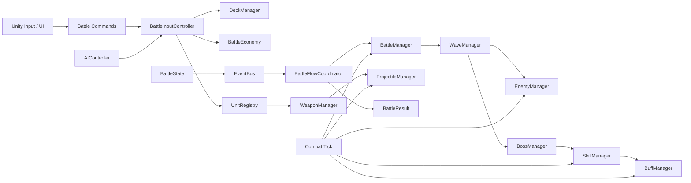

# 总体架构与模块边界

## 目标结构



## 分层

### 1. Domain / Rule Layer

建议迁移为普通 C# 类：

- `BattleState`
- `BattleManager`
- `WaveManager`
- `BattleEconomy`
- `DeckManager`
- `BattleInputController`
- `AIController`
- `UnitRegistry`
- `EnemyManager`
- `BossManager`
- `WeaponManager`
- `ProjectileManager`
- `BuffManager`
- `SkillManager`
- `BattleResult`

这层不得引用 `MonoBehaviour`、`Transform`、`Time.deltaTime`、Spine 或 Unity UI。

### 2. Configuration Layer

优先加载 `unity-export/config/*.json`。稳定后可转换为 ScriptableObject：

- Units
- Generals
- Enemies
- Bosses
- Weapons
- Projectiles
- Buffs
- Skills
- Waves
- Maps
- Battle economy

### 3. Adapter / Port Layer

Unity 实现：

- `ICombatClock`
- `IRandomSource`
- `ICombatView`
- `IAudioPort`
- `IVfxPort`
- `IInputPort`
- `IScenePort`
- `IResourcePort`

### 4. Presentation Layer

MonoBehaviour 负责：

- 单位、敌人和 Boss Prefab
- Spine-Unity 动画
- 投射物和 Trail
- 地块高亮、雨幕、黑暗遮罩
- HUD、牌组、GameOver

## 组合入口

JavaScript 当前组合入口：

```text
CoreCombatRuntime
  ├─ CombatServices
  └─ CombatLifecycle
```

Unity 推荐由 `CombatCompositionRoot` 在 Battle Scene 加载时创建纯逻辑服务，并将 View/Audio/Input/Scene Adapter 注入。
