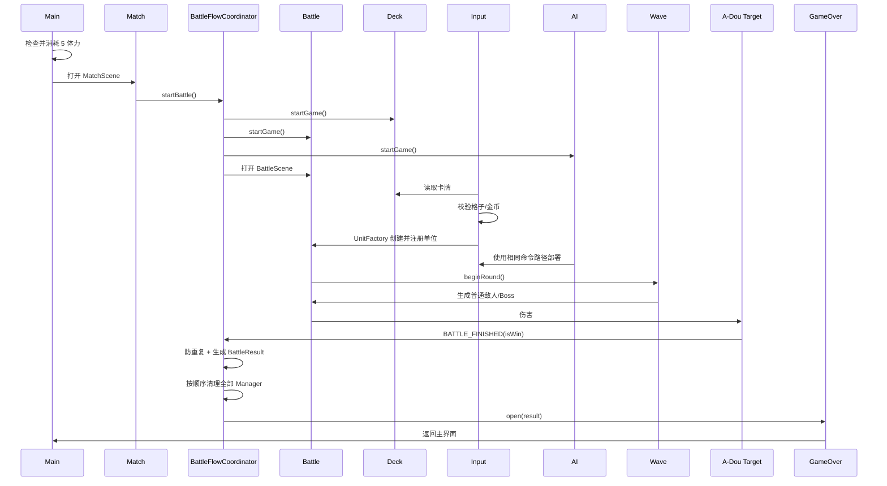

# 单场游戏完整时序

## 已验证的确定性流程



## 已验证 Smoke 数据

- 场景顺序：`MainScene → MatchScene → BattleScene → GameOverScene → MainScene`
- 玩家购买：弓，费用 1，装备 LongBow。
- 玩家完成一次刀兵合成，目标等级 2。
- AI 使用同一 Deck/Input/Factory 链部署刀兵。
- 普通波：10 个单位。
- Boss 波：双侧张梁。
- 自动结算：`BATTLE_FINISHED`，不是脚本手动调用 `gameOver()`。
- BattleResult：胜利、1 星、23 金币、29320ms、Round 2、6 次击杀。

详细原始报告：

```text
analysis/smoke/single-game-flow.json
```

## Unity 入口建议

1. MainScene 只处理体力和模式选择。
2. MatchScene 构造 `BattleStartRequest`。
3. BattleScene 创建 `CombatCompositionRoot`。
4. UI 发出命令，不直接修改 Registry、金币或单位。
5. 结算只由 `BATTLE_FINISHED` 触发。
