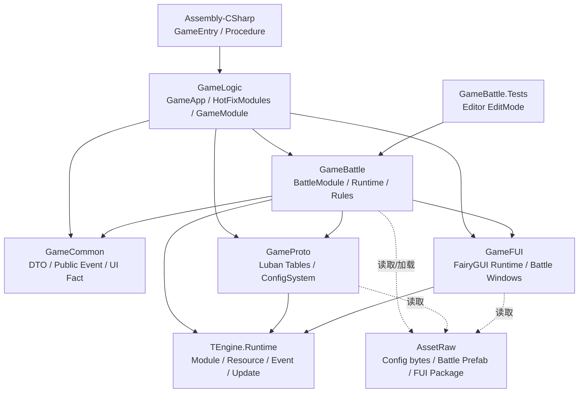
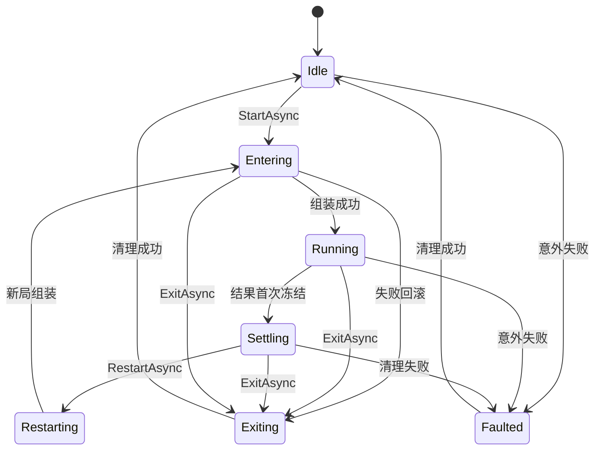

# 当前工程核心战斗模块架构

> 状态：当前源码快照
>
> 更新时间：2026-08-09
>
> 范围：`GameBattle` 核心战斗逻辑，以及直接连接的 `GameLogic`、`GameCommon`、`GameProto`、`GameFUI`、TEngine 运行时、战斗资源和 EditMode 测试。

本文以当前工作区源码为准，描述已经存在的实现，不等同于 `docs/HotFix架构/` 下的目标设计、历史记录或 OpenSpec 任务描述。若文档与源码冲突，以源码为准；本文末尾列出已发现的不一致和待验证项。

## 1. 架构结论

当前战斗模块已经形成以下主链路：

```text
GameEntry / ProcedureLoadAssembly
    -> GameApp.Entrance(object[])
    -> GameEventHelper.Init()
    -> ConfigSystem.Instance.Load()
    -> HotFixModules.Register()
    -> GameModule.Battle.ShowEntryAsync()
    -> BattleStartPanel
    -> IBattleModule.StartAsync()
    -> BattleRuntimeFactory.Create()
    -> BattleRuntime.Advance()
    -> BattleSimulation.Advance()
    -> 各阶段 Manager / Entity / Attack / Projectile
    -> BattleResultBuilder.TryFreeze()
    -> Settling / Event / UI / 资源释放
```

核心所有权分为两级：

| 所有者 | 生命周期 | 主要职责 |
|---|---|---|
| `BattleModule` | 热更域模块生命周期 | 对外提供战斗入口、维护模块状态、接收 TEngine 更新、持有地图世界宿主、跨局对象池与当前活动运行时 |
| `BattleRuntime` | 单局战斗生命周期 | 持有本局配置快照、规则状态、Manager、实体、输入、逻辑时钟、事件订阅、表现适配器和单局资源 |

规则状态的 source of truth 是 `BattleState`；表现层读取 `BattleReadModel`；跨程序集只传递 `GameCommon` 中的不可变 DTO 和事实事件。

当前已具备的主要架构特征：

- `BattleModule` 的公开接口较小，但内部承载生命周期、异步取消、失败回滚和并发合并，属于相对 deep 的模块。
- `BattleRuntimeFactory` 是单局组合根，集中依赖组装和阶段接线，业务规则主要留在各 Manager 和实体中。
- `BattleRuntimeScope` 集中处理单局资源、订阅、取消令牌、池租借和表现回调的逆序释放，具有较好的 locality。
- `Ports` 目录存在 Unity 实现和 Null 实现；`Config` 目录存在 Luban 实现和 JSON 测试实现，两个适配器分别证明了表现与配置接缝的实际用途。

## 2. 程序集与模块边界



### 2.1 程序集职责

| 程序集 | 当前职责 | 关键文件 |
|---|---|---|
| `GameLogic` | 热更组合根、入口、模块注册和框架访问门面 | `Assets/GameScripts/HotFix/GameLogic/GameApp.cs`、`Module/HotFixModules.cs`、`GameModule.cs` |
| `GameBattle` | 战斗模块、单局运行时、规则对象、战斗配置适配、表现端口 | `Assets/GameScripts/HotFix/GameBattle/` |
| `GameCommon` | 跨程序集不可变 DTO、公共战斗事件、UI 事实载荷 | `Assets/GameScripts/HotFix/GameCommon/Battle/` |
| `GameProto` | Luban 生成类型、`Tables`、配置加载器 | `Assets/GameScripts/HotFix/GameProto/` |
| `GameFUI` | FairyGUI 基础设施、战斗窗口和绑定注册 | `Assets/GameScripts/HotFix/GameFUI/` |
| `TEngine.Runtime` | ModuleSystem、资源、事件、更新和基础设施 | `Assets/TEngine/Runtime/` |
| `GameBattle.Tests` | 仅 Editor 平台的 NUnit/EditMode 验证 | `Assets/GameScripts/HotFix/GameBattle.Tests/` |

`GameBattle.asmdef` 当前直接引用 `TEngine.Runtime`、`GameCommon`、`GameProto`、`GameFUI`、FairyGUI runtime 以及其他工程程序集引用。仓库文本中有部分引用 GUID 无法仅通过 `.asmdef.meta` 还原名称，最终名称应以 Unity 程序集解析结果为准。

当前没有发现 `GameBattle → GamePlay` 或 `GamePlay → GameBattle` 的程序集引用。`GamePlay` 仍不是核心战斗链路的一部分。

## 3. 启动、注册与进入战斗

### 3.1 热更入口

主包流程负责加载热更程序集，随后反射调用 `GameApp.Entrance(object[])`。当前热更入口顺序为：

1. `GameEventHelper.Init()`：初始化源生成事件包装。
2. 保存热更程序集列表。
3. `ConfigSystem.Instance.Load()`：构造 Luban `Tables`。
4. `HotFixModules.Register()`：注册 GameFUI 与 GameBattle。
5. `GameModule.Battle.ShowEntryAsync(BattleLoadoutDto.CreateMinimalDefault())`：打开 FairyGUI 战斗入口。

关键证据：

- `Assets/GameScripts/HotFix/GameLogic/GameApp.cs:27`
- `Assets/GameScripts/Procedure/ProcedureLoadAssembly.cs`
- `Assets/GameScripts/HotFix/GameLogic/Module/HotFixModules.cs`

### 3.2 模块注册

`HotFixModules.Register()` 是当前 GameLogic 组合根中战斗模块的唯一注册入口：

```text
FUI.RegisterModule(GameModule.Resource, FUIOptions)
    -> ModuleSystem.RegisterModule<IFUIModule>(FUI.Module)
    -> new BattleModule()
    -> ModuleSystem.RegisterModule<IBattleModule>(module)
    -> _fuiModule.FreezeBindings()
```

注册方法使用 `_battleModule` 缓存保护幂等性。重复调用直接返回已注册实例，不重复创建模块、更新入口或事件订阅。

`GameModule.Battle` 只缓存并返回 `ModuleSystem.GetModule<IBattleModule>()` 的结果，业务调用方不应直接 `new BattleModule()`。

### 3.3 战斗入口 UI

`BattleModule.ShowEntryAsync()` 负责：

- 确保 `BattleMap0` 世界准备完成；
- 打开 `BattleStartPanel`；
- 把 `IBattleModule.StartAsync` 作为入口操作回调传给窗口。

真正开始一局由 `BattleStartPanel` 触发 `IBattleModule.StartAsync`，不是由 `GameApp` 直接创建 `BattleRuntime`。

## 4. `BattleModule`：跨局生命周期模块

### 4.1 对外接口

`IBattleModule` 是 GameBattle 对外唯一战斗模块接口，主要成员如下：

| 接口成员 | 语义 |
|---|---|
| `State` | 只读生命周期状态 |
| `ShowEntryAsync(loadout)` | 打开战斗入口，不创建活动战斗运行时 |
| `StartAsync(loadout, cancellationToken)` | 仅 `Idle` 可调用，创建并启动一局 |
| `RestartAsync(loadout, cancellationToken)` | 仅 `Settling` 可调用，销毁旧局并创建新局 |
| `ExitAsync(cancellationToken)` | 任意状态可作为退出/清理入口，幂等合并并发请求 |

预期失败返回 `BattleOperationResult` 和 `BattleErrorCode`，例如 `AlreadyActive`、`ConfigMissing`、`AssetLoadFailed`；调用方取消保留 `OperationCanceledException` 语义，但内部仍执行清理。

### 4.2 状态机



实现中的并发控制：

- `StartAsync`、`RestartAsync` 通过 `SemaphoreSlim _lifecycleGate` 串行化。
- `ExitAsync` 使用 `UniTaskCompletionSource<BattleOperationResult>` 合并并发退出请求。
- `Faulted` 状态保留活动运行时所有权，允许后续 `ExitAsync` 重试清理。

### 4.3 模块级所有权

`BattleModule` 在 `OnInit()` 中：

- 创建模块级取消令牌；
- 创建非激活的 `BattleWorldRoot`；
- 向 `GameFUI.BindingRegistry` 注册战斗窗口和 Widget。

`BattleModule` 跨局持有：

- 当前活动 `BattleRuntime` 和 `BattleRuntimeScope`；
- `BattlePoolScope`；
- `BattleWorldHost`；
- 战斗入口准备任务和退出处理器。

`Shutdown()` 负责取消模块异步操作、释放当前运行时、关闭战斗窗口、清空对象池、释放地图世界、恢复主相机和销毁模块取消令牌。

## 5. `BattleRuntime`：一局战斗的所有权根

### 5.1 组装流程

`BattleRuntimeFactory.Create()` 每次调用创建独立的 `BattleRuntimeAssembly`。当前组装职责包括：

1. 创建 `BattleRuntimeScope`、运行时取消令牌和配置快照。
2. 读取 `ConfigSystem.Instance.Tables`。
3. 通过 `LubanBattleConfigProvider` 生成 `BattleConfigSnapshot`。
4. 通过 `BattleConfigValidator` 校验快照。
5. 创建 `BattleState`、`BattleReadModel`、`BattleResultBuilder`。
6. 创建敌人、单位、投射物、攻击效果、经济、牌组、波次和输入相关对象。
7. 创建 `BattleInternalSignalHub` 和 `BattleEventBridge`。
8. 创建 `BattleSimulation`、`BattleActionScheduler`。
9. 创建 `BattlePresenter` 和 View/Audio/VFX 端口。
10. 将各阶段回调接入实际 Manager。
11. 任一步骤失败时由 `BattleRuntimeScope` 逆序回滚。

Factory 是依赖组装和接线的模块，不应成为新的规则 source of truth；规则应继续由 `BattleManager`、`WaveManager`、实体和战斗系统实现。

### 5.2 单局核心对象

| 领域 | 主要类型 | 作用 |
|---|---|---|
| 规则状态 | `BattleState` | 持有生命、金币、波次、击杀和其他可变规则状态；是规则写入根 |
| 只读状态 | `BattleReadModel` | 向 Presenter/视图提供只读战斗快照 |
| 结果 | `BattleResultBuilder` | 在唯一结算点首次冻结 `BattleResultDto` |
| 波次 | `BattleManager`、`WaveManager` | 启动战斗、推进波次、安排敌人生成和判断胜负 |
| 敌人 | `EnemyManager`、`EnemyFactory`、`EnemyBase` | 敌人生成、移动、接触伤害、受击、延迟移除和对象池回收 |
| 单位 | `UnitFactory`、`UnitRegistry`、`SoldierBase` | 单位创建、布阵、注册、攻击调度和回收 |
| 攻击 | `AttackScheduler`、`AttackResolver`、`AttackEffectManager` | 冷却、目标选择、伤害提交、攻击效果推进和回收 |
| 投射物 | `ProjectileFactory`、`ProjectileManager`、移动/命中策略 | 箭矢获取、移动、命中、伤害提交和池回收 |
| 地图 | `MapData`、`BattleTarget`、`PlacementReservationRegistry` | 网格、路径、放置预留、双方目标和空间相关数据 |
| 输入 | `BattleInputController`、`BattleInputCommand` | 输入命令进入单局运行时并由逻辑阶段处理 |
| 经济/牌组 | `BattleEconomy`、`DeckManager` | 金币、刷新、单位牌组和单局经济规则 |
| 事件 | `BattleInternalSignalHub`、`BattleEventBridge` | 单局内部事实和跨程序集事实转换 |
| 表现 | `BattlePresenter`、`BattleViewSynchronizer`、Ports | 只读状态与生命周期事实转为 Unity/FairyGUI 表现 |

单局状态不能跨 `BattleRuntime` 复用。重开流程会销毁旧运行时、释放其 Scope，再创建新运行时。

## 6. 逻辑时钟与阶段驱动

### 6.1 更新调用链

```text
TEngine ModuleSystem 更新队列
    -> BattleModule.Update(elapseSeconds, realElapseSeconds)
    -> BattleRuntime.Advance(deltaMilliseconds)
    -> BattleSimulation.Advance(frameNowMs)
    -> BattleUpdatePhase 顺序执行
```

`BattleModule` 仅在 `Running` 状态转发逻辑时间；`Idle`、`Entering`、`Settling`、`Exiting`、`Restarting`、`Faulted` 不推进模拟。

当前战斗模拟不依赖 TEngine `TimerModule` 作为第二套规则时钟。到期动作由 `BattleActionScheduler` 和 `BattleSimulation` 的双时钟共同处理。

### 6.2 双时钟规则

| 时钟 | 来源 | 用途 |
|---|---|---|
| `FrameNowMs` | 外部帧时间戳 | 攻击冷却、到期动作和同一外部帧内的统一观察时间 |
| `StepMs` | 当前逻辑子步时长 | 移动、投射物、攻击效果和累计游戏时间 |

`BattleSimulation` 的固定规则：

- 单帧最大吸收 `500ms`，避免卡顿帧造成过大逻辑跳跃；
- 每个逻辑子步最大 `80ms`；不足 `80ms` 的余数在当前帧立即执行；
- 同一外部帧的所有子步观察同一个 `FrameNowMs`；
- 暂停时不使用 `realElapseSeconds` 补偿；
- 结果冻结后不再推进剩余子步。

### 6.3 阶段顺序

当前 `BattleUpdatePhase` 顺序为：

```text
DueActionsAndInput
    -> Enemy
    -> Projectile
    -> AttackRelease
    -> WaveSpawn
    -> UnitAttack
    -> AttackEffect
```

阶段接线位于 `BattleRuntimeFactory`。其中 `AttackRelease` 当前为空操作，属于尚未填充的阶段，不应在架构图中误认为已经有独立规则实现。

结果冻结的处理方式是“同步提交后、阶段边界停止”：

```text
受击/伤害同步提交
    -> BattleResultBuilder.TryFreeze()
    -> BattleSimulation.TryFreeze()
    -> 跳过当前子步剩余阶段和当前帧剩余子步
    -> BattleModule 转入 Settling
```

这样避免在伤害调用栈内直接销毁 Manager、集合或对象池。

## 7. 核心战斗数据流

### 7.1 配置流

```text
Configs/GameConfig/Datas/*.xlsx
    -> Luban 生成
    -> GameProto/GameConfig/battle/*.cs
    -> Assets/AssetRaw/Configs/bytes/battle_tb*.bytes
    -> ConfigSystem.Instance.Tables
    -> LubanBattleConfigProvider
    -> BattleConfigNormalizer
    -> BattleConfigSnapshot
    -> BattleConfigValidator
    -> BattleRuntime / 各 Manager
```

当前工程可见的源表目录为 `E:\MyWork\MyTD\TEngine\Configs\GameConfig\Datas`；Unity 工程内的生成代码位于 `Assets/GameScripts/HotFix/GameProto/GameConfig/`，二进制产物位于 `Assets/AssetRaw/Configs/bytes/`。

核心战斗表包括：

`TbMap`、`TbWave`、`TbEnemy`、`TbEnemyStats`、`TbUnit`、`TbUnitLevel`、`TbWeapon`、`TbWeaponRegistry`、`TbProjectile`、`TbEconomy`、`TbBuff`、`TbSkill`、`TbDeck`、`TbBoss`、`TbEvent`、`TbResultSchema`、`TbRank` 和 `TbGeneral`。

配置加载时序已由 `GameApp.Entrance()` 显式执行 `ConfigSystem.Instance.Load()`；战斗子步阶段不应回读配置系统或触发资源加载。

### 7.2 配置接缝与当前缺口

`IBattleConfigProvider` 是配置适配接缝：

- 生产方向是 `LubanBattleConfigProvider`；
- `JsonBattleConfigProvider` 只用于测试/开发黄金基线；
- 运行时只持有 `BattleConfigSnapshot`，不应持有具体 `Tables` 或 Provider。

当前 Provider 仍存在兼容补位或字段缺口：

- 地图网格、部分敌人属性和敌人波次属性仍有黄金基线 fallback；
- 波次的 `skipBoss`、延迟和最大波次等字段存在 fallback；
- 经济配置的部分最大生命字段未完全由表驱动；
- 投射物 movement/hit strategy 仍包含适配补位；
- `DeckDefinitions` 仍参与最简牌组默认值；
- `BattleLoadoutDto.ConfigVersion` 和 `ConfigHash` 仍是占位语义。

工程中已经存在 `TbDeck` 和 `battle_tbdeck.bytes`，但 Provider 注释仍保留“没有完整 Deck 表”的历史说明；这是文档/实现需要继续核对的点。

## 8. 规则行为调用链

### 8.1 敌人与波次

```text
BattleManager.StartGame
    -> UpdateSpawnState
    -> WaveManager / SpawnPairWhenDue
    -> EnemyFactory.Acquire
    -> EnemyBase.Configure / InitializeStats / BeginMoving
    -> EnemyManager.Register
    -> EnemyManager.Update
    -> MapData 路径移动
    -> 到达路径终点后攻击 BattleTarget
```

`EnemyManager` 使用快照遍历和延迟移除，避免更新过程中直接修改活动集合。敌人受击后由 `EnemyManager` 负责按 ID 定位、延迟移除和回收到对象池。

### 8.2 单位与攻击

```text
UnitRegistry.CreateAndPlace
    -> UnitFactory.Acquire
    -> SetPlacement / Register / ActivatePlacement
    -> AttackScheduler.Update
    -> SoldierBase.Attack
    -> 具体兵种 PerformAttack
    -> AttackEffectManager / ProjectileManager
```

当前四类主要兵种与攻击实现：

| 兵种 | 当前攻击路径 |
|---|---|
| `KnifeSoldier` | `KnifeAttackEffect` |
| `BowSoldier` | `BowReleaseEffect` → `ProjectileAttackEffect` |
| `SpearSoldier` | `PikeAttackEffect` |
| `CavalrySoldier` | 两个 `CavalrySweepEffect` |

当前没有独立的 `SkillSystem`、`BuffSystem`、`WeaponSystem` 或 `DamageSystem`。技能/Buff/武器配置类型已存在，但实际运行时主要由单位、攻击效果、攻击解析和投射物链路承载。

### 8.3 投射物

```text
AttackEffect
    -> ProjectileFactory.Acquire
    -> ObjectPool + RuntimeId
    -> TargetEnemyBezierMovement
    -> ProjectileManager.Update
    -> HitEnemyStrategy.Apply
    -> AttackResolver / EnemyManager.ApplyDamage
    -> ProjectileFactory.Release
```

投射物的移动、命中和回收分别通过策略、Manager 和 Factory 协作完成；投射物不得由多个模块重复推进。

### 8.4 伤害、目标与结果

```text
AttackEffect / Projectile
    -> AttackResolver
    -> EnemyManager.ApplyDamage
    -> EnemyBase.Hit

EnemyBase.AttackBattleTarget
    -> BattleTarget.ApplyDamage
    -> BattleState.ApplyDamage
    -> BattleManager.TryFreezeResult
    -> BattleResultBuilder.TryFreeze
    -> BattleSimulation.TryFreeze
```

`BattleResultBuilder` 第一次成功冻结后形成不可变 `BattleResultDto`，后续冻结请求不改写结果。`BattleTarget` 是目标受击边界和冻结触发适配器，规则状态仍由 `BattleState` 持有。

## 9. 事件、接缝与表现隔离

战斗事件分为三类，不应混用：

| 类型 | 机制 | 适用范围 |
|---|---|---|
| 核心一致性调用 | 直接调用 | 敌人注册、伤害提交、池回收等一对一同步操作 |
| 单局内部事实 | `BattleInternalSignalHub` | 波次准备、生命变化、金币变化、结果冻结等低频一对多事实 |
| 跨程序集事实 | `GameCommon` `[EventInterface]` + TEngine `GameEvent` | `OnBattleStarted(BattleLoadoutDto)`、`OnBattleFinished(BattleResultDto)` |

`BattleEventBridge` 的职责是：

- 将 `BattleInternalSignalHub` 的内部事实转换为 `IBattleUiEvent`；
- 发送跨程序集的开始/完成公共事实；
- 随 `BattleRuntimeScope` 释放，避免旧运行时订阅回调到新一局。

UI 高度频繁的数据不通过全局 `GameEvent` 广播：

- `BattleViewSynchronizer` 直接读取 `BattleReadModel`/运行时只读数据同步位置和动画；
- `BattlePresenter` 订阅敌人、单位、投射物的生命周期事实；
- `IBattleUiEvent` 只承载低频、类型安全的 UI 事实。

公共事件契约位于：

- `Assets/GameScripts/HotFix/GameCommon/Battle/IBattlePublicEvent.cs`
- `Assets/GameScripts/HotFix/GameCommon/Battle/IBattleUiEvent.cs`
- `Assets/GameScripts/HotFix/GameCommon/Battle/BattleLoadoutDto.cs`
- `Assets/GameScripts/HotFix/GameCommon/Battle/BattleResultDto.cs`

`GameEventHelper.Init()` 必须在所有 `GameEvent.Get<T>()` 之前执行；当前唯一确认的入口是 `GameApp.Entrance()`。

## 10. 表现、资源与世界宿主

### 10.1 世界宿主

`BattleWorldHost` 是模块级 Unity 世界宿主：

- 根节点：`BattleWorldRoot`；
- 地图 location：`BattleMap0`；
- 通过 `IResourceModule.LoadGameObjectAsync` 加载 `BattleMap0.prefab`；
- 绑定 `EnemyRoot`、`SoldierRoot`、`ProjectileRoot`、`EffectRoot`、`UnitSlotRoot`；
- 保存并恢复 `MainCamera` 的位置、投影和背景属性；
- 退出时销毁地图实例、动态子节点、临时放置 Sprite/Texture 和世界根。

当前核心路径是动态加载地图 Prefab，不是通过 `GameModule.Scene.LoadSceneAsync` 加载一个独立 Unity 战斗场景。工程中仍存在来源于 Laya 的 `BattleScene.ls`，它不等于当前 Unity 运行时场景。

### 10.2 表现端口

`Ports` 提供逻辑到表现的接缝：

| 接口 | 当前适配器 |
|---|---|
| `IBattleViewPort` | `UnityBattleViewPort`、`NullBattleViewPort` |
| `IBattleAudioPort` | `UnityBattleAudioPort`、`NullBattleAudioPort` |
| `IBattleVfxPort` | `UnityBattleVfxPort`、`NullBattleVfxPort` |
| `IRandomSource` | `SeededRandomSource` 等 |

逻辑运行时通过接口写入表现事实，不直接持有 FairyGUI Widget 或具体 Unity 表现对象。测试可以注入 Null 适配器，EditMode 不必启动完整视图。

### 10.3 FairyGUI 接入

战斗 UI 由 `GameFUI` 承载，当前战斗相关窗口/面板包括：

- `BattleStartPanel`
- `BattleHudPanel`
- `BattleResultPanel`
- `BattleStartWidget`
- `BattleFuiOwner`

`BattleModule.OnInit()` 负责向 `FUI.BindingRegistry` 注册战斗 UI；`HotFixModules.Register()` 在所有业务 owner 注册完成后调用 `FreezeBindings()`。战斗规则不应反向依赖具体 UI 实现。

## 11. 单局资源和释放顺序

`BattleRuntimeScope` 统一跟踪以下所有权：

- 运行时取消令牌；
- GameEvent/内部信号订阅；
- YooAsset `AssetHandle` 和资源租约；
- 对象池租借；
- 表现回调；
- FairyGUI Package 租约；
- 其他 `IDisposable` 对象。

释放原则：

```text
结果冻结
    -> 关闭输入
    -> 清空已处理命令
    -> 取消 Runtime Token
    -> 冻结 ActionScheduler
    -> 清理攻击效果 / 投射物 / 敌人 / 单位
    -> 清理波次 / 牌组 / 经济 / 放置预留
    -> 清理内部 SignalHub
    -> 通知 Presenter / 发布完成事实
    -> RuntimeScope 逆序释放资源与订阅
```

退出或重开时，`BattleRuntime.Dispose()` 和 `BattleRuntimeScope.Dispose()` 负责单局释放；`BattleWorldHost.Release()` 负责模块级地图与 Unity 世界释放；`BattleModule.ClearPoolsForExit()` 负责清空跨局对象池容量。

表现资源目前存在两种加载模式：

- 地图、单位和投射物 Prefab 主要使用 `LoadGameObjectAsync` 或带引用的实例加载；
- VFX、Sprite、音频等资源使用 `AssetHandle` 或端口内部的异步加载。

所有表现端口的异常路径、句柄登记和真实 Player 释放仍需运行时验证，不能仅凭 EditMode 源码阅读视为完整闭环。

## 12. 测试与验证面

测试程序集是 Editor-only 的 `GameBattle.Tests`，主要覆盖：

| 领域 | 代表测试 |
|---|---|
| 状态与生命周期 | `BattleModuleStateTests`、`BattleModuleLifecycleTests`、`BattleWorldLifecycleRegressionTests` |
| 模拟时间 | `BattleSimulationTimeTests` |
| 战斗规则 | `BattleManagerTests`、`BattleTargetTests`、`WaveManagerTests` |
| 单位/敌人 | `UnitBaseTests`、`UnitFactoryAndRegistryTests`、`EnemyBaseTests`、`EnemyIntegrationTests` |
| 攻击 | `AttackSchedulerTests`、`AttackResolverTests`、`AttackTimingAndSettlingTests`、`AttackEffectManagerCancelAndPoolTests` |
| 投射物 | `ProjectileMathTests`、`SimpleDynamicArrowTests`、`ProjectileManagerIntegrationTests`、`ProjectileEdgeCaseTests` |
| 配置 | `BattleConfigSnapshotTests`、`BattleConfigValidatorTests` |
| 黄金基线 | `GoldenSnapshotComparisonTests`、`Phase5GoldenTrajectoryTests`、`golden-battle-bundle.json` |
| 输入/地图/对象池 | `BattleInputControllerTests`、`MapDataTests`、`PlacementReservationRegistryTests`、Pooling tests |

本文只盘点测试和源码，没有执行 Unity Test Runner。因此“测试存在”不等于“本次已通过”。当前未看到覆盖真实 Player、HybridCLR DLL 动态加载和非 Editor YooAsset 包的等价测试闭环。

## 13. 当前未完成项与风险

以下内容是源码中可见的缺口或需要进一步验证的项：

1. `AttackRelease` 阶段仍为空操作。
2. 尚未形成独立的 `SkillSystem`、`BuffSystem`、`WeaponSystem`、`DamageSystem`；当前能力主要分散在单位、攻击效果、解析器和投射物链路。
3. `BattleModule` 中 `ENABLE_COMPUTER_LANE_ENEMY_SPAWN = false`，默认路径未完全开启对手车道刷敌人。
4. `LubanBattleConfigProvider` 对地图、敌人、波次、经济、投射物和牌组仍有 fallback/硬编码补位，配置表并非所有字段的唯一 source of truth。
5. `TbDeck` 已生成且 `battle_tbdeck.bytes` 已存在，但 Provider 注释和部分适配逻辑仍使用旧的“缺少 Deck 表”语义。
6. `ConfigVersion`/`ConfigHash` 尚未形成真正的版本和校验机制。
7. `GameBattle.asmdef` 中部分引用 GUID 仅靠仓库文本无法还原名称，需要 Unity 编译结果确认。
8. 真实 Player 中的 `GameBattle.dll` 加载、YooAsset DLL location、HybridCLR 运行时调用和 FUI Package 资源释放尚未在本次静态整理中验证。
9. 当前没有发现网络输入或服务端权威同步进入 `BattleRuntime` 的调用链。
10. 旧文档仍有过期描述：`docs/HotFix架构/架构设计.md` 和 `战斗移植设计总纲.md` 的部分章节仍把 `GameBattle` 视作占位实现，或写成打开旧 UGUI `BattleMainUI`；当前入口实际是 `BattleStartPanel`。

## 14. 关键文件索引

### 入口与组合根

- `Assets/GameScripts/HotFix/GameLogic/GameApp.cs`
- `Assets/GameScripts/HotFix/GameLogic/Module/HotFixModules.cs`
- `Assets/GameScripts/HotFix/GameLogic/GameModule.cs`
- `Assets/GameScripts/HotFix/GameBattle/GameBattle.asmdef`

### 模块与运行时

- `Assets/GameScripts/HotFix/GameBattle/Module/IBattleModule.cs`
- `Assets/GameScripts/HotFix/GameBattle/Module/BattleModule.cs`
- `Assets/GameScripts/HotFix/GameBattle/Module/BattleWorldHost.cs`
- `Assets/GameScripts/HotFix/GameBattle/Runtime/BattleRuntimeFactory.cs`
- `Assets/GameScripts/HotFix/GameBattle/Runtime/BattleRuntime.cs`
- `Assets/GameScripts/HotFix/GameBattle/Runtime/BattleRuntimeScope.cs`
- `Assets/GameScripts/HotFix/GameBattle/Runtime/BattleSimulation.cs`
- `Assets/GameScripts/HotFix/GameBattle/Runtime/BattleActionScheduler.cs`

### 状态、规则和实体

- `Assets/GameScripts/HotFix/GameBattle/State/BattleState.cs`
- `Assets/GameScripts/HotFix/GameBattle/State/BattleReadModel.cs`
- `Assets/GameScripts/HotFix/GameBattle/State/BattleResultBuilder.cs`
- `Assets/GameScripts/HotFix/GameBattle/Battle/BattleManager.cs`
- `Assets/GameScripts/HotFix/GameBattle/Battle/WaveManager.cs`
- `Assets/GameScripts/HotFix/GameBattle/Battle/BattleTarget.cs`
- `Assets/GameScripts/HotFix/GameBattle/Unit/`
- `Assets/GameScripts/HotFix/GameBattle/Enemy/`
- `Assets/GameScripts/HotFix/GameBattle/Combat/`
- `Assets/GameScripts/HotFix/GameBattle/Projectile/`

### 配置、事件和表现

- `Assets/GameScripts/HotFix/GameBattle/Config/`
- `Assets/GameScripts/HotFix/GameBattle/Events/BattleInternalSignalHub.cs`
- `Assets/GameScripts/HotFix/GameBattle/Events/BattleEventBridge.cs`
- `Assets/GameScripts/HotFix/GameBattle/Ports/`
- `Assets/GameScripts/HotFix/GameBattle/Presentation/`
- `Assets/GameScripts/HotFix/GameCommon/Battle/`
- `Assets/GameScripts/HotFix/GameProto/ConfigSystem.cs`
- `Assets/GameScripts/HotFix/GameFUI/UIBase/UIBattle/`

### 资源与测试

- `Assets/AssetRaw/Configs/bytes/`
- `Assets/AssetRaw/Battle/Prefabs/`
- `Assets/AssetRaw/FUI/`
- `Assets/GameScripts/HotFix/GameBattle.Tests/EditMode/`
- `Assets/GameScripts/HotFix/GameBattle.Tests/EditMode/Golden/`

