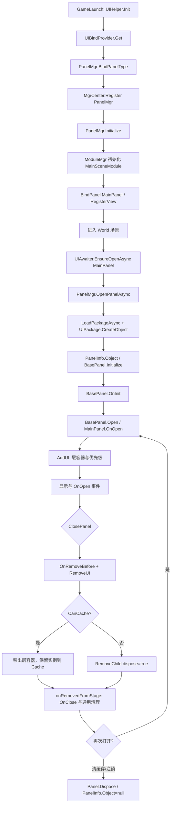

# 调查结论：UI 框架与表现层组织

## 结论摘要

**代码确认。** OLD 是 FairyGUI 运行时之上的 ZeroFramework UI 适配层：生成的 `BaseXxx` 类负责把 FairyGUI 组件树映射成可继承的类型；`BasePanel` 承担面板状态、模块事件归属和关闭钩子；`BaseView` 只承担嵌入式组件的阶段生命周期；`PanelMgr` 负责注册、创建、层级排序、导航、缓存分流和全局 UI 事件；模块负责把业务类型注册到管理器并持有自己的事件组。[S03-E003][S03-E004][S03-E005][S03-E006][S03-E007]

**代码确认。** OLD 的“关闭”不是固定的“销毁”：普通面板从容器移除时会递归 Dispose；带 `PanelOption.CanCache` 的面板则被移到 `$Cache_Panel`，实例继续挂在 `PanelInfo` 上，下次打开复用，直到清缓存或注销时才 Dispose。[S03-E011]

**代码确认。** OLD 有 `m_openingPanel` 记录异步打开状态，但 `OpenPanelAsync` 在加入集合后没有先检查集合，也没有统一 `try/finally`。因此“有状态查询”不等于“并发打开已被抑制”；创建/加载失败早返和异常还可能留下陈旧的 opening 标记。这是静态代码风险，不是本轮运行测试结论。[S03-E008][S03-E009]

**代码确认。** CURRENT 的 `GameLogic` UI 是另一套以类型为主键的 UGUI/Canvas 运行时：`UIModule` 把一个窗口类型的实例放入 `_uiStack`，重复 Show 会重新压栈并刷新参数，Close 直接走 `InternalDestroy`；Hide 只有在配置了延迟时才暂时隐藏，否则也会 Close。CURRENT 没有 OLD 那种面板注册表、`IPanel`、缓存面板或独立 `OnClose` 钩子。[S03-E017][S03-E018][S03-E020][S03-E021]

**代码确认。** CURRENT 的窗口加载入口是 `UniTaskVoid InternalLoad`，调用 `IUIResourceLoader` 的异步接口时没有传窗口级取消 token；关闭加载中的窗口会先设置 `IsDestroyed` 并从栈移除，资源完成后由 `Handle_Completed` 销毁迟到的 GameObject。加载失败或返回 null 时 `IsLoadDone` 不会被置为 true，因此 await 轮询只能等到 60 秒上限；这些路径需要运行时/后续设计确认。[S03-E019][S03-E023]

**推断。** 两套系统都把表现生命周期置于 UI 类型/实例一侧，把业务状态置于模块/调用方一侧，但 OLD 的模块事件组和窗口清理约定更显式；CURRENT 已有 `GameEventMgr` 的 UI 自有订阅回收，却没有覆盖所有外部订阅、计时器和窗口异步任务的通用所有权边界。[S03-E010][S03-E014][S03-E015][S03-E018][S03-E023]

## 1. 可达架构与职责边界

### 1.1 OLD 的分层

| 层 | 实际代码/归属 | 职责 | 依赖方向与限制 |
|---|---|---|---|
| UI 运行时 | `Assets/Scripts/framework/FairyGUI/Scripts/UI`，FairyGUI 的项目内源码/适配版本 | `GObject/GComponent` 树、`AddChild/RemoveChild/Dispose`、stage 事件和 `AddDisposable` | 这是第三方能力及项目改造的混合边界；`BasePanel` 的关闭清理依赖其 `onRemovedFromStage` 和 `Dispose` 语义，不能仅凭 ZeroFramework 代码独立证明所有运行时时序。[S03-E013] |
| 框架基类 | `Assets/Scripts/framework/Library/ZeroFramework/Panel/BasePanel.cs`、`BaseView.cs`、`IPanel.cs` | 把 FairyGUI 对象变成可扩展的 panel/view 生命周期；维护模块 dispatcher、事件组、状态和 UI 选项 | 只依赖 FairyGUI 与框架事件/计时器；不直接承载具体业务状态。[S03-E006][S03-E007] |
| UI 管理器 | `PanelMgr.cs` 及 partial 文件 | 注册面板/视图、载入 UI 包、创建对象、分层、排序、打开/关闭、缓存清理、扩展回调 | 依赖 `UIBindProvider` 产生的绑定、`FguiResourceMgr`/`UIPackage` 和模块管理器；调用方不能绕开注册约定安全创建面板。[S03-E004][S03-E005][S03-E008][S03-E011] |
| 生成代码 | `Assets/Scripts/UIBase/**/Base*.cs` | 暴露组件字段、控制器、URL/包名/资源名常量，作为业务 partial 类的基类 | 文件头明确为 FairyGUI 自动生成；本轮不分析编辑器生成过程。[S03-E003] |
| 业务调用方 | `Assets/Scripts/game/Module/**` | 在模块初始化时 `BindPanel/RegisterView`，在场景进入时请求打开，窗口实现 `OnInit/OnOpen/OnClose` | 业务代码显式负责订阅、计时器和表现刷新；框架提供模块事件组和基类兜底清理，但不替业务理解订阅内容。[S03-E005][S03-E015] |

`UIHelper.Init` 在启动早期消费 `UIBindProvider` 的反射结果并调用 `PanelMgr.BindPanelType`；随后 `MgrRegisterCommander` 把 `PanelMgr` 注册到 `MgrCenter`，`MgrCore.Add` 立即执行 `manager.Initialize()`。`GameLaunch` 的顺序把这两步放在模块初始化之前，因此这是代码可达的旧 UI 初始化前置链，而不是只存在于目录的推断。[S03-E002][S03-E004][S03-E005]

### 1.2 CURRENT 的分层

| 层 | 实际代码/归属 | 职责 | 依赖方向与限制 |
|---|---|---|---|
| TEngine 基础模块 | `Assets/TEngine/Runtime` 的资源、计时器、更新模块 | 提供资源加载接口、计时器 ID 和更新驱动 | 没有在该目录发现 `UIModule/UIWindow` 实现；UI 具体管理器位于 `GameLogic` 热更程序集，不能当作 TEngine Runtime 的通用 UI API。[S03-E023][S03-E024] |
| UI 管理器 | `Assets/GameScripts/HotFix/GameLogic/Module/UIModule/UIModule.cs` | 查找 UIRoot、维护 `_uiStack`、实例化窗口、异步/同步载入、排序、全屏遮挡、Hide/Close、更新轮询 | 通过 `Singleton<UIModule>` 注册到 `SingletonSystem` 的 IUpdate 生命周期；依赖场景中的 `UIRoot` 和 `IUIResourceLoader`。[S03-E017][S03-E020][S03-E021][S03-E024] |
| 窗口基类 | `UIBase.cs`、`UIWindow.cs` | 公开 UI 类型、父子关系、生命周期 hook、UI 自有事件池、窗口 Canvas/raycaster/可见性和加载状态 | `UIWindow` 不是 `MonoBehaviour`；它持有实例 GameObject，Close 时由管理器显式销毁。[S03-E018][S03-E019] |
| 组件基类 | `UIWidget.cs` | 挂入父 `UIBase` 的 `ListChild`，同步/异步从父节点或 prefab 创建，递归更新和销毁 | 组件没有独立的 UI 管理器栈；父 UI 负责持有 `ListChild`。[S03-E018] |
| 配置/扩展约定 | `WindowAttribute.cs` 与窗口类上的属性 | 给类型提供层、资源定位、全屏、是否 Resources、隐藏后关闭时间 | 属性是运行时反射读取的轻量元数据；当前注释提出未来配置表想法，但代码没有实现配置表导航或货币栏位等扩展。[S03-E020][S03-E022] |
| 启动/调用方 | `GameApp.StartGameLogic`、`GameEntry`/Procedure 入口 | 启动后请求显示业务窗口；场景提供名为 `UIRoot` 的 prefab 实例 | `GameApp` 由程序集反射入口调用；`GameModule.UI` 首次访问才创建 UIModule。[S03-E017][S03-E024] |

CURRENT 还有一个独立的 `Launcher` 程序集和 `LauncherMgr`。它使用 `Resources.Load("UIWindow/" + typeof(T).Name)`、字典缓存已创建对象，但 `CloseUI` 隐藏后立即 `DestroyImmediate` 并从字典移除；这不是 `GameLogic.UIModule` 的另一入口，也不能与其窗口栈或缓存语义混用。[S03-E022]

## 2. 基类、窗口和组件边界

### 2.1 OLD `BasePanel`：可管理、可缓存的面板对象

`IPanel` 把管理器需要的契约集中在名称、层、同层优先级、打开状态、选项、方向能力、初始化、打开、关闭、移除前处理和 Dispose 上；`IBackHandler` 则是可选的返回键策略。[S03-E006]

`BasePanel.Initialize` 给实例写入名称、所属模块 dispatcher、`PanelMgr`、logger，并挂上 `onAddedToStage`；随后只调用一次 `OnInit`（定义级别确认，实际次数取决于一个对象是否只初始化一次）。第一次 `Open` 执行 `OnOpen`，成功后设置 `m_isOpen` 并执行打开动画；已经打开的实例不再执行 `OnOpen`，而是复制参数列表后进入 `OnUpdateParam`。因此 OLD 的重复打开语义是“同一实例更新参数”，不是“再创建一个同名窗口”。[S03-E006]

`BasePanel.Close` 本身只把请求交给 `PanelMgr.ClosePanel(Name)`；它不直接 Dispose。真正移除前由管理器调用 `OnRemoveBefore`，再由 `RemoveUI` 决定缓存脱离还是销毁。基类在 FairyGUI `onRemovedFromStage` 回调中执行 `OnClose`、清空关闭回调、移除以实例为目标的计时器/模块事件/Stage touch，并删除所属模块事件组。[S03-E006][S03-E010]

### 2.2 OLD `BaseView`：嵌入式表现组件

`BaseView` 继承 `GComponent`，初始化时接收 owner dispatcher、`PanelMgr` 和 logger，第一次进入 stage 执行 `OnInit`，每次进入执行 `OnOpen`，移除 stage 执行 `OnClose`，随后清理以对象为目标的计时器、模块事件、Stage touch 和 view 事件组。它没有 `IPanel` 的 `IsOpen/Layer/Priority/Option`，也没有被 `PanelMgr` 的面板栈直接导航。[S03-E007]

这形成了清晰但强依赖 FairyGUI stage 的边界：窗口由 `PanelMgr` 决定是否存在于层容器，视图由父组件/FGUI 包在树中创建；view 生命周期的开关来自“进出 stage”，不是独立的 `OpenPanel`。[S03-E004][S03-E007]

### 2.3 CURRENT `UIWindow` / `UIWidget`：实例窗口与父子组件

CURRENT `UIBase` 提供 `UIType`、父节点、用户数据、`gameObject/transform/rectTransform` 抽象和 `OnCreate/OnRefresh/OnUpdate/OnDestroy/OnSortDepth/OnSetVisible` hooks；`UIWindow` 将真实 prefab GameObject、Canvas、GraphicRaycaster 和窗口元数据接入这些 hooks；`UIWidget` 创建后立刻挂到父 UI 的 `ListChild`，依次执行注入、生成绑定、成员绑定、事件注册、创建和刷新。[S03-E018][S03-E019]

两者的关键区别：

- `UIWindow` 才进入 `UIModule._uiStack`，拥有层、深度、全屏遮挡、Hide 延迟和 Close 入口；`UIWidget` 只在父 UI 内部存在。[S03-E017][S03-E018][S03-E020]
- CURRENT 没有与 OLD `OnOpen/OnClose` 对应的基类 hook。首次资源准备后由 `OnWindowPrepare` 调用 `InternalCreate → InternalRefresh`；再次 Show 已存在窗口只调用 `TryInvoke`，立即刷新已准备窗口，未准备窗口则覆盖 `_prepareCallback`。[S03-E020]
- Close 的清理入口是 `InternalDestroy → RemoveAllUIEvent → 子组件销毁 → OnDestroy → Destroy(GameObject)`；因此扩展窗口必须把可逆显示状态放在 `Visible/OnSetVisible`，把最终释放放在 `OnDestroy`。这是一条运行时约定，不是编译器强制的接口。[S03-E018][S03-E019]

## 3. 打开、显示、隐藏、关闭、销毁和缓存

### 3.1 OLD 生命周期图

图中的 `onRemovedFromStage` 是 FairyGUI 运行时事件边界：ZeroFramework 明确注册了该处理器，`RemoveUI` 明确执行 `RemoveChild`；本轮没有运行 Unity 来观测事件回调的精确帧时序。[S03-E006][S03-E010][S03-E011][S03-E013]

### 3.2 OLD 的缓存与销毁分流

`PanelMgr.RemoveUI` 先判断 `BasePanel.Option` 是否包含 `CanCache`。缓存分支把 display object 的 `home` 指向 `$Cache_Panel` 并从当前层容器移除，不调用 `Dispose`；非缓存分支调用 `RemoveChild(ui, true)`，并把 `PanelInfo.Object` 置空。`PanelInfo.Object` 的 setter 同时更新 `PanelInfo.Panel`，所以缓存实例仍可被 `GetPanelIfLoaded` 找到，非缓存实例则不再被视为已创建。[S03-E011]

`ClearCachePanel` 只收集 `Panel != null && !Panel.IsOpen` 的记录，调用 `info.Panel.Dispose()` 并将 `info.Object=null`；`UnregPanelByName` 即使对象在缓存中也会先移除注册，再 Dispose。由此可以确认：

- `ClosePanel` 是逻辑关闭/从可见栈移除；是否最终销毁由 `CanCache` 决定。[S03-E011]
- `OnInit`、生成绑定和 `Initialize` 属于创建/初始化阶段；缓存再次打开会直接回到 `Panel.Open`，不会从 `Initialize` 重新开始。[S03-E006][S03-E008][S03-E011]
- 缓存的所有权属于 `PanelMgr` 的 `PanelInfo` 和 `$Cache_Panel`；业务模块不能只靠“关闭”释放它，必须调用清缓存或注销。[S03-E004][S03-E011]

### 3.3 CURRENT 的“隐藏”不是缓存

`UIModule.HideUI` 找到窗口后，如果 `HideTimeToClose <= 0`，直接调用 `CloseUI`；否则把 Canvas 及其子 Canvas 切到隐藏层、禁用 raycaster，设置 `IsHide`，并以 `HideTimerId` 注册定时器。重新 Show 同类型窗口时 `TryInvoke` 先 `CancelHideToCloseTimer`、清除隐藏状态，再把现有实例移动到栈顶。[S03-E019][S03-E020]

因此 CURRENT 的延迟 Hide 是“等待一段时间后仍关闭销毁”，不是 OLD 那种 detached cache。资源模块的资产池和窗口实例缓存也不能混为一谈：当前 `IUIResourceLoader` 只承诺加载/实例化接口；`UIModule` 本身没有一个保留已关闭 `UIWindow` 实例的字典或 `PanelInfo`。[S03-E019][S03-E023]

### 3.4 CURRENT 关闭与模块释放

`UIModule.CloseUI` 调用 `InternalDestroy`、从 `_uiStack` 移除、重排同层深度并重新计算全屏可见性；`CloseAll` 对栈内窗口逐个 `InternalDestroy` 后清空栈。模块释放时先释放错误日志，再 `CloseAll(isShutDown:true)`，最后销毁 UIRoot 的父 GameObject。[S03-E017][S03-E019]

这证明“正常 manager 释放路径”会销毁当前栈内窗口，但不证明任意用户自建的、未进入 `_uiStack` 的 `UIWindow` 都能被 UIModule 回收；这类对象的所有权仍是待验证项。[S03-E017][S03-E018]

## 4. 层级、深度和导航

### 4.1 OLD

OLD 的 `PanelLayer` 只有 `Top/Panel/Bottom` 三个实际容器，`Count/Any` 是控制值；`PanelOption` 把 HUD、容器、缓存、禁止返回、忽略返回、全屏、淡入淡出、模糊和安全区等策略拆成 flags。`PanelMgr.Initialize` 为每个 layer 创建一个 `GComponent` 放入 `GRoot`；`AddUI` 按层内 `Priority` 插入，并从高层到低层重建 `m_panelList`，列表尾部代表更前面的窗口。[S03-E004][S03-E012]

导航不是简单的“最后打开者”：`GetTopPanel` 可按 layer 和 option 忽略容器等窗口；`CloseTopPanel` 会跳过/停止于 `DisBack`，若顶部实现 `IBackHandler`，由其决定是否真的关闭。这个策略既服务于返回键，也服务于批量关闭过滤。[S03-E012]

### 4.2 CURRENT

CURRENT 的 `UILayer` 有 `Bottom/UI/Top/Tips/System` 五个数值层；`Push` 保持层值递增、同层按插入顺序排列；`OnSortWindowDepth` 使用 `layer * 2000 + index * 100` 计算 Canvas sorting order，并同步调整子 Canvas 的相对深度。[S03-E020][S03-E021]

全屏遮挡通过从栈顶向下扫描实现：遇到未隐藏的、已准备且 `FullScreen` 的窗口后，后续窗口设为不可见；不可见窗口在 `Visible=false` 时仍保留在栈中。`Visible` 同时切换 Canvas layer 和所有 GraphicRaycaster，并调用 `OnSetVisible`；这是表现遮挡和交互控制，不是销毁。[S03-E019][S03-E021]

CURRENT 未发现 OLD `IBackHandler` 或基于 option 的 `CloseTop`/白名单关闭接口；`GetTopWindow` 只返回栈尾或指定 layer 最后一个记录，源码没有跳过 `IsHide` 的逻辑。因此“栈顶查询是否代表可返回的可见窗口”不能直接沿用 OLD 语义，需要产品/交互场景进一步确认。[S03-E017][S03-E020]

### 4.3 方向变化

OLD 还有 `PanelMgr_AutoRotate`：尺寸变化切换 `UIPackage.branch`，下一帧批量清理关系、更新有竖版面板布局、恢复位置、向子组件传播方向并通知扩展；循环对象是当前 `m_panelList`，而不是 detached cache。异步打开中的方向变化和缓存重新打开的路径并没有由本轮静态分析证明完整一致，且异步分支中的缓存方向恢复代码是注释状态。[S03-E016][S03-E008]

CURRENT 本领域源码只看到 `WindowAttribute` 层/全屏等元数据和安全区辅助方法，没有发现等价的 UIModule 全局方向布局管线；`SetUISafeFitHelper` 只作为窗口实例的适配辅助，不等于方向重排策略。[S03-E019][S03-E020]

## 5. 异步打开、重复打开和错误路径

### 5.1 OLD：异步加载与 opening 标记

`PanelMgr.OpenPanelAsync` 的主顺序是：校验退出/初始化/禁止打开/注册表 → `m_openingPanel.Add(panelName)` → 异步加载包 → `UIPackage.CreateObject` → 检查 `IPanel` → 写入 `PanelInfo.Object` → `Initialize` → `ParamVo.Get` → `Panel.Open` → `m_openingPanel.Remove` → 成功后 `AddUI` 和派发打开事件。失败路径并不统一：`UIPackage.CreateObject` 返回 null、对象不实现 `IPanel` 或 `panelGo == null` 时直接早返；只有 `Panel.Open` 返回 false 的分支才在 `m_openingPanel.Remove` 后调用 `RemoveUI`。对于已写入 `info.Object` 但后续早返的路径，还需关注对象引用和注册状态是否残留。[S03-E008]

但以下语义只能写成静态风险：

1. `m_openingPanel` 只在 `OpenPanelAsync` 中 add/remove 和查询，没有“如果已 opening 则等待已有任务/拒绝第二次”的入口守卫；`UIAwaiter.EnsureOpenAsync` 也只是检查已打开，然后直接再次调用 `OpenPanelAsync`。两个并发调用都可能在 `info.Panel == null` 时创建对象，最终谁写入 `PanelInfo.Object`、谁派发打开事件取决于运行时交错。[S03-E008][S03-E009]
2. `UIPackage.CreateObject` 返回 null、对象不实现 `IPanel`、`panelGo == null` 的早返发生在 `m_openingPanel.Remove` 之前；`await LoadPackageAsync` 或后续逻辑抛异常时也没有看到统一 finally。因此 opening 集合可能残留，`HasPanelOpening` 可能长期为 true。[S03-E008][S03-E009]
3. `UIAwaiter.WaitOpenAsync/WaitCloseAsync` 维护的是基于 `PanelMgr.OnOpen/OnClose` 的等待者列表，解决“等待事件”而不是“合并打开请求”。`EnsureOpenAsync` 的多参数版本单独 catch 异常，其他重载没有统一异常策略。[S03-E009]

已打开实例的重复调用有另一层保护：即使管理器再次进入 `Panel.Open`，`BasePanel.Open` 会转为参数更新，不重复 `OnOpen`。[S03-E006] 这不能修复加载阶段的重复创建窗口风险。

### 5.2 CURRENT：类型去重，但加载操作不可取消

`UIModule.ShowUIImp` 先以 `Type.FullName` 查找 `_uiStack`；如果存在，`TryGetWindow` 将已有实例弹出再压入栈顶并 `TryInvoke`，所以同一类型的重复 Show 不再创建第二个窗口。若不存在，才 `CreateInstance → Push → InternalLoad(...).Forget()`。[S03-E020]

CURRENT 的重复打开语义是：

- 已准备窗口：取消 Hide 定时器、更新 `_userDatas`、刷新并置顶；没有单独的 OnOpen。[S03-E018][S03-E020]
- 加载中的窗口：栈内实例已经存在，后续调用不会重启加载，但会覆盖 `_prepareCallback`；多个调用者没有各自的 await 完成句柄。[S03-E019][S03-E020]
- `ShowUIAsync` 返回 `void`，错误和完成不能由调用者直接 await；`ShowUIAsyncAwait` 另起轮询，最多等待 60 秒，没有把资源加载异常转换成明确的 UI 结果。[S03-E020]

关闭加载中的窗口的静态链是：`CloseUI → InternalDestroy → IsDestroyed=true → Pop`；此前启动的 `InternalLoad` 仍在等待，因为窗口方法没有收到取消 token。资源完成后 `Handle_Completed` 检查 `IsDestroyed` 并销毁加载出的 GameObject，但不把已经弹出的窗口重新放回管理器。[S03-E019] 在完成回调确实执行且 `IsDestroyed` 检查生效的前提下，这条兜底路径可避免迟到对象继续挂在场景上；它仍不等于已取消底层加载，也没有统一报告给调用者。[S03-E023]

## 6. 事件、计时器、任务和资源的所有权

### 6.1 OLD 的多层清理

OLD 的清理分四层：

1. **窗口/视图阶段清理。** `BasePanel`/`BaseView` 监听 `onRemovedFromStage`，移除以实例为目标的 FairyGUI timer、模块事件和 Stage touch；Panel 还移除所属 owner 的事件组。[S03-E006][S03-E007]
2. **窗口自定义清理。** 真实 `MainPanel.OnClose` 先调用 `base.OnClose()`，再显式取消自己的 Stage/Lod/owner/ModuleMgr/RedDot 订阅和多个业务计时器。它证明旧项目要求业务窗口对自己新增的外部订阅负责，不能把框架兜底清理误写成“所有事件自动回收”。[S03-E015]
3. **异步任务清理。** `BasePanel_CancellationToken` 为每个 panel 提供惰性创建的 linked token，`CancelPanelTasks` 在 `OnClose` 中取消、Dispose 并置空。[S03-E014]
4. **可 Dispose 资源清理。** 项目扩展的 `AutoDispose` 把 IDisposable 放进 `GComponent` 的 Disposable 列表；项目 FairyGUI `GComponent.Dispose` 在递归销毁 transitions/controllers/子对象前调用 `DisposeDisposables`。这是“项目扩展 + FairyGUI 修改能力”的组合，不是纯 ZeroFramework `BasePanel` 自身的能力。[S03-E013][S03-E014]

Panel 所属模块也有第二道边界：`BaseModule.Init` 为模块创建 `Module_<Id>` 监听组；`BindPanel`/`RegisterView` 把 dispatcher 和组传给 `PanelMgr`；模块 Dispose 前的 `RemoveAllListener` 调用 `PanelMgr.UnregPanelByGroup`，并清网络、通知和 dispatcher。[S03-E005][S03-E015] 在正常的 `MgrCenter` 两阶段释放中，`ModuleMgr.BeforeDispose` 先释放模块，再由已注册的 `PanelMgr` 处理自身 Dispose；这解释了“模块组注销是常规面板清理入口”，但直接单独 Dispose `PanelMgr` 不等于已验证会逐个关闭所有活动面板。[S03-E005][S03-E015]

### 6.2 CURRENT 的清理覆盖面

CURRENT `UIBase` 的 `EventMgr` 是惰性从 `MemoryPool` 取得的 `GameEventMgr`；`AddUIEvent` 把监听记录交给它，`RemoveAllUIEvent` 将其归还内存池，`GameEventMgr.Clear` 再移除记录的全局事件监听。`UIWindow.InternalDestroy` 与 `UIWidget.OnDestroyWidget` 都调用这条 UI 自有事件清理。[S03-E018][S03-E023]

CURRENT 窗口的 Hide 定时器不是 UI 事件池的一部分：`HideTimerId` 由 `UIModule.HideUI` 写入，`TryInvoke`/`InternalDestroy` 通过 `CancelHideToCloseTimer` 显式调用 `ITimerModule.RemoveTimer`。`ITimerModule` 的通用接口只接受 timer ID，没有 owner 参数或按 UI 对象批量移除能力；因此窗口/业务自己创建的其他 timer 仍需自行保存和删除。[S03-E019][S03-E023]

资源边界由 `IUIResourceLoader` 暴露：同步/异步加载 GameObject，异步接口接受 `CancellationToken`，接口注释把实例销毁与资源释放责任交给资源模块。但是 `UIWindow.InternalLoad` 调用异步接口时未传 token；`UIBase.CreateWidgetByPathAsync`（用于创建 `UIWidget`）才传了 `gameObject.GetCancellationTokenOnDestroy()`。所以 CURRENT 的“资源接口支持取消”和“窗口加载使用取消”不是同一事实。[S03-E019][S03-E023]

## 7. 表现状态与业务状态的边界

### 7.1 OLD 的实际边界

`MainSceneModule.OnInit` 负责预加载 UI 包、绑定窗口和注册视图；`OnEnterBindScene` 请求 `UIAwaiter.EnsureOpenAsync<MainPanel>`。这表明模块是 UI 注册和场景进入触发者，`PanelMgr` 才是表现对象的创建/层级/销毁拥有者。[S03-E005][S03-E015]

`MainPanel` 作为业务调用证据，使用 `OnInit` 初始化子视图引用，`OnOpen` 注册表现所需订阅/计时器并刷新可见状态，`OnClose` 取消这些订阅/计时器和临时表现状态。报告不展开这些订阅对应的游戏功能；可确认的架构点是：业务类拥有具体订阅列表，框架基类拥有生命周期边界和兜底清理。[S03-E015]

### 7.2 CURRENT 的实际边界

`GameApp.StartGameLogic` 只发起 `GameModule.UI.ShowUIAsync<BattleMainUI>`；`GameModule.UI` 首次访问获取 `UIModule.Instance`，`Singleton<T>.Instance` 执行 `OnInit` 并注册 `IUpdate` 生命周期。窗口的表现工作位于 `OnCreate/OnRefresh/OnUpdate/OnSetVisible/OnDestroy`；业务参数通过 `UIBase._userDatas` 传递。[S03-E017][S03-E018][S03-E024]

CURRENT 的 `BattleMainUI` 只作为真实扩展约定证据：类继承 `UIWindow`、使用 `[Window(...)]`，生成的 `ScriptGenerator` 绑定 prefab 子节点。该类没有被报告用来整理业务功能。[S03-E022]

边界上的已知缺口是：CURRENT 窗口的 `InternalDestroy` 和组件的 `OnDestroyWidget` 会清理各自显式持有的 `GameEventMgr`、子组件和窗口/组件对象，然后调用派生类 `OnDestroy`；`UIBase.OnDestroy` 本身只是空 hook。源码没有一个统一的“所有外部事件、任意 timer、窗口级异步任务”登记袋。若业务在 `OnCreate/OnRefresh` 外部注册资源回调或 timer，静态代码不能证明它会自动清理。[S03-E018][S03-E019][S03-E023]

## 8. 扩展新窗口的运行时约定

### 8.1 OLD

要新增一个 OLD 面板，至少需要满足以下可由代码确认的约定：

1. 生成的 FairyGUI 基类继承 `BasePanel`，并具有 `URL/PkgName/ResName` 常量；业务类继承该生成基类。[S03-E003]
2. `UIHelper.Init` 能在 `dls.ui.base` 与逻辑程序集扫描到它，并在 `PanelMgr.BindPanelType` 中建立 URL → 类型的扩展绑定。[S03-E002][S03-E003]
3. 业务模块在 `OnInit` 中 `BindPanel<T>`，视图在需要时 `RegisterView<T>(url)`，从而把模块 dispatcher 和监听组传入管理器。[S03-E005]
4. 通过 `PanelOption`/`Layer`/`Priority` 声明层级、返回、缓存、安全区等表现策略，并在 `OnOpen`/`OnClose` 对自己注册的外部订阅和计时器成对清理。[S03-E006][S03-E012][S03-E015]
5. 异步调用优先走 `UIAwaiter` 推荐接口，但调用方仍需明确取消/错误策略；该接口并不自动合并并发打开。[S03-E005][S03-E009]

### 8.2 CURRENT

要新增一个 CURRENT `GameLogic` 窗口，源码支持的最小约定是：

1. 类型继承 `UIWindow` 且可由 `new()`/`Activator.CreateInstance` 创建；建议提供 `WindowAttribute`，配置层、资源定位、全屏和 Hide 延迟，否则管理器使用默认 UI 层、类型名资源和默认延迟。[S03-E020][S03-E022]
2. 资源 prefab 必须由 `IUIResourceLoader`/`Resources.Load` 得到，并含根 `Canvas`；`Handle_Completed` 找不到 Canvas 会抛异常，随后应由调用路径的错误策略承接。[S03-E019][S03-E023]
3. 绑定代码应放在 `ScriptGenerator`，成员引用放在 `BindMemberProperty`，UI 事件放在 `RegisterEvent`，初始化表现放在 `OnCreate/OnRefresh`，销毁自有对象和订阅放在 `OnDestroy`。生成流程本身不在本报告展开。[S03-E018][S03-E022]
4. 嵌入式界面用 `UIWidget.Create/CreateByPath/CreateByPrefab` 挂入父窗口；不要把 widget 当作独立窗口压入 `UIModule` 栈。[S03-E018]
5. 不要假设 Close 后实例可复用：CURRENT 的 Close 已执行 `InternalDestroy` 和 GameObject 销毁；如果只需要暂时不可见，应使用 Hide 语义并确认 `HideTimeToClose` 的回收后果。[S03-E019][S03-E020]

## 9. 关键局限与可复查判断

- “实际使用”判断：OLD `MainSceneModule`、`MainPanel`、启动器和绑定消费链均有调用证据；未把仅有定义而无调用的 `BasePanel.OnShow` 当作普遍生命周期。[S03-E002][S03-E005][S03-E015]
- “关闭后是否一定触发 `onRemovedFromStage`”：ZeroFramework 明确依赖该事件，FairyGUI 代码明确执行移除/Dispose，但确切回调时序仍是第三方运行时行为，本轮未执行 Unity。[S03-E006][S03-E010][S03-E013]
- “旧框架性能更好”：没有任何测量，本报告不做性能优劣判断。CURRENT 的更新链有可见性检查和有效 Update 子组件列表筛选，OLD 的本轮证据主要覆盖 PanelMgr 扩展更新，不能据此横比性能。[S03-E016][S03-E018][S03-E021]
- “缓存一定值得引入”：OLD 明确保留实例和状态，代价是缓存所有权、方向状态和显式清缓存；CURRENT 当前没有等价窗口缓存。是否引入只能按具体窗口创建成本、状态重建成本和内存测量决定。[S03-E011][S03-E017]
