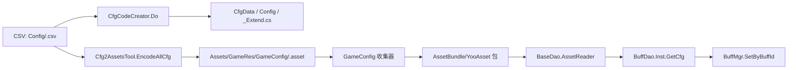

# S06 调查结论：编辑器工具、构建与代码生成

## 结论摘要

旧工程的核心不是一个单独的“打包按钮”，而是由编辑器菜单、资源收集配置、反射式导出处理器、HybridCLR/配置生成器和 YooAsset 适配层共同组成的阶段链。最完整的入口会先生成代码和配置资产，再进入收集/打包，最后执行后置处理；OnlyBuild 则显式跳过生成阶段。[S06-E003][S06-E004][S06-E005][S06-E006][S06-E010]

当前工程已经有更清晰的 BuildConfig → ReleaseTools → YooAsset pipeline 主链，并把热更程序集清单集中到 UpdateSetting，但 Luban、UI 脚本生成和 Roslyn 事件生成仍是独立工具契约；主构建源码没有证据表明会自动调用它们。[S06-E020][S06-E021][S06-E024][S06-E026][S06-E028][S06-E029][S06-E033]

本次最重要的可复刻观察有三条：

1. 必须把“入口参数、阶段顺序、输出物、运行时消费者”作为一个契约检查，而不能只复制某个菜单或某段第三方调用。[S06-E003][S06-E010][S06-E016][S06-E020][S06-E041]
2. 生成代码、生成资产和手写扩展的所有权边界决定后续可维护性；旧配置生成器和当前 UI 生成器都已经提供了部分边界，但当前 Luban/事件生成的实际激活仍需核验。[S06-E012][S06-E027][S06-E030][S06-E034]
3. 旧工程双包/反射/本地 HybridCLR patch 机制包含大量项目与机器耦合；当前工程已改变包模型和程序集清单，不能把旧配置值直接当作当前实现。[S06-E009][S06-E019][S06-E024][S06-E025][S06-E037]

## 证据等级与归属

- 已确认：文件、配置字段、方法体和静态调用在本次读取中存在。
- 推断：由多个已确认节点连接出的设计含义，已在句末标证据，但不升级为运行时实测。
- 待核验：需要 Unity 导入/编译/运行、外部脚本退出结果或完整程序集加载关系才能确认。

“自写框架/适配器”“第三方原始能力”“生成模板/生成工件”“业务调用”在证据索引中单独标注。尤其是 YooAsset 的 pipeline.Run 只能证明调用了第三方构建接口，包名、规则、上传和清理仍由项目代码决定。[S06-E006][S06-E010][S06-E021]

## 一、旧工程：编辑器到资源包的机制

### 1. 入口与阶段顺序

旧工程有两层编辑器入口：AssetBundle 窗口的 Build 操作，以及 YooAsset/一键生成并打包bundle 静态菜单。后者会生成 YooAsset 版本号、调用通用代码生成、调用 CSV→.asset 编码，再调用 AssetBundleBuilder.Build 和复制；窗口的 OnlyBuild 选项则明确不执行代码/配置生成。[S06-E003]

静态链可以还原为：

这里的箭头表示源码调用关系和阶段职责，不表示一次未执行的构建已经成功。完整 `BuildAll` 和 AssetBundle 面板的 `Build` 路径已经在入口处调用一次 `Cfg2AssetsTool.EncodeAllCfg()`，随后 `AssetBundleImporter.Build()` 的 Export 前置处理又调用一次；这是旧链真实存在的重复转表，不应在复刻时误合并或默认假定幂等。`ExportProcessor` 中的 `GenCodeTool.GenCode()` 当前是注释代码，因此重复的是配置资产化，不是通用代码生成。收集器导入阶段会处理映射、过滤和输出列表，底层构建成功后才进入后置处理。[S06-E003][S06-E004][S06-E005][S06-E006][S06-E007]

### 2. 每个阶段的责任与依赖方向

| 阶段 | 责任 | 输入/输出 | 所有权与限制 |
|---|---|---|---|
| 菜单/窗口 | 读取编辑器选择和序列化配置，防止重复点击，决定完整构建或仅构建 | framework_cfg.asset、ab_filter.asset、操作类型；进度条、配置保存 | 自写编辑器层；m_abTime 只是本进程内的防连点保护，不是跨进程锁。[S06-E003] |
| 导入/收集 | 将路径、地址、PackRule、FilterRule 转成 YooAsset 可处理的资产集合和 AB 映射 | AssetBundleCollectorSetting.asset、ab_filter.asset；ab_mapping.asset、output/ab.json、AssetBundleTarget.txt | 自写适配 + YooAsset 配置格式；收集规则本身含业务命名。[S06-E004][S06-E008][S06-E039][S06-E040] |
| 预处理 | 在真正构建前生成/复制热更、配置和 SoData 等前置资产 | Export 处理器、PackageMode；更新工程资产 | 业务导出处理器拥有这些副作用；反射调用未提供统一排序和异常隔离。[S06-E006][S06-E007] |
| YooAsset 构建 | 分别构建 DefaultPackage 与 RawPackage，生成包、清单/版本信息并可上传 | target、输出根、平台、包名、版本、复制策略 | 自写 YooAssetBuildHelper 包装第三方 API；Dual package 不是 YooAsset 默认必然行为。[S06-E009][S06-E010] |
| 收尾/复制/清理 | 写日志、后置回调、刷新资产、还原或清理 StreamingAssets/输出 | LastBuild*、日志、StreamingAssets、AB/AAB 目录 | 清理是定向路径删除；构建失败时后置回调不应被假定会运行。[S06-E005][S06-E010] |

### 3. 包名、路径和命名的隐式契约

旧工程的包输出路径由“默认输出根/平台/包名/YooAssetAbVersion”组成；中间列表、过滤资产和版本配置也各有固定位置。[S06-E038] DefaultPackage 与 RawPackage 采用不同的 Ignore/Pack 规则：DefaultPackage 使用 SilentNormalIgnoreRule 和目录/用户数据语义，RawPackage 则使用 RawFileIgnoreRule、保留扩展名和 AssetGUID。[S06-E008][S06-E009]

包名还依赖项目文件命名。特效会把 e_map、e_ui、hero/troop 等前缀映射到特定 bundle 名；配置按 Common/World/Map 分组；UI .png 和 .bytes 有自己的名称推导；原始文件可能保留扩展名。由此可以确认：复刻旧资源结果时，必须复制规则和输入路径，不能只复制 DefaultPackage 字符串。[S06-E039]

旧磁盘配置的 UseYooAsset 仍为 0，但一键入口会先将其设为 true 并标记资产；同时资产中还保留旧的 dls.*、Assembly-CSharp 清单。这个组合更像一个迁移中/兼容中的状态，实际入口覆盖值优先于静态快照，但不应把它解释为所有入口都一致。[S06-E003][S06-E037]

### 4. 错误、清理和可扩展性

YooAssetBuildHelper 将错误、最后输出目录和版本存入静态状态；配置校验、参数校验、第三方 BuildResult 失败和异常都能转成 false 并写日志。[S06-E010] 但反射扩展的 InvokeMember 外层没有统一 try/catch，业务预处理抛错时可能直接中断主链；因此“helper 有失败状态”不能外推成“所有阶段都有结构化错误结果”。[S06-E006][S06-E007]

扩展点有三种：新增 Export 处理器、新增 YooAsset Pack/Filter/Ignore 规则、扩展 BuildOptions。它们的共同缺陷是依赖隐式发现或字符串/配置名：没有排序就无法稳定表达多个导出处理器的先后；没有规则版本/输入快照就难以复现历史包；Clear 只负责已知输出路径，不负责外部上传和所有临时目录。[S06-E005][S06-E007][S06-E010][S06-E039]

## 二、旧工程：配置和通用代码生成

### 1. CSV→C#→.asset→DAO 的真实链路

旧配置生成有两个相关但不同的步骤。选中 CSV 时，菜单 Assets/创建配置文件代码进入 CfgCodeCreator.Do；构建/一键入口则调用 EncodeAllCfg 将 CSV 解码成 .asset。代码生成按配置名派生 CfgData、配置类、DAO、Decoder，并生成 _Extend 扩展文件；发布分支的资产路径为 `Assets/GameRes/GameConfig/<resName>.asset`。[S06-E011][S06-E012]

配置收集器正好收集 `Assets/GameRes/GameConfig/Common`、`Map`、根目录和 `extra_map`，说明生成资产可以进入包输入。[S06-E040] 运行时 BaseDao 在非编辑器或启用 YooAsset 时选择 AssetReader，通过 FrameworkConfig.GetConfigPath 和 LoadMgr.Inst.LoadAsset<BaseCfgData<TConfig>> 读取；业务 BuffMgr.SetByBuffId 再调用 BuffDao.Inst.GetCfg(id)。[S06-E013][S06-E042]

这是本次确认最完整的旧工程“生成/构建产物→运行时消费者”链。它还带有编辑器/Windows 下 CSV 回退逻辑，不能简单说成所有平台永远只读取 AssetBundle。[S06-E011][S06-E013]

### 2. 生成与手写的边界

CfgCodeCreator 的边界是：定义文件和数据/DAO骨架可重建，`<Config>_Extend` 已存在时跳过；模板生成失败、目录创建失败和写文件失败主要通过日志反馈。[S06-E012] 这意味着业务扩展依赖 partial/扩展文件稳定命名，命名或目录变化会成为编译和运行时资产路径的破坏性变更。

旧通用 GenCodeTool 采用另一种协议：反射查找 IGG.Framework.ICodeGenerator，实例必须有无参构造、Get 和 WriteCode；Get 返回业务对象列表，工具按每 1000 项切割方法，最后生成 #if !UNITY_EDITOR 的类。[S06-E014] 该协议的责任分层是“provider 决定数据和单项代码，框架负责聚合、切分、落盘”；但已找到的 UIBind provider 是注释示例，CmdMethodProvider 也主动注释掉接口并改用反射，因而当前是否有实际 provider 仍待核验。[S06-E015]

### 3. 旧 UI/协议生成的特别风险

旧 UI 生成工具依赖 FairyGUI、程序集反射和 UI 类型命名；同时部分旧菜单/示例已标注“移入 ICodeGenerator”或被注释。这里可以确认技术方向和协议，但不能从菜单入口推断当前产物一定存在。复刻时需要把“脚本生成器定义”“可执行 provider”“最终生成文件”三层分开验收。[S06-E014][S06-E015]

## 三、旧工程：命令行、程序集与热更构建

### 1. 输入→Unity→结果

旧自动化工具的输入契约是 JSON 字典：BatchMode 下 JSON 经 UTF-8/Base64 作为 -executeParams，编辑器模式落到 output/unity_params.json；运行前会删除 output/unity_result.json，结束后根据进程结果和结果 JSON/日志判断成功。[S06-E016][S06-E017]

CommandHelper.InitFromCommandLine 还会将命令行版本、修订号、包模式等写回 FrameworkConfig/YooAssetConfig。因此它不是只读参数解析器，而是“参数→工程资产配置”的变更入口；在复刻时必须明确哪些字段可以持久化、哪些只应留在一次构建上下文中。[S06-E016]

### 2. HybridCLR 的责任边界

旧 MakeInterface.BuildProject/BuildHotUpdate 先关闭 Cache Server、检查或安装本地 HybridCLR，再调用完整项目导出/热更导出。安装源固定在工程内的 HybridCLRData/il2cpp_plus_repo/libil2cpp，缺少 hybridclr 子目录会抛错；Generate/Export 出错会记录并重新抛出。[S06-E018]

另有 HybridCLRPatchSync 负责把 SVN 管理的 patch 源按 marker 同步到本地 IL2CPP 副本，提供 Editor delayCall、菜单和 BuildPlayer 前最后回调三层触发。[S06-E019] 这是自写的源管理适配器；它拥有 patch 清单和 marker，却没有删除目标中多余文件的清理职责，不能被当作通用 HybridCLR 生命周期保证。

## 四、当前工程：已经形成的主链与断点

### 1. 当前构建主链

当前菜单以 BuildConfig 为输入；BuildWithConfig 可先编译/复制热更 DLL，再刷新 AssetDatabase，运行 YooAsset pipeline，可选处理最小包，最后可选 BuildPlayer。[S06-E020] BuildInternalWithConfig 将输出根归一化、内置文件根指向 StreamingAssets，并把 PackageName 固定写成 DefaultPackage 后调用 pipeline.Run。[S06-E021]

它与旧工程的差异不是“旧逻辑换了类名”：

- 当前主链没有静态调用旧 GenCodeTool、Cfg2AssetsTool 或 LubanTools，所以转表不能被默认视为构建前置阶段。[S06-E020][S06-E026][S06-E028]
- 当前窗口配置来自机器级 EditorPrefs（TEngine_BP_*），不是团队共享的构建资产；CLI、窗口和菜单可能使用不同默认值。[S06-E022]
- 当前 BuildInternalWithConfig 是参数化入口，但兼容 CLI 的 BuildInternal 还有默认版本 1.0；CLI 入口读取 packageVersion 后没有传给该参数。[S06-E021][S06-E036]
- 当前收集器 DefaultPackage 主要收集 Assets/AssetRaw 下的 DLL、Configs、UI 等目录；旧工程独立 RawPackage 的 IncludeAssetGUID/保留扩展名语义没有直接对应物。[S06-E009][S06-E025]
- BuildConfig 的目标平台没有完整贯穿热更前置：BuildWithConfig 调用无参 `BuildDLLCommand.BuildAndCopyDlls()`，该方法及其复制方法读取 `EditorUserBuildSettings.activeBuildTarget`，而 YooAsset 使用 `config.BuildTarget`；窗口允许保存的目标与当前 active target 不一致时，DLL 产物可能与资源包目标错位。[S06-E020][S06-E022][S06-E023]
- BuildWithConfig 返回 `void`，AssetBundle 失败时只记录错误并提前返回；BuildPipelineWindow 调用后仍无条件追加“构建完成”，当前调用方没有结构化成功/失败结果。[S06-E020][S06-E022]

当前资源运行时消费者是可回查的：ProcedureInitPackage 以 DefaultPackageName 初始化包，ResourceModule.Initialize 创建/设置默认 YooAssets 包，资源加载走默认或指定包；失败提示直接写出 StreamingAssets/package/DefaultPackage/PackageManifest_DefaultPackage.version 的内置清单路径。[S06-E041] 因而“当前构建固定 DefaultPackage”与“当前运行时默认包固定 DefaultPackage”是相互匹配的已确认事实，但不代表 Other/Dlc 包已经有完整运行时路由。[S06-E025][S06-E041]

### 2. 当前程序集/热更链

UpdateSetting 记录带 .dll 的 HotUpdateAssemblies 和 AOT 元数据清单；编辑器修改时剥离扩展名同步到 HybridCLRSettings。构建前的 BuildDLLCommand 编译后把 AOT/热更 DLL 复制到 Assets/AssetRaw/DLL，并附加 .bytes。[S06-E023][S06-E024]

运行时 ProcedureLoadAssembly 默认把 `GameProto.dll`、`GameLogic.dll` 等程序集名作为资源地址加载；只有关闭 `_enableAddressable` 时才拼接 `Assets/AssetRaw/DLL/*.dll.bytes` 物理路径。当前 `AddressByFileName` 会把 `GameLogic.dll.bytes` 映射为 `GameLogic.dll`，因此是“物理复制路径→资源地址→运行时加载”的映射链，而不是直接按同一物理路径读取；AOT metadata 也走同样的地址/路径分支。[S06-E023][S06-E024][S06-E043]

但失败语义不统一：AOT 源文件不存在时记录错误并继续，热更 DLL 复制没有 File.Exists 防护，可能由 File.Copy 直接抛异常。这个观察只说明静态错误路径，不等于已在运行中复现。[S06-E023]

### 3. 当前 Luban 配置生成链

当前转表是外置工具链：菜单拼接 Configs/GameConfig/gen_code_bin_to_project_lazyload.bat/.sh 并启动进程；脚本再读取 luban.conf、复制 ConfigSystem.cs/ExternalTypeUtil.cs，调用 Luban cs-bin，将 C# 写到 GameProto/GameConfig、二进制写到 AssetRaw/Configs/bytes。[S06-E026][S06-E028]

模板定义了预期运行时消费者：ConfigSystem 延迟创建 Tables，通过 TEngine IResourceModule 把 TextAsset 转 ByteBuf；每个表第一次访问时以 output_data_file 定位并 ResolveRef。[S06-E027] 但本次工作树没有这些目标目录或生成 C#，也未执行脚本；所以当前能确认的是工具契约和模板，不是生成结果已可编译或运行。[S06-E026][S06-E027][S06-E028]

相比旧 CSV→.asset 链，当前配置代码生成的差异是：输出主类型是 Luban 生成的 GameProto C# + bytes，运行时依赖资源模块按文件名取二进制；旧链则是 C# DAO/Decoder + Unity .asset + BaseDao/LoadMgr。这是迁移边界，不能用旧 FrameworkConfig.ConfigRoot 直接推导当前 Luban 的资源 location。[S06-E011][S06-E013][S06-E026][S06-E027]

### 4. 当前 UI 与事件生成链

UI 生成器通过 ScriptGeneratorSetting 管理绑定路径、实现路径、命名空间和前缀规则；自动模式生成 `<name>_Gen.g.cs` 并设为只读，再生成 partial 实现文件时遇到已存在文件会跳过。[S06-E029][S06-E030] UI runtime 的创建顺序把 ScriptGenerator、属性绑定和事件注册放在 OnCreate 之前，销毁时先移除事件和子项，因此生成代码会参与明确的 runtime 生命周期。[S06-E031]

当前 BattleMainUI 仍是业务文件内嵌“脚本工具生成的代码”区域，文件名不符合自动模式的 _Gen.g.cs 约定；这说明工作树至少存在混合所有权形态，不能把现有文件直接归为自动生成物。[S06-E032]

事件生成器的源代码扫描 EventInterface 接口，使用 Roslyn AddSource 生成事件 ID、接口包装器、GameEventHelper 和 EventCenter；ILoginUI 使用标记，GameApp.Entrance 调用 GameEventHelper.Init。[S06-E033][S06-E035] 当前工作树保存了标记为 RoslynAnalyzer 的 DLL，但 .meta Editor 启用字段为 0，且生成 .g.cs 不落盘；因此“工具源码/工件存在”和“Unity 当前编译实际启用”必须分开记录。[S06-E034][S06-E035]

## 五、两条端到端静态链路

### 链路 A：旧配置生成/打包到业务 DAO

1. 入口：YooAsset/一键生成并打包bundle。
2. 处理：菜单先调用 Cfg2AssetsTool.EncodeAllCfg，读取 CSV 并按 decoder 解码；发布路径写到 `Assets/GameRes/GameConfig/<resName>.asset`。[S06-E003][S06-E011]
3. 构建：GameConfig 目录被 DefaultPackage 的收集器纳入，之后进入 AssetBundle/YooAsset 构建。[S06-E040][S06-E010]
4. 运行时消费：BaseDao.AssetReader 按同一配置根定位并用 LoadMgr 取 BaseCfgData<TConfig>；业务 BuffMgr 通过 BuffDao.Inst.GetCfg(id) 使用结果。[S06-E013][S06-E042]

确认边界：源码证明了入口、调用、路径和消费者；没有执行构建，所以没有声称包文件实际生成成功。

### 链路 B：当前构建到 DefaultPackage/热更加载

1. 入口：TEngine/Build/一键打包AssetBundle 或 ReleaseTools.BuildWithConfig。
2. 处理：默认配置可先调用 BuildDLLCommand.BuildAndCopyDlls；DLL/AOT 资产写入 AssetRaw/DLL，AssetDatabase 刷新后进入 YooAsset pipeline。[S06-E020][S06-E023]
3. 构建产物：BuildInternalWithConfig 使用配置输出根、StreamingAssets 内置根、DefaultPackage 和 PackageVersion 调用 pipeline.Run；当前收集器有 DLL/Configs/UI 等 AssetRaw 组。[S06-E021][S06-E025]
4. 运行时消费：ProcedureInitPackage 初始化 DefaultPackage；ResourceModule 建立默认包并加载资源；ProcedureLoadAssembly 通过程序集名资源地址读取由 `Assets/AssetRaw/DLL/<dll>.bytes` 提供的热更程序集，随后热更入口 GameApp 使用事件 Helper 并进入 UI。[S06-E041][S06-E023][S06-E024][S06-E035][S06-E043]

确认边界：这条链的调用和命名契约均来自源码；没有执行 Player/资源初始化，Other/Dlc 包的 runtime route 仍未知。

## 六、给后续复刻的原则性结论

- 复刻对象应是“阶段图 + 输入/输出 manifest + runtime consumer”，而不是旧菜单的表面名称。[S06-E003][S06-E010][S06-E041]
- 生成文件必须声明所有权：可覆盖的 generated、不可覆盖的 hand-written extension、Roslyn 不落盘的 generated source 需要分别处理。[S06-E012][S06-E030][S06-E033]
- 包名、版本、资源根和程序集清单应从一个构建上下文传递到收集器和运行时；当前 DefaultPackage 固定、旧双包和 CLI 版本缺口说明这是高风险交界。[S06-E009][S06-E021][S06-E024][S06-E036]
- 外部工具必须返回可判定结果，不能只启动进程并把 stdout/stderr 异步打到 Unity 日志；当前 Luban bridge 与旧 Python unity_result.json 形成明显契约对照。[S06-E017][S06-E028]
- 失败与清理必须显式分层：构建失败、前置生成失败、复制源缺失、输出清理和上传失败不能都压缩成一个 Debug.Log。[S06-E005][S06-E010][S06-E018][S06-E023]
