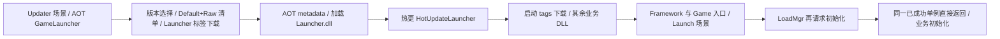
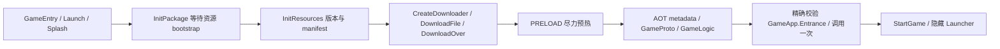

# 两步热更新策略比较与 master 复核

日期：2026-09-09。输入为用户确认完成的 [参考报告](reference-analysis.md) 与 [当前报告](current-analysis.md)。本轮只作静态复核与规划，未修改两份原报告，未运行 Unity、构建、下载或真机测试。

## 1. 结论

**两者不一致，区别在更新器的执行边界。** ProjectOld 先在 AOT 层加载 Launcher.dll，再在热更 Launcher 内组织下一段资源下载和业务 DLL 加载；当前 TEngine 的更新 Procedure 属于主包 Assembly-CSharp，先完成资源更新，再加载 GameProto/GameLogic。

- 若关注第二阶段更新策略、交互和编排能否随补丁修复，参考方案更灵活。但其版本发现、YooAssetMgr、下载底层仍在 AOT，不能宣称整个更新系统都可热更。
- 若关注已经写入代码的启动终态、入口验证、资源归还、退出协调，当前工作区更适合做迁移基础。该判断来自控制流，不代表已经通过真 Player 可靠性验证。
- 若只是让游戏业务 DLL 更新，当前架构已有这项能力，不必为“两步”重构；应先补齐实际启用配置和产物。
- 针对本次希望获得可热更更新器的目标，推荐 **局部移植：新增 GameUpdater 热更程序集，保留单 DefaultPackage，拆分启动 Bundle，保留现有主包 Launcher 和业务入口**。不整体搬运参考工程。

没有下载量、耗时或故障率实测，不能判定两阶段一定更快、更省流量。首版收益是第二阶段可修复性，代价是额外的程序集边界、启动产物及版本验证。

## 2. 输入快照与报告纠偏

复核参考报告记录的 18 个文件完整 SHA256，以及当前报告 30 个文件的 SHA256 前 16 位：**48/48 与当前磁盘一致**。当前 HEAD 为 `e724c132278c1334e41d88f83ad7dbfd94f2be64`，仍含用户已有未提交修改。快照一致只能证明文件未漂移，不能证明报告推理正确。

以下纠偏优先于两份原报告中的相关表述：

| 项目 | master 裁定及依据 |
|---|---|
| 参考报告“正常冷启动还有第三轮全量更新” | LoadMgr 确实再次调用 StartLaunchAsync()，但不能由调用点推出实际下载。YooAssetLauncher 是 DontDestroyOnLoad 单例，第一阶段成功后设 IsLaunchCompleted/IsLaunchSuccess；后续调用在 133–137 行直接返回。正常成功主链仍是两段。只有对象被重建、原阶段失败等条件下才可能重走；具体重启行为未运行验证。[单例与短路](D:/Work/SAUnity/ProjectOld/Assets/Scripts/framework/Library/ZeroFramework/YooAsset/YooAssetLauncher.cs:124)、[成功标志](D:/Work/SAUnity/ProjectOld/Assets/Scripts/framework/Library/ZeroFramework/YooAsset/YooAssetLauncher.cs:699)、[LoadMgr 调用](D:/Work/SAUnity/ProjectOld/Assets/Scripts/framework/Library/ZeroFramework/Load/LoadMgr.cs:225) |
| 参考报告“第一阶段 metadata 不依赖 CDN” | 只能在目标 manifest 所需文件确实内置/缓存时成立。metadata/hotUpdate.txt 属于 Game 标签，Launcher 标签本身不构成完整闭包；新 manifest 可能要求新文件，且 WebGL 导出可删除 catalog 以外全部内置文件。不能把首包收集配置当成所有更新版本的离线保证。[WebGL 清理](D:/Work/SAUnity/ProjectOld/Assets/Scripts/framework/Editor/AssetBundle/YooAssetBuildHelper.cs:280)、[导出调用](D:/Work/SAUnity/ProjectOld/Assets/Scripts/framework/Editor/Export/ExportProject.cs:1205) |
| 当前报告表格把全部 Procedure 归入 Launcher | 错误。Procedure 在 Assets/GameScripts/Procedure，路径及上级无 asmdef/asmref，属于 Assembly-CSharp；Launcher.asmdef 只覆盖 Assets/Launcher 子树。Assets/Editor 也不能算进 Player 的 Assembly-CSharp。[Procedure](E:/MyWork/MyFramework/TEngine/UnityProject/Assets/GameScripts/Procedure/ProcedureBase.cs:1)、[Launcher asmdef](E:/MyWork/MyFramework/TEngine/UnityProject/Assets/Launcher/Launcher.asmdef:1) |
| 当前报告“缺宏即业务一定全部 AOT 打入 Player” | 只能确认运行时选择 CollectAlreadyLoadedAssemblies。HybridCLRSettings.enable=1 与项目宏缺失是配置不一致；插件构建剔除/编译结果未经验证，不能保证业务程序集存在，更不能保证可启动。[运行分支](E:/MyWork/MyFramework/TEngine/UnityProject/Assets/GameScripts/Procedure/ProcedureLoadAssembly.cs:127)、[项目插件配置](E:/MyWork/MyFramework/TEngine/UnityProject/ProjectSettings/HybridCLRSettings.asset:15) |
| 当前报告“HybridCLRData 不存在证明 Installer 未执行” | 目录缺失只证明此工作区缺少该目录/产物，不能断言机器工具链从未安装。应单独检查工具链及实际构建产物。无宏、离线序列化配置仍足以判定当前快照不能直接作为已启用线上热更的证据。 |
| 当前报告称下载器接缝为 DownloadByTags | 本地 YooAsset 2.3.17 实际 API 为 ResourcePackage.CreateResourceDownloader(string[] tags, int downloadingMaxNumber, int failedTryAgain)；当前 ResourceModule 只封装整包版本。[实际重载](E:/MyWork/MyFramework/TEngine/UnityProject/Packages/YooAsset/Runtime/ResourcePackage/ResourcePackage.cs:996) |
| 当前报告建议更新器通过 SetRemoteServicesUrl 即时改 CDN | 方法存在，但只改模块字符串；初始化时创建的 RemoteServices 将 URL 存为 readonly。已初始化文件系统不会因改字符串自动换地址，初始化参数还参与冲突检查。迁移中应在 InitPackage 前固定地址。[属性更新](E:/MyWork/MyFramework/TEngine/UnityProject/Assets/TEngine/Runtime/Module/ResourceModule/ResourceModule.cs:788)、[初始化快照](E:/MyWork/MyFramework/TEngine/UnityProject/Assets/TEngine/Runtime/Module/ResourceModule/ResourceModule.cs:669)、[readonly 服务](E:/MyWork/MyFramework/TEngine/UnityProject/Assets/TEngine/Runtime/Module/ResourceModule/ResourceModule.Services.cs:14) |
| 当前报告默认版本格式为 yyyy-MM-dd-HHmm | 实际为日期加“当天总分钟数”，同一分钟可重复；不是唯一发布 ID 的充分来源。[版本生成](E:/MyWork/MyFramework/TEngine/UnityProject/Assets/TEngine/Editor/ReleaseTools/BuildConfig.cs:50) |

这些修正不要求 slave 重做整份调查；后续实施以本复核、计划和实时源码为准。

## 3. 两条实际主链

参考工程正常成功冷启动：

非 WebGL 的阶段二标签为 PreDownload、Launcher、Game、wwise；WebGL 为 PreDownload。ResolveLaunchTags 读取动态配置的函数存在，但实际这条下载路径使用硬编码数组。[下载实现](D:/Work/SAUnity/ProjectOld/Assets/Scripts/HotUpdate/Launcher/HotUpdateLauncher.cs:308)

当前 TEngine 的 Host、非边玩边下路径：

Offline/EditorSimulate 跳过线上版本与整包下载；WebPlay/边玩边下跳过整包下载，走预热及按需加载。当前 PRELOAD 标签配置未实际使用；即使未来配置启用，现有 PRELOAD 是尽力而为，不能当成“所有必需业务资源验证通过”的闸门。[预热终态](E:/MyWork/MyFramework/TEngine/UnityProject/Assets/GameScripts/Procedure/ProcedurePreload.cs:73)

## 4. 对照表

| 维度 | ProjectOld | 当前 TEngine | 迁移判断 |
|---|---|---|---|
| 实际配置 | 有 Host/Web、双包与平台条件，依赖各构建选项及外部环境 | prefab playMode=0 在 Player 回退 Offline；无 ENABLE_HYBRIDCLR，当前产物不齐 | 先明确可出包基线，不能将支持能力等同已上线 |
| 更新代码边界 | Launcher 内的第二段可热更；YooAssetMgr/版本与下载服务仍 AOT | Procedure/Launcher UI/ResourceModule 都是主包；仅 GameProto/GameLogic 为配置热更业务 | 新增独立 GameUpdater；主包保留稳定底层 |
| 包结构 | DefaultPackage + RawPackage；DLL 随平台走不同包 | 运行链使用 DefaultPackage，另有未使用空包 | 首版保持单包，无 RawFile 需求不引入双包 |
| Bundle 粒度 | 启动器单独标签；metadata 等依赖不全在同一标签闭包 | AssetRaw/DLL 使用 PackDirectory 且无标签 | 独立 Bootstrap 目录/collector，验证真实 Bundle 闭包 |
| 版本一致性 | 正常两包使用 RuntimeHotVersion；退路独立查两包版本，一致性检查被注释 | 单包按一次版本查询更新 manifest，缺业务级 release/兼容证明 | 固定一个 release；两个阶段禁止刷新 latest 或切 manifest |
| 启动数据量 | 标签支持分段，但不能由标签名推定字节数与首包完整性 | Host 默认等待全包，Web/边玩边下另走按需 | 首版第二段保持整包下载，无速度收益承诺 |
| 失败终态 | 部分 metadata/DLL 失败跳过、异常直接尝试进游戏 | 包和程序集 attempt、精确入口及失败终态更严格；资源下载仍有非成功静默返回风险 | 保留严格终态，补足新阶段所有退出路径 |
| 重试与回退 | 阶段二可切旧 manifest，但 Launcher 已在内存，有版本混用风险 | DLL 失败提示退出；Optional 仅写版本变量，没有完成旧 manifest/资源一致性证明 | 同版本资源可重试；不可逆装载后只退出/重启，不切旧资源 |
| 强更含义 | 应用最低版本强更在登录链；资源更新容许降级 | UpdateStyle.Force 是资源更新禁止跳过 | 应用升级与资源强更分开；首版仅迁移 Host Force |
| 成功记录 | 阶段二 tags 完成就写“最后成功”，早于其余 DLL/业务入口 | GAME_VERSION 可在 manifest/下载完成前覆盖，DownloadOver 也早于入口 | 新模式入口成功后记检查点；不采信旧键作为成功依据 |
| 缓存/离线 | Recover 可依赖 CDN；清理只覆盖 Default 的入口不代表所有缓存保留 | 清缓存流程被 false 字段禁用；资源卸载与磁盘缓存是不同概念 | 首版无自动离线回滚；禁用破坏历史候选的自动清缓存 |
| 取消/退出 | CancelDownload 只改状态/发事件，不能证明底层中止 | 有全局关闭门、attempt 代际及资源 owner 收尾 | 保留统一 Shutdown，取消等待不等于物理 IO 已停 |
| 构建/发布 | 双包、平台切换、标签首包、版本指针及 SDK 耦合复杂 | 已有分阶段结果、缺产物失败、目标一致性校验；未形成线上发布闭环 | 扩展当前构建器，不照搬旧上传脚本 |
| 验证成熟度 | 本轮无 Player 结果 | 本轮无 Player 结果，已有测试源码不代表已通过 | 正式启用以真实 IL2CPP 两版本验证为门槛 |

关键风险依据：[旧版成功记录及回退](D:/Work/SAUnity/ProjectOld/Assets/Scripts/HotUpdate/Launcher/HotUpdateLauncher.cs:325)、[旧版异常进游戏](D:/Work/SAUnity/ProjectOld/Assets/Scripts/HotUpdate/Launcher/HotUpdateLauncher.cs:94)、[双包退路](D:/Work/SAUnity/ProjectOld/Assets/Scripts/framework/Library/ZeroFramework/YooAsset/Services/YooAssetUpdateService.cs:143)、[无效取消](D:/Work/SAUnity/ProjectOld/Assets/Scripts/framework/Library/ZeroFramework/YooAsset/Services/YooAssetUpdateService.cs:435)、[当前过早版本写入](E:/MyWork/MyFramework/TEngine/UnityProject/Assets/GameScripts/Procedure/ProcedureInitResources.cs:108)、[入口成功提交](E:/MyWork/MyFramework/TEngine/UnityProject/Assets/GameScripts/Procedure/ProcedureLoadAssembly.cs:385)。

## 5. 移植、保留、拒绝与延后

| 分类 | 内容 |
|---|---|
| 移植 | 独立热更更新器；阶段一必需资源闭包；单次版本选择；发布产物先完整可用、最后切指针；故障注入测试思路 |
| 保留 | 当前主包 Launcher、GameProto/GameLogic 和 Entrance ABI；DefaultPackage；ResourceModule 资源所有权；bootstrap/attempt/统一 Shutdown；现有构建失败传播 |
| 拒绝照搬 | 失败吞掉后进游戏；已加载新 Launcher 后切旧资源；下载部分 tags 就标记整个启动成功；无效 CancelDownload；dls.*、MgrCenter、旧场景、SDK、上传路径；假设运行中改 URL 属性即生效 |
| 延后 | WebGL/微信专项两阶段、Optional 离线历史回退、动态资源组和后台下载、RawPackage/PAD/Wwise、自动多版本缓存淘汰、热更 UI 资源、自动上传/灰度服务 |

最终设计及批次见 [移植计划](migration-plan.md)。历史报告提出的“简单 DLL 加密”不纳入本次移植；加密与程序来源真实性、版本兼容性是不同问题。

## 6. 尚需实施阶段闭合的事项

目标 Player 平台和实际工具链以 P0 本地记录为准；未指定时选已有可用 IL2CPP 目标验证，不自动安装工具链。尚无线上渠道证据，计划按“新旧基础 Player 通道需要可隔离”设计，部署配置稍后确定。基础 Player/AOT 产物来源、最小 Bootstrap Bundle 的真实大小、现有生命周期测试的当前运行结果均未由此次静态调查证明。

