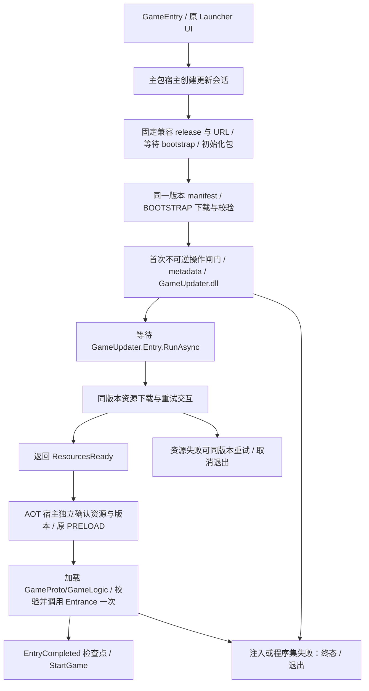

# ProjectOld → TEngine：可热更更新器移植计划

日期：2026-09-09。状态：**规划完成，尚未实施**。输入及主审纠偏见 [比较文档](comparison.md)。用户只授权本轮文档和手动交接，不自动创建代理、实现或发布。

当前基线为 HEAD `e724c132278c1334e41d88f83ad7dbfd94f2be64` 加用户已有工作区修改。两份调查中 48 个记录快照复核一致；参考报告“固定第三次全量下载”等误读已在比较文档纠正，本计划不以其为迁移理由。

## 1. 目标与范围决定

把参考工程“先加载更新器 DLL，再执行第二阶段”的机制移入当前框架；使第二阶段的下载提示、重试交互、进度呈现及组织逻辑能够随 GameUpdater.dll 更新。版本发现、资源底层、metadata 注入、程序集装载及最低限度错误处理保留 AOT，避免把整个框架热更化。

首版明确限定：
- 新增默认关闭的两阶段模式，支持 **HostPlayMode + UpdateStyle.Force + 非边玩边下** 的运行切片，以及仅用于逻辑验证的 EditorSimulate。
- 原模式关闭该功能时保持现有模式选择及接口兼容。新模式不支持的 Offline/Optional/WebPlay/边玩边下组合由预检明确拒绝；不能悄悄忽略开关或声称这些组合已验收。
- 保持单 DefaultPackage；阶段一只下载完整 BOOTSTRAP 闭包，阶段二下载同版本全包剩余内容。业务 PRELOAD 沿用尽力预热，不扩大为必需业务 ready。
- 单独新增热更程序集 GameUpdater，保留已有 AOT Launcher 和 UI。GameUpdater 不引用 GameProto/GameLogic/Assembly-CSharp。
- 游戏业务 DLL、UI 业务实现、事件体系、场景和整体模块框架不迁移。独立热更 UI、动态分组下载和参考工程双包能力另批处理。

这是有意控制范围的首版，不是把未支持的回退路径留给 slave 临时猜测。首版全部交付并验收后，才规划扩展模式。

## 2. 目标启动与所有权

Assembly-CSharp 的主包 Procedure 拥有会话、attempt、阶段切换及最终启动闸门；TEngine.Runtime 拥有资源和稳定接口；GameUpdater 只执行一次可等待的第二阶段任务。资源系统的 Initialize/Shutdown 全局所有权仍属于现有模块，更新器不得直接 YooAssets.Destroy 或重建框架。

**初始化顺序细节**：ResourceModuleDriver 的 bootstrap 可以先创建资源模块/空包；阶段宿主必须在真正 InitPackage、构造 RemoteServices 之前完成两阶段 URL 的固定。不能通过初始化后 SetRemoteServicesUrl 改两个字符串来冒充有效换 CDN。

## 3. 冻结接口与配置

下列名称是本计划新增设计，并非现有 API：

| 契约 | 决定 |
|---|---|
| EnableTwoStageUpdate | 默认 false；发布配置显式开启；开启而缺宏/缺配置/模式不兼容是明确错误 |
| BootstrapAssemblyName | 新模式固定为 GameUpdater.dll；旧配置为空时保持原语义 |
| HotUpdateAssemblies | 仍为所有热更程序集的权威名单；新配置包含 GameUpdater/GameProto/GameLogic |
| Business assembly selection | 从总名单排除明确的 BootstrapAssemblyName，业务加载及 GameApp 的 List<Assembly> 只含 GameProto/GameLogic；编辑器同步和构建不得把 updater 漏掉或重复加载 |
| BootstrapTextAssetPath | 新目录 AssetRaw/Bootstrap/DLL；业务 AssemblyTextAssetPath 保持 AssetRaw/DLL；新模式 metadata 从 Bootstrap 地址加载 |
| UpdateSessionContext | Runtime 公共只读类型：SessionId、ContractVersion、BasePlayerId、Platform、Channel、PackageName、PackageVersion、ReleaseId、manifest 摘要及 CancellationToken |
| IUpdateHost | Runtime 窄接口：资源操作/下载结果、进度与交互、会话有效性；宿主注入已有 IResourceModule 能力，不创建新的全局模块查找器 |
| UpdateStageResult | Runtime 公共结果：ResourcesReady/Failed/Cancelled；含 SessionId/ReleaseId/错误原因；空值、错会话、未知结果均失败 |
| 更新器入口 | 唯一 public static UniTask<UpdateStageResult> GameUpdater.Entry.RunAsync(UpdateSessionContext context, IUpdateHost host) |

反射调用前校验精确签名，等待返回任务并展开异常。GameUpdater 不得直接 ChangeState 到主包 Procedure，也不能调用 GameApp；宿主保持阶段控制。只提供必要宿主能力，避免以接口搬运一整个新服务框架。

现有 StartupAttempt/StartupEntryContract 为 Assembly-CSharp internal，首版仍由 AOT 宿主持有；热更层使用传入 token 和会话检查，不反向引用内部类型，不为此开放 Assembly-CSharp friend 给热更程序集。

原业务 ABI 不变：`public static void GameApp.Entrance(object[] objects)`，`objects[0]` 为业务 `List<Assembly>`；反射 Invoke 保持外层 arguments 包装。GameUpdater 不混入该列表。Entrance 同步正常返回才进入 StartGame；其内部异步 UI/业务仍不在成功定义内。

## 4. 版本、兼容性及发布数据

### 4.1 固定 release

新模式从配置的受信任地址读取一个 release descriptor；首版直接使用一份版本化 schema 的描述文件，不建通用发布服务。至少包含：
- schema/ContractVersion、ReleaseId、PackageVersion、PackageName；
- Platform、Channel、BasePlayerId；
- manifest 标识与摘要；
- updater/业务 DLL 的名称、资源地址、摘要；
- 必需 AOT metadata 的名称及摘要。

主包拒绝空/重复程序集、非法版本路径、错误平台/包名/兼容 ID、未知必需协议版本、缺失摘要和主程序集。远端数据不能引导任意本地路径写入或换到任意主机；生产配置使用 HTTPS，开发本地 HTTP 只在显式测试配置允许。文件 hash 用于产物一致性，不冒称数字签名。

选择完成后，PackageVersion、descriptor、manifest 和 CDN 服务地址在整个会话不可变。阶段二禁止重新查询 latest、更换 manifest 或改变 URL；主包在 ResourcesReady 及入口提交前再核对会话和实际包版本。

### 4.2 基础 Player 与 AOT

需要新基础安装包：当前已发布 Player 不认识 GameUpdater/宿主契约，不能只更新 GameLogic 实现这个边界。

BasePlayerId 是构建期生成并写入基础 Player 的兼容标识，对应真实稳定 AOT ABI/裁剪产物。每个 release 明确匹配一个基础 ID；“应用显示版本相同”不足以证明兼容。最终 Player 的实际 AOT strip 摘要必须与 release 中 metadata 来源匹配；不能只比较热更前某次旧 Player 目录的 DLL。首次出包可先产 strip 再构建资源，最终 Player 如果改变 strip，必须重新生成匹配产物并复核，不能继续发布不一致的包。

新旧基础 Player 按平台/渠道/BasePlayerId 使用不同发布根，保留原 Player 地址与旧包格式。首版不为现有老包更改 CDN 规则，也不在原版本目录覆盖新内容。版本字符串不能仅靠当天分钟数保证唯一；构建/发布清单拒绝同 ReleaseId 对应不同摘要。

## 5. 资源布局与装载

- 新源码目录：Assets/GameScripts/HotFix/GameUpdater/，独立 asmdef，只依赖稳定 AOT/UniTask 等基础依赖。
- 新产物目录：Assets/AssetRaw/Bootstrap/DLL/，包含 GameUpdater.dll.bytes 及新模式所需 metadata；独立 BOOTSTRAP collector，业务 DLL 留在原目录。使用文件名地址时维持名称唯一。
- 现有 AssetRaw/DLL 为 PackDirectory。不能把 updater 直接加入该目录，仅加标签；必须通过独立目录/collector 使两组进入不同 Bundle。构建报告必须验证 updater Bundle 不捆绑业务 DLL。
- DLL 复制名单、metadata 地址、运行时加载及 UpdateSettingEditor→HybridCLRSettings 同步来自同一配置分类。避免旧同步器只写业务名单，导致 updater 没编译；也避免旧 metadata 留在两目录重复寻址。
- 只处理本构建配置拥有的产物目录；迁移/删除遗留 bytes 前形成精确清单，不能清理用户无关资源。新增脚本、asmdef、资源目录按 Unity 要求保留 meta。
- BOOTSTRAP 依赖闭包包括协议读取后的加载依赖、全部需要的 metadata 和更新器；不能把 metadata 混在第二阶段再靠隐性按需下载才能启动 updater。以报告/manifest 验证闭包及实际下载量，不凭标签名断言。
- IResourceModule 增加不冲突的方法名，例如 CreateResourceDownloaderByTags(string[] tags, string packageName = "")；保留现有整包方法，内部使用本地 ResourcePackage.CreateResourceDownloader(tags, max, retry)。
- 一阶段一个 downloader owner；回调绑定/解绑与任务终态归属同一 attempt，不能让两个阶段竞争 ResourceModule.Downloader 的遗留引用。
- 建立本会话已注入 metadata/已装载程序集记录。阶段一注入所需 metadata 后，业务装载复用成功记录，不二次注入；每个程序集在本会话只加载一次并核对 identity。已有程序集仅在 EditorSimulate 的明确分支复用。
- ResourcesReady 不能只相信更新器返回；宿主检查实际 manifest/会话匹配，确认 Host 全包无待下载必需文件。PRELOAD 保持旧有尽力预热，失败不应被重新解释成所有内容缺失。

## 6. 失败、成功与缓存契约

### 6.1 不可逆边界

在首次 RuntimeApi metadata 注入或 Assembly.Load **之前**置不可逆闸门，因为调用抛错也可能已有部分副作用。两阶段不是同进程 DLL 替换；任何新版本选择只发生在下一独立进程。

| 失败 | 首版行为 |
|---|---|
| descriptor/版本/manifest/Bootstrap 下载失败，尚未注入 | 明确错误，可重试准备阶段或退出；开始新 attempt 前处理旧操作/回调，不并发重复 InitializeAsync |
| 更新器已加载、第二阶段资源失败 | 仅同一固定 release 的资源重试或退出；不重载更新器、不换旧 manifest |
| metadata/DLL/identity/入口契约错误、更新器抛异常、GameApp.Entrance 抛异常 | 单次失败终态；不进入 StartGame；提示退出并重新启动应用 |
| 用户退出、流程离开、超时 | 取消等待及可协作操作，旧结果不得弹新 UI/切状态/登记资源；晚完成只收尾 |
| 下载任务非成功但未触发错误回调 | await 结果仍必须产生 Failed/Cancelled 终态，不能静默停住 |
| 同步 Assembly.Load/Entrance 阻塞 | 不能被异步超时抢占；如实记录限制，不宣称可强制回滚 |

准备/装载异步阶段采用现有可配置的 60 秒非缩放超时；网络下载使用传输/无进度超时，不能给整个大型下载或用户交互套 60 秒总时限。下载重试按钮合并重复点击，成功/失败/取消只能提交一次。

### 6.2 成功记录

新模式不用 GAME_VERSION 作为成功证明，也不在取得版本、下载一部分、DownloadOver 时写可信成功记录。只在必需资源确认、metadata/DLL 成功、Entrance 正常返回且 attempt 有效后写 EntryCompleted 检查点，记录 release、BasePlayerId、平台/渠道及对应摘要。

检查点按基础 ID/平台/渠道/包隔离，使用临时文件+可验证的原子替换（首版 Host 桌面/移动文件平台）；格式错误视无效。写入失败保留旧有效记录，本轮不重复 Entrance，可以进入游戏但明确记录“成功检查点未保存”。该记录只表示入口已完成，不代表登录/异步 UI 全部 ready。

首版不实现自动历史回退，因此检查点不是“离线一定能启动”的承诺；新模式不消费旧 GAME_VERSION 作为可跳过下载的许可。原模式的历史行为暂保留并在比较文档标出风险，不顺手在此项目中全量重写。

### 6.3 缓存和生命周期

新模式不自动清理磁盘历史缓存；保留旧清理功能但不引入到新流程。完整离线候选验证、多版本依赖保留及自动淘汰属后续批次；仅保存版本字符串不能代替这些能力。磁盘不足应以下载失败/明确错误结束，不能盲删所有缓存后继续。

保留现有资源唯一 owner、TextAsset finally 归还、包初始化共享及参数冲突、bootstrap 不等于 manifest ready、统一 Shutdown 八阶段和新会话重置。GameUpdater 经宿主取消和关闭，不直接销毁 YooAssets；不再创建第二套退出协调器。不支持同进程业务 Restart 来重载 DLL。

## 7. 批次、依赖与验收

P0→P1→P2→P3→P4 顺序进行，构成首版一条完整工作包；中间批次均不是可发布完成态。只由用户手动把实施提示词交给 slave。

| 批次 | 内容和起点 | 验收/针对性验证 |
|---|---|---|
| P0 基线 | 记录 git status/diff；核查目标平台/宏/HybridCLR 工具链/产物；读 UpdateSetting、ResourceModuleDriver、BuildConfig/BuildPreflight、现有生命周期验证 | 选定已有可用 IL2CPP 测试目标并记录；两阶段默认关闭；非法新配置在构建副作用前报错；不把目录缺失等同未安装 |
| P1 会话协议 | Runtime 窄契约、release 校验、成功检查点、不可逆闸门、按 tag 下载 API；不改变默认业务流程 | 测试错 ID/平台/协议/路径、重复状态、写入中断、版本漂移、旧回调；包初始化参数仍一致 |
| P2 运行时切片 | GameUpdater asmdef/入口；主包 Bootstrap/Updater 宿主 Procedure；接回 Preload/LoadAssembly/StartGame；UpdateSetting 配置分类 | updater 先于业务 DLL；只反射跨域；metadata 不重复；返回结果及实际资源就绪双检；异常/退出不进业务、不复活 |
| P3 构建闭环 | BuildDLLCommand、UpdateSettingEditor、ReleaseTools、collector、生成 release/检查清单；保留既有构建结果模型 | Bootstrap 不捆业务 DLL；缺产物/重复地址/错目标/错 strip 摘要阻止下游；最小包闭包验证；热更 DLL 剔除与宏一致；输出隔离 |
| P4 真包与回归 | 新 TwoStageHotUpdate 测试；Startup/Shutdown/Resource 和受影响 UI 关键回归；验证文档 | 同一个真实基础 IL2CPP Player 下 release A→B，只改 updater 的可观察行为即可证明能力；故障矩阵通过，再允许人工开启新模式发布配置 |

P0 若没有可用 IL2CPP 环境，slave 仍可完成不依赖它的代码和受控测试，必须把真 Player 门槛列为未完成，不能宣称已验收/可发布，不自动安装或变更授权服务。

## 8. 真 Player 与故障矩阵

1. 不替换基础 Player，仅换 GameUpdater 的第二阶段状态文本或可观察交互，再启动进程确认新行为；业务 DLL 未开始加载前能观察到更新器已换版。
2. 第一阶段下载不含 GameProto/GameLogic Bundle；metadata 与更新器依赖完整；记录实际字节与时间，无性能目标承诺。
3. 阶段一完成后改变服务器指针：本轮仍固定原 release；下一独立进程选择新 release。
4. 新更新器加载后业务资源断网/失败：只能同版本重试或退出，不切旧 manifest。
5. 各 metadata/DLL 缺失、损坏、identity 错误、入口签名错误、入口异常：无 StartGame、无成功记录、无重复注入/调用。
6. 下载无错误回调但操作返回失败、用户取消、重复按钮、timeScale=0 超时：都有唯一终态。
7. 退出时 updater/资源/预热仍未完成：晚结果不写新会话、不复活 UI，handle 与 spawn 配对归还。
8. 成功记录写失败/文件损坏：不重复入口、不采信坏记录；原有效文件保留。
9. 旧模式的 EditorSimulate/热更关闭/Offline/Host/Web 分支按受影响范围回归；这不等于新模式已经支持全部平台。
10. 最终 Player 的真实 AOT strip、程序集剔除、metadata 和 release 对应一致。模拟加载器、.NET 编译、EditorSimulate 不能替代真实 HybridCLR 验证。

## 9. 发布、撤回及未来批次

首版只产生本地发布产物、摘要清单及操作说明，不新增真实 CDN 上传动作。发布时在新兼容通道先完整上传不可变 Bundle/manifest/descriptor，核验完整可获取后最后切换指针；远端查询失败不能当“首次发布”。

撤回指针只影响下一独立进程。当前进程固定原 release；不在内存里倒换 DLL。已发布旧 Player 继续走旧通道。

后续独立计划：
- P5：Optional/Offline 的完整本地候选验证、进程重启后回退、历史依赖与缓存淘汰。
- P6：WebGL/微信专项生命周期、内置文件、网络和持久化验证。
- P7：以体积/启动耗时实测驱动业务标签、动态下载和可热更 UI；只有明确 RawFile/PAD 需求才考虑双包。
这些不属于本轮实施提示词授权范围。

## 10. 交接与审查

[完整实施提示词](prompts/04-slave-implementation.md) 包含首版全部冻结决定；[独立 master 审查提示词](prompts/05-master-correctness-review.md) 用于实现后新会话。

slave 对小的源码差异自行解决；若必须破坏 GameApp ABI、引入第二资源包、改变统一 Shutdown、或底层无法满足固定 manifest/正确收尾，输出 PLAN_CONFLICT，给出具体源码与需重议决策，不自行扩大范围。审查以实际 diff 和测试证据为准；未通过真 Player 门槛不能给“发布就绪”的结论。

