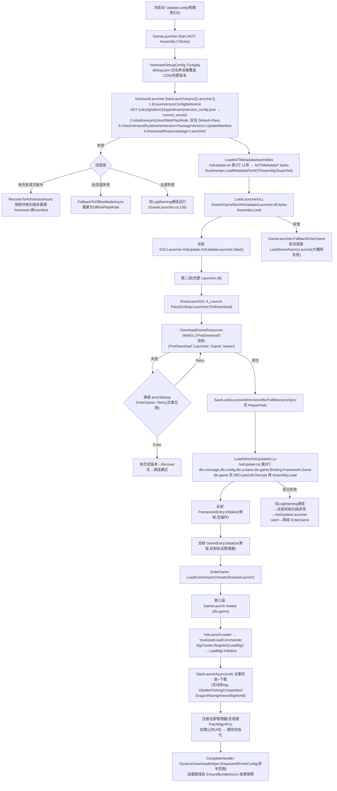

# ProjectOld「两步热更新」机制调查报告

> 调查对象：`D:\Work\SAUnity\ProjectOld`（只读，未修改任何源码/配置/资源）
> 调查方式：静态源码阅读 + 程序集配置 + 资源采集配置 + 构建脚本核对。**未启动 Unity、未执行构建、未联网、未做真机运行验证。**
> 调查日期：2026-09-09
> 结论以「文件绝对路径:行号 + 文件 SHA256」标注证据。除特别说明，所有结论均直接来自当前磁盘源码。

---

## 1. 摘要

**「两步热更新」在本工程中的真实含义（源码验证）：**

它不是泛指"代码和资源分开下载"，而是一个**按程序集分段的启动管线**——把"负责更新的代码"本身做成热更 DLL，从而让更新流程自身可热更：

| 段 | 宿主程序集 | 做什么 | 下载什么 tag |
|---|---|---|---|
| **第一段（AOT）** | Assembly-CSharp 的 `GameLauncher`（启动场景 `Updater.unity`） | 初始化 YooAsset → 版本发现 → 下载 → 加载 AOT 补充元数据 → `Assembly.Load(Launcher.dll)` → 反射调用 `HotUpdateLauncher.Start()` | 仅 `Launcher`（Launcher.dll + A_LaunchUI） |
| **第二段（热更 Launcher 程序集）** | `HotUpdateLauncher`（Launcher.dll） | 显示 A_Launch FairyGUI → 下载资源 → 按 `hotUpdate.txt` 第 2 行加载其余 7 个热更 DLL → 反射调用 Framework/Game 骨架入口 → 加载 Launch 场景 | WebGL: `PreDownload`；非 WebGL: `PreDownload, Launcher, Game, wwise` |
| **隐性第三段（热更 dls.game，Launch 场景）** | `GameLaunch`（dls.game） | 经 `LoadMgr` 再次走 `StartLaunchAsync(null)` **全量**版本检查+下载 → 注册全部管理器 → 初始化模块 → 动态下载入队 | null（全部 tag，含动态 tag） |

因此更准确的说法是：**两段代码加载 + 三段资源下载**。"第二段"本身既下载资源也加载 DLL，且第三段的全量同步藏在 Launch 场景里——这一点容易被注释文字（"其余资源由 DynamicDownload 在游戏中按需/后台拉取"，HotUpdateLauncher.cs:300-301）掩盖，实际 Launch 场景会阻塞式全量拉取（GameLaunch.cs:333-341 → LoadMgr.cs:225-250 → YooAssetLauncher.StartLaunchAsync(null)）。

**成功版本持久化时机**：第二段启动 tag 集下载成功后写入 `PlayerPrefs["YooAsset.LastSuccessHotVersion"]`（HotUpdateLauncher.cs:327 → YooAssetLauncher.cs:782-804 → YooAssetVersionStateService.cs:19-29）。注意：**WebGL 下第二段只下载 `PreDownload` 一个 tag，也会写入成功版本**——方法名 `SaveLastSuccessHotVersionAfterFullResourceSync` 及其注释（"全量资源下载成功后调用"，YooAssetLauncher.cs:780）与实际触发面不一致。第一段 Launcher 标签成功不写（YooAssetLauncher.cs:332 注释明确）。

**回退链**（两段各有）：历史成功热更版本（重建式切换 manifest，`RecoverToHotVersionAsync`）→ 离线模式（`FallbackToOfflineModeAsync` 重建为 OfflinePlayMode）→ 最终失败仅记日志/弹窗。

---

## 2. 实际启动流程图



---

## 3. 阶段 / 程序集 / 资源包关系表

### 3.1 程序集归属（HybridCLRSettings.asset:20-33 + hotUpdate.txt + asmdef 实测）

| 程序集 | AOT/热更 | 加载时机 | 源码位置 | 备注 |
|---|---|---|---|---|
| Assembly-CSharp（无 asmdef） | AOT | 构建内 | `Assets\Scripts\Launcher\GameLauncher.cs`、`YooAssetDebugConfig.cs` | 启动场景入口；无独立 asmdef |
| YooAssetMgr | AOT | 构建内 | `Assets\Scripts\framework\Library\ZeroFramework\YooAsset\YooAssetMgr.asmdef` | 被 GameLauncher（AOT）直接引用 |
| dls.framework | AOT | 构建内 | `Assets\Scripts\framework\Framework.asmdef`（name=dls.framework） | 含 LoadMgr/PanelMgr/ModuleMgr/MgrCenter/PatchMgr/FairyGUI；其剥离元数据进 AOTMetadata |
| dls.framework.common | AOT | 构建内 | `...\Library\Common\FrameworkCommon.asmdef` | 含 DllCryptoUtil |
| dls.framework.unsafe / dls.im | AOT | 构建内 | `...\Library\ZeroFramework\Unsafe\`、`Assets\Scripts\im\` | 元数据列入 hotUpdate.txt 但磁盘缺失（见 §6 风险2） |
| **Launcher** | **热更** | **第一段末** | `Assets\Scripts\HotUpdate\Launcher\Launcher.asmdef` | HybridCLRSettings 列入热更；含 HotUpdateLauncher + A_Launch UI Base* 类 |
| HotUpdate | 热更 | 无加载 | `Assets\Scripts\HotUpdate\HotUpdate.asmdef` | 仅 HotUpdateEntry.cs（无调用者，死代码） |
| dls.message / dls.config / dls.ui.base / dls.game / Binding | 热更 | 第二段 | `Scripts\game\Data\Message|Data\Config`、`Scripts\UIBase`、`Scripts\game`、`Scripts\Binding` | hotUpdate.txt 第 2 行顺序加载 |
| Framework / Game（骨架） | 热更 | 第二段 | `Scripts\HotUpdate\Framework\`、`Scripts\HotUpdate\Game\` | 与 AOT 的 dls.framework 重名不同名；Initialize 基本为空/日志验证 |
| dls.game.core / dls.game.notifys / dls.game.leafmodules / IGC.Game | （配置存在，源码不存在） | — | 无 asmdef | HybridCLRSettings.hotUpdateAssemblies 列出但工程内无源码，疑似陈旧配置（未知项 U2） |

### 3.2 资源包与标签（AssetBundleCollectorSetting.asset，SHA256 fc441b05…）

**双包结构**：`DefaultPackage`（AssetBundle，LZ4，BundleName_HashName）+ `RawPackage`（RawFileBuildPipeline，不压缩，PreserveExtensionPackRule）。

| 标签 | 内容 | 所属包 | 阶段归属 |
|---|---|---|---|
| `Launcher` | `GameRes/HotUpdate/Launcher.dll.bytes`；`GameRes/A_LaunchUI`（FairyGUI 整目录 PackDirectory） | DefaultPackage（WebGL，EnableOnWebGLGroup）或 RawPackage（非 WebGL，DisableOnWebGLGroup 反向启用） | 第一段下载；同时 buildin |
| `PreDownload` | AppConfig、GameConfig(含 DynamicTagsManifest.asset)、Language、Device、SKInnerCityBytes、Environment/InnerCity/PVEBattle 贴图；WebGL 专属：UI 的 `.bytes`、Wwise 配置 | DefaultPackage | 第二段（WebGL 只下这个） |
| `Game` | 主体内容（Scenes/Prefab/Effects/Roles/Environment 等）+ **除 Launcher.dll.bytes 外的整个 GameRes/HotUpdate**（其余热更 DLL bytes、hotUpdate.txt、AOTMetadata/*） | DefaultPackage / RawPackage | 第二段（非 WebGL）/ buildin / 第三段 |
| `wwise` | `GeneratedSoundBanks`（CollectWWise） | RawPackage（DisableOnWebGLGroup → 仅非 WebGL） | 第二段（非 WebGL） |
| 动态 tag：XBattle、FishingCompetition、DragonRacing、Arena、BigWorld | 各活动/玩法资源 | DefaultPackage | 设计上由 DynamicDownload 调度器拉取；实际第三段 `StartLaunchAsync(null)` 也会全量拉（见 §5.4） |

**关键闭包事实**：
- 第一段可运行闭包 = `Launcher` tag（Launcher.dll + A_LaunchUI）+ buildin 中的 hotUpdate.txt 与 AOTMetadata（tag 为 `Game` 但被 BuildinTagRule 划入首包）。
- **AOT 补充元数据在第一段之前即可完整获得的前提**是 BuildinTagRule 生效（ClearAndCopyByTags）；该模式默认关闭，需打包机 `-tagbuild 1` 或 EditorPrefs `IGG.DynamicDownload.EnableTagBuild`（YooAssetBuildHelper.cs:1663-1690、DynamicDownloadBuildSettings.cs:18-22）。**若以默认 ClearAndCopyAll 打包，首包是全量 bundle，结论同样成立（全量都在首包里）**——两种模式下第一段都不依赖 CDN，依赖的是"首包里有没有这份文件"。
- WebGL 宏约束：`UNITY_WEBGL && !UNITY_EDITOR && !LOAD_HOT_UPDATE_FROM_BUNDLE` → `#error`（GameLauncher.cs:15-17）；ProjectSettings WebGL 定义确含 `LOAD_HOT_UPDATE_FROM_BUNDLE;WEIXINMINIGAME`，并由 `Tools/make/plugin/wxminigame.py` 兜底注入（GameLauncher.cs:8-14 注释）。

### 3.3 构建与发布顺序（ExportProcessor.cs + ExportProject.cs + YooAssetBuildHelper.cs）

```
Python make.py (Tools\make)
 ├─ export 插件 → RunUnity(MakeInterface.BuildProject)     [整包]
 └─ hot_update 插件 → RunUnity(MakeInterface.BuildHotUpdate) [热更包]
      └─ ExportProject.BuildHotUpdate()
           ├─ PackageMode=HotUpdate；YooAssetAbVersion = yyyy-MM-dd-{当日分钟数}（GetDefaultPackageVersion = `DateTime.Now.ToString("yyyy-MM-dd") + "-" + (Hour*60+Minute)`，YooAssetBuildHelper.cs:1035-1039；framework_cfg.asset 现值 `2026-01-28-193` 佐证）
           └─ AssetBundleBuilder.Build()
                ├─ OnPreExportAssetBundle（Assets\Editor\Export\ExportProcessor.cs:20-50）
                │    ├─ CopyWwiseToAssets
                │    ├─ PackageMode.Full  → HybridCLRGenerateAll（PrebuildCommand.GenerateAll + 拷DLL + AOT元数据）
                │    ├─ PackageMode.HotUpdate → ExportHybridCLRDLL（CompileDll + 拷全部热更DLL.bytes，dls.game 加密）
                │    └─ Cfg2AssetsTool / SoDataDecoder
                ├─ YooAssetBuildHelper.BuildAssetBundles(target)
                │    ├─ DynamicTagsManifestSyncer.SyncAll()（同步 tag 清单）
                │    ├─ BuildPackage(DefaultPackage, ClearAndCopyByTags[若 tagbuild] / ClearAndCopyAll)
                │    ├─ BuildPackage(RawPackage)
                │    └─ UpdateVersionConfigAfterAllPackages → 写/更新 {cdn}/{platform}/{appVersion}/version_config.json（current_version=hotVersion）
                └─ 上传 HFS/S3：manifests/ 与 bundles/ 分目录；跳过 .report/.version；已存在文件跳过（只增不删）
```

- **代码/资源版本绑定**：DLL bytes 与 bundle 在同一次构建产出、写入同一份 manifest（PackageVersion = YooAssetAbVersion）。客户端以 version_config.json → manifest → bundle 三级串起。
- **发布语义**：version_config.json 在所有包上传完才更新（YooAssetBuildHelper.cs:203-206 注释：避免 iOS HFS rename 出 `version_config (1).json`；上传前先 DELETE 主文件）。**未更新 version_config 前，资源在 CDN 上但对客户端不可见**——这是一个可利用的灰度窗口，也是"上传完成≠发布完成"的语义点。
- **版本共存**：上传只增不删（HfsFileExists 跳过，YooAssetBuildHelper.cs:592-596），历史 manifest 保留在 CDN → `RecoverToHotVersionAsync` 可跨版本换回旧 manifest（YooAssetMgr.cs:484-547）。

---

## 4. 版本发现细节

1. `GET {cdnBaseUrl}/{platform}/{appVersion}/version_config.json`，超时 4s，重试 1 次（共 2 次），间隔 250ms（VersionConfigService.cs:31-38）。解析 `current_version` 作为热更版本（= YooAsset PackageVersion）。
2. **必须在 YooAsset Initialize 之前拿到**（YooAssetLauncher.cs:156-158 注释 + EnsureVersionConfigBeforeInitAsync:543-560），否则 RemoteServices URL 缺 HotVersion——注意：当前 `SmartRemoteServices` 的 URL 只到 `{host}/{manifests|bundles}/{fileName}`（RemoteServicesImpl.cs:47-60），版本体现在 **manifest 文件名**里（YooAsset 以 `{PackageName}_{PackageVersion}.bytes` 请求 manifest）。YooAsset 2.3.18002 包源码不在仓库内（Library 未随库），该文件命名细节标注为"YooAsset 惯例，未本地核对"（未知项 U5）。
3. debug.json（白名单设备）可覆盖：CDN 地址、热更版本、version_config URL，并可注入故障（ForceDefaultPackageFail / ForceRawPackageFail / ForceLastSuccessFallback / ForceOfflineFallback）（YooAssetDebugConfig.cs:48-103、YooAssetConfig.cs:49-60）。这是本工程做故障演练的正式入口。
4. 平台字符串：Android / iOS / WebGL / StandaloneWindows64（YooAssetConfig.cs:192-213）；URL 按 `{platform}/{appVersion}` 隔离；**没有渠道维度**。

---

## 5. 失败、回退与运行语义核查

### 5.1 失败重试
- version_config 拉取：2 次尝试（VersionConfigService.cs:54-73）。
- bundle 下载：YooAsset 下载器级别 `RetryCount=3`（YooAssetConfig.cs:91-92 → UpdateService.cs:303-305）。
- 启动期 tag 下载失败：YooAssetLauncher 层先走回退链（历史版本→离线），**不自动重试下载**；第二段则由 UI 弹窗驱动重试循环（HotUpdateLauncher.cs:335-359 的 while+needOuterRetry）。

### 5.2 断网
- `DownloadResourcesAsync` 前置 `Application.internetReachability == NotReachable` → 直接失败（UpdateService.cs:276-284）。
- version_config 传输失败（连 HTTP 成功都没有）→ `LastVersionConfigFetchHadTransportFailure` → **跳过历史版本回退，直接离线**（YooAssetLauncher.cs:292-300）。理由：回退 Recover 也要访问 CDN manifest，传输层已死时无意义。
- 下载并发按网络/机型自适应：蜂窝 2、低端 2、中端 5、高端 8（UpdateService.cs:233-269）。

### 5.3 强更
- **不在资源热更链路内**。客户端版本强更由登录流程驱动：`NativePlatformMgr_Login.cs:303-324` `CheckUpdate_Force(loginBox.forceVersion, …)`，GPC/login 服务器下发 forceVersion，弹 ForceUpdate 优先级面板（NativePlatformMgr_Login.cs:69）。资源热更层面**没有**"最低热更版本"闸门——CDN current_version 即最新，直接执行。

### 5.4 manifest 切换与混合版本风险（核心审查项）
- 正常更新：每次启动 version_config → `UpdatePackageManifestAsync(hotVersion)`（Default+Raw 双包各自更新，UpdateService.cs:210-212）。
- 回退切换：`RecoverToHotVersionAsync` = `RuntimeHotVersion=目标版本` → 销毁 YooAssets → 重新 Initialize → 重新取版本 → 重新 UpdateManifest（YooAssetMgr.cs:499-540）。
- **混合版本是否可能**：可能，且是结构性而非偶发：
  1. Launcher.dll 在第一段已 `Assembly.Load` 进内存，**程序集不可卸载**。第二段失败回退时，资源/DLL 可回旧版，但 Launcher.dll 保持为**第一段启动时那一代**的代码（首包 buildin 或当时 CDN manifest，此后不随 Recover 变化；Launcher.asmdef 直接引用 dls.framework、dls.framework.common、dls.ui.base、YooAssetMgr、DynamicDownload，Launcher.asmdef:4-13）。
  2. 每次 AB 构建都会把当前 Launcher.dll.bytes 重新打进去（Collector 对 GameRes/HotUpdate 全目录收集），因此不同 hot 版本的 Launcher.dll 可能不同。回退到旧资源版时 = "新 Launcher + 旧 dls.*" 组合。
  3. 实际爆点取决于 Launcher 与 dls.* 之间的接口漂移：本调查在 Launcher 源码目录未发现对 dls.ui.base 命名空间的 `using`（仅 IGG.Game.UI.A_Launch 自有命名空间），但 asmdef 引用了 dls.ui.base 的 GUID（915e3608…）——是否为残留引用、编译后是否有真实类型引用，**未验证**（未知项 U3）。
- 成功版本持久化：见 §1；键为单一 `YooAsset.LastSuccessHotVersion`，**无平台/渠道后缀**（YooAssetVersionStateService.cs:12）。隔离依赖 PlayerPrefs 自身的按应用隔离 + CDN URL 按 platform/appVersion 隔离。同设备同 App 只有一条"最后成功版本"，若在 iOS 端写入了 iOS 版本号后用同一存档体系跨平台（如 Steam 云存档）理论上可能串——本工程未见此用法，记为设计注意点。

### 5.5 取消 / 退出
- 第二段下载期间**无取消入口**：加载面板只有进度文本；`YooAssetUpdateService.CancelDownload()` 定义了但**全工程无调用**，且实现只改状态/发事件，并不中止下载器（UpdateService.cs:435-448）——无效实现。
- 失败弹窗两按钮：`m_btnContinue` 标题设为 "Enter Game"、`m_btnExit` 标题设为 "Retry"（HotUpdateLauncher.cs:425-426）——**节点名与语义互换**，直接照搬 UI 会踩坑。
- 应用退出：`GameLaunch.Quit` → `Application.Quit`（编辑器下 Restart 代替）（GameLaunch_Reload.cs:129-141）。

### 5.6 重复进入 / 重启
- 冷启动重复调用有防护：`StartLaunchAsync` 幂等（IsLaunching/IsLaunchCompleted 短路，YooAssetLauncher.cs:126-138；HotUpdateLauncher.s_initialized，HotUpdateLauncher.cs:46-50）。
- 游戏内重启：`GameLaunch.Restart()` → `DoRestart()`（GameLaunch_Reload.cs:31-119）：全量拆除（CloseAll 面板、MgrCenter.DisposeAll、删 [YooAssets]/YooAssetLauncher 对象、UnloadAllAssetsAsync + `AssetBundle.UnloadAllAssetBundles(true)`、GC）→ **直接 LoadSceneAsync(Launch)**（不回 Updater 场景，GameLaunch_Reload.cs:106 已注释）→ Launch 场景的 LoadMgr 再次 `StartLaunchAsync(null)`。**热更程序集不重载**（HybridCLR 程序集无法卸载），新 DLL 代码需冷启动才生效。
- **重启后的资源版本行为（静态推断，未运行验证，见未知项 U10）**：`YooAssetMgr` 是纯静态单例（无 MonoBehaviour），`DoRestart` 未调用 `YooAssetMgr.Inst.Destroy()`（全工程无调用点）——`IsInitialized` 保持 true；但 `MgrCenter.DisposeAll` 会对注册的管理器逆序执行 `BeforeDispose()+Dispose()`（MgrCenter.cs:173-192），其中 `YooAssetUpdateService.Dispose()` 置空其包引用（YooAssetUpdateService.cs:493-502）。据此推断重启后的重走链为：EnsureVersionConfig 可从 CDN 刷到新版本 → `InitializeAsync` 因 `IsInitialized && _defaultPackage != null` 幂等直返（YooAssetMgr.cs:315-319）→ `CheckVersionAsync` 因 UpdateService 已释放而 Fail（UpdateService.cs:124-127）→ 落入回退链 → **Recover 到"最后成功热更版本"或转离线**（Recover 中 `RuntimeHotVersion` 被覆写为旧版本，YooAssetMgr.cs:504）。即：重启大概率**不会升级到 CDN 新版本**，新版本需冷启动才会被拾取。
- YooAssetLauncher.cs:132 注释"GameReStart 的时候不需要重走初始化流程"对应的是**实例存活**时的短路；DoRestart 显式销毁了该实例（GameLaunch_Reload.cs:79-80），因此该短路在当前重启流程不生效。

### 5.7 缓存清理
- 运行时 API：`YooAssetMgr.ClearCacheAsync()` = `ClearCacheFilesAsync(EFileClearMode.ClearAllBundleFiles)`（YooAssetMgr.cs:800-807）——**仅 DefaultPackage**，RawPackage 缓存不清。
- 未发现自动按版本清理未用 bundle 的调用（无 ClearUnusedBundleFiles 使用点）。清理策略基本依赖 YooAsset 缓存按 hash 寻址的覆盖 + 构建产物管理，**客户端侧无版本淘汰逻辑**（未知项 U6：是否由 YooAsset 内部或外部工具承担）。
- 构建侧清理齐备：WebGL StreamingAssets 减肥（TrimStreamingAssetsForWebGL，仅留 BuildinCatalog.bytes，YooAssetBuildHelper.cs:280-331）、首包快照备份/还原（BackupBuildinSnapshot/RestoreYooAssetToStreamingAssets:340-367/1078-1126）。

### 5.8 AOT metadata
- 来源：`HybridCLRData/AssembliesPostIl2CppStrip/{platform}` → 拷贝到 `Assets/GameRes/HotUpdate/AOTMetadata/*.dll.bytes`（ExportHybridCLRPatch.cs:348-394，硬编码 7 项：mscorlib、System、System.Core、UnityEngine.CoreModule、UniRx、dls.framework.unsafe、dls.im）。
- 加载：hotUpdate.txt 第 1 行列出 11 项（另含 dls.framework、dls.framework.common、UniTask、Unity.Collections），逐个 `LoadMetadataForAOTAssembly(bytes, HomologousImageMode.SuperSet)`（GameLauncher.cs:148-212）。
- **磁盘实况**：AOTMetadata 目录只有 8 项——`UniRx`、`dls.framework.unsafe`、`dls.im` 缺失，加载时静默跳过（并发版无警告日志，GameLauncher.cs:191-210）；`UniTask/Unity.Collections/dls.framework.common` 在磁盘上但不在导出脚本硬编码清单里（旧版脚本或手动放入的产物，无流程保证）。
- HybridCLR 预处理产物路径配置为 `HybridCLRGenerate/link.xml`、`HybridCLRGenerate/AOTGenericReferences.cs`（HybridCLRSettings.asset:42-43）——仓库内**两者都不存在**于配置所指位置；`Assets\Scripts\Launcher\AOTGenericReferences.cs` 是一份**手写**的泛型保留文件（非 HybridCLR 生成产物，命名易误导）。

### 5.9 编辑器 vs 真机
| 维度 | 编辑器 | 真机 |
|---|---|---|
| DLL 加载 | 跳过（Domain 直接有程序集，HotUpdateLauncher.cs:534-537/607-610） | LoadRawFile（raw）或 LoadAsset\<TextAsset\>（bundle）+ Assembly.Load |
| PlayMode | UseSimulateModeInEditor=true → EditorSimulateMode（YooAssetConfig.cs:109-116） | HostPlayMode；微信小游戏强制 WebPlayMode + WechatFileSystem（YooAssetConfig.cs:118-122、PackageInitializer.cs:58-71） |
| PAD | 不涉及 | AAB 走 PlayAssetDelivery（YooAssetMgr.cs:351-353，PADHelper） |

### 5.10 死代码 / 遗留路径（不要当成现役机制）
- `ResolveLaunchTags()`（HotUpdateLauncher.cs:392-410）：定义了"从 DynamicTagsManifest 读 BuildinTags"的方案，**无任何调用**；实际 tag 硬编码（:316-321）。
- `HotUpdate` 程序集 + `HotUpdateEntry`：无调用者。
- `PatchMgr`（IFix 补丁，2020 年代码）：仍注册于 Launch 加载器（GameLaunch.cs:353），与 YooAsset 并存；其在 UseYooAsset=true 时的实际行为未深入（未知项 U7）。
- `LoadAOTMetadataAssemblies_Ori`（GameLauncher.cs:217-296）：旧版串行实现，无调用。
- `dls.framework.dll.bytes`、`HotUpdate.dll.bytes` 位于 GameRes/HotUpdate 但不在任何加载清单——会随 `Game` tag 进 buildin/CDN，纯冗余体积。
- **设计意图与实际行为分歧**：`SaveLastSuccessHotVersionAfterFullResourceSync`（YooAssetLauncher.cs:780 注释："全量资源下载成功后调用"）实际触发点是 HotUpdateLauncher 启动 tag 集下载成功（HotUpdateLauncher.cs:325-328）；WebGL 下该集合仅 `PreDownload`，此时即写入"成功版本"。同理，HotUpdateLauncher.cs:300-301 "其余资源由 DynamicDownload 调度器在游戏中按需/后台拉取"的注释与 Launch 场景 `StartLaunchAsync(null)` 阻塞式全量下载的行为不符。

---

## 6. 已发现缺陷与风险（附触发条件；均为源码证据，未做真机复现）

| # | 问题 | 证据 | 触发条件 | 后果 |
|---|---|---|---|---|
| 1 | 热更 DLL 加载失败只 LogWarning 不中断 | HotUpdateLauncher.cs:521-524, 596 | CDN 部分 bundle 损坏/缺失 | 进入"部分程序集已加载"状态；后续反射初始化抛异常 → catch 后"直接进入游戏"降级 → 场景加载大概率也失败 → 黑屏卡死 |
| 2 | AOT 元数据清单与磁盘不符（11 列 8 有）且静默跳过 | hotUpdate.txt:1 + AOTMetadata 目录清单 + GameLauncher.cs:191-210 | 构建机 AssembliesPostIl2CppStrip 未含 UniRx 等 | 热更层用到对应 AOT 程序集泛型时 wasm/IL2CPP 运行时报错（GameLauncher.cs 注释里描述过此类症状） |
| 3 | AOT/GameLauncher 两侧 catch-all 降级"直接进入游戏" | GameLauncher.cs:95-102、HotUpdateLauncher.cs:94-102 | 任一启动异常 | 资源未就绪时 LoadSceneAsync 必败，错误被吞，无重试 UI |
| 4 | `CancelDownload` 无调用且不真正中止 | UpdateService.cs:435-448（grep 全工程仅定义处） | — | 未来接"取消下载"需求时是坑 |
| 5 | 失败弹窗按钮语义与节点名互换 | HotUpdateLauncher.cs:425-426 | 迁移 UI | 文案/节点错位 |
| 6 | 混合版本结构风险（Launcher 不随 Recover 回退） | §5.4 | 第二段失败→Recover 旧版 | 新 Launcher + 旧 dls.* 组合，接口漂移即崩 |
| 7 | `.version` 文件不上传 + 运行时跳过 `.version` 请求 | YooAssetBuildHelper.cs:433/503（跳过上传）+ UpdateService.cs:143-155（跳过请求） | version_config 缺失时 fallback `RequestPackageVersionAsync` | fallback 请求 `{host}/bundles/*.version` 必 404（SmartRemoteServices 把非 .hash/.bytes/.json 路由到 bundles/，RemoteServicesImpl.cs:54-60） |
| 8 | 启动 tag 三处一致性靠人肉 | HotUpdateLauncher.cs:316-321（硬编码）/ BuildinTagRule.asset / Collector 组规则 | 任何一处改动 | tag 不同步 → 首包缺文件或下载冗余 |
| 9 | PlayerPrefs 成功版本键无平台/渠道维度 | YooAssetVersionStateService.cs:12 | 跨渠道共存同 App | 回退目标可能取到非本渠道版本串（当前 CDN 路径按平台隔离可部分缓解） |
| 10 | ClearCacheAsync 只清 DefaultPackage | YooAssetMgr.cs:800-807 | 调用清理时 | RawPackage 缓存（DLL bytes/视频/音库）永不清 |
| 11 | 失败记录重复实现两处 | YooAssetLauncher.cs:806-817 与 YooAssetVersionStateService.cs:42-57 | — | 维护成本/键名漂移风险 |

---

## 7. 可迁移机制 vs 工程耦合

### 7.1 值得迁移的机制（机制级，非代码级）
1. **AOT 最小启动器模式**：AOT 层只做"YooAsset 初始化 + 最小 tag 下载 + 元数据加载 + 加载一个 Launcher.dll"，把更新 UI/流程/其余 DLL 加载全部交给热更层——更新逻辑本身可热更（GameLauncher.cs:21-38 设计注释与实现一致）。
2. **version_config.json 单点版本发现**：把 YooAsset PackageVersion 与 CDN 上的一个手写 JSON 解耦绑定，支持 current_version 一键回拨（灰度/回滚）。
3. **历史成功热更版本 + 重建式 Recover + 离线兜底**三级回退链；"成功版本只在热更层下载成功后写入"的保守写法（但注意 WebGL 下仅 PreDownload 即写入，见 §5.10 分歧条目）。
4. **启动 tag 白名单 buildin**（ClearAndCopyByTags + 首包大小警戒 600MB）+ 打包前自动同步 tag 清单（DynamicTagsManifestSyncer + PreBuild 钩子）。
5. **按需保障**：`EnsureBundleAsync` 织入 LoadService 的加载路径（YooAssetLoadService.cs:130/185/281），后台调度器（优先级/性能自适应）作为补充。
6. **故障注入开关**（debug.json 白名单 + ForceOfflineFallback/ForceLastSuccessFallback/ForcePackageFail）——回退路径可自动化演练。
7. **构建收尾统一更新 version_config**、上传只增不删、首包快照备份/还原、WebGL StreamingAssets 减肥。
8. **简单 DLL 加密**（仅 dls.game，导出加密/加载解密对称，ExportHybridCLRPatch.cs:324-329 + HotUpdateLauncher.cs:516-517）。

### 7.2 不能照搬的工程耦合
- dls.* / 骨架 Framework+Game / Binding 代理三层命名体系；场景节点挂 Binding 程序集 Proxy（GameLaunchProxy : GameLaunch，GameLaunchProxy.cs:3-5）。
- 启动场景 Updater.unity + 构建索引；framework_cfg.asset 与 CommandHelper 在打包期改写 UseYooAsset/CdnEnv（CommandHelper.cs:307、ExportProject.cs:229-233）。
- HFS/S3 上传脚本、SVN 布局、wxminigame 宏注入、GPC/Peapod SDK、Wwise、PAD。
- Launcher 程序集内嵌 FairyGUI 包 + 反射注册包类型（RegisterFguiPackageTypes，HotUpdateLauncher.cs:130-142）。
- debug.json 的白名单机制与设备号落地文件（YooAssetDebugConfig.cs:78-85）。

---

## 8. 未知项（缺失证据，不做推断）

| # | 未知项 | 说明 |
|---|---|---|
| U1 | 全部回退路径的真机表现 | 未运行；尤其 WebGL WechatFileSystem 下 Recover/离线重建 |
| U2 | dls.game.core/notifys/leafmodules/IGC.Game 陈旧配置是否导致热更导出报错 | 工程无源码；ExportHybridCLRPatch.cs:319-321 对缺失 DLL 会 throw——推测当前构建要么 settings 已本地改过、要么 HybridCLRData 有历史 DLL，无法核实 |
| U3 | Launcher.dll 对 dls.ui.base 是否有真实编译期引用 | asmdef 有 GUID 引用，源码未见 using；需反编译或编译验证 |
| U4 | Production（S3/CloudFront）上传全流程 | C# 侧只写日志"走正式 CDN 流程"（YooAssetBuildHelper.cs:251-254），外部脚本细节不在仓库 |
| U5 | YooAsset 2.3.18002 manifest/版本文件 URL 精确形状 | Library 未随仓库；本报告相关表述基于 YooAsset 2.x 惯例 + 本仓库上传/路由代码推得 |
| U6 | 客户端缓存淘汰策略 | 未见自动清理调用点 |
| U7 | PatchMgr(IFix) 在 UseYooAsset=true 下是否仍有实际职能 | 仅确认其被注册 |
| U8 | AOTMetadata 中 dls.framework.common/UniTask/Unity.Collections 的产生方式 | 不在现版导出脚本硬编码清单内 |
| U9 | `SmartRemoteServices` fallback host 与主 host 相同值（static-sk.igg.com）的真实部署差异 | 配置默认值相同，未见区分 |
| U10 | 游戏内重启后能否拾取 CDN 新版本 | §5.6 静态推断"大概率停留在最后成功版本"；依赖 YooAssetMgr 静态残留/服务已释放等多个细节，需运行验证 |

---

## 9. 迁移前验证场景建议（针对 TEngine 移植评估）

1. **断网冷启动（无历史版本）**：预期走离线兜底或停 splash；确认不会无限白屏、不崩溃。
2. **断网冷启动（有历史成功版本）**：Recover 需要从 CDN 拉旧 manifest——验证"回退也依赖 CDN 可用"这一前提在目标 CDN 上成立（本工程用传输失败标志规避，TEngine 移植时应保留）。
3. **version_config 404 / 内容为空**：确认 current_version 为空 → CheckVersion 走 RequestPackageVersionAsync → 404 → 失败链；观察是否按预期回退。
4. **第二段下载中途断网**：弹窗 → Enter（Recover）→ 验证"新 Launcher + 旧 dls.*"混合版本是否可运行（本工程风险 #6 的实测）。
5. **删除一个热更 DLL bytes**：验证静默 LogWarning + 降级链的实际表现（风险 #1/#3）。
6. **验证已缺失的 3 项元数据（UniRx/dls.framework.unsafe/dls.im）静默跳过**：对照日志确认 loadedCount 与无警告，再在热更层构造对应 AOT 程序集的泛型调用看是否报 wasm/IL2CPP 错误。
7. **二次冷启动（版本已最新）**：确认第一段/第二段零下载直通（下载器 TotalDownloadCount==0 路径，UpdateService.cs:323-327）。
8. **游戏内 Restart**：重点验证 §5.6 静态推断——重启后是否真的停留在"最后成功热更版本"而不升级到 CDN 新版本（关注 YooAssetMgr 静态残留与已 Dispose 的 UpdateService 导致 CheckVersionAsync Fail 的链路）；同时确认 DLL 不重载的表现。
9. **tagbuild 开/关**：对比 StreamingAssets 体积与首包闭包；验证 600MB 警戒 lint。
10. **强更链路**：login forceVersion 弹窗与资源热更是两个独立系统，迁移时确认 TEngine 侧对应的登录流程挂点。

---

## 10. 证据索引（关键文件 SHA256）

| 文件（绝对路径） | SHA256 |
|---|---|
| `D:\Work\SAUnity\ProjectOld\Assets\Scripts\Launcher\GameLauncher.cs` | cca4e5e518fbf63bce84893792417486c098439587ca4e42647190c4b099323b |
| `D:\Work\SAUnity\ProjectOld\Assets\Scripts\HotUpdate\Launcher\HotUpdateLauncher.cs` | 7ff6e7c0a9da25dc3d4423b5df8a717345f6f78bb1baf287178e3d1133a50776 |
| `D:\Work\SAUnity\ProjectOld\Assets\Scripts\framework\Library\ZeroFramework\YooAsset\YooAssetLauncher.cs` | bf18f884c90865eb6997f6100db72e72ae2d987a868c0321631d31b31114aa1f |
| `D:\Work\SAUnity\ProjectOld\Assets\Scripts\framework\Library\ZeroFramework\YooAsset\YooAssetMgr.cs` | 835609b9264bd4b623195c8feefb2732fafd4db326355ee0fd6adfb94b3638f6 |
| `D:\Work\SAUnity\ProjectOld\Assets\Scripts\framework\Library\ZeroFramework\YooAsset\Services\YooAssetUpdateService.cs` | 434bf3da6e2eee5246b4c3665ef82d0d6da74e75bf7bfc26d2ee32582c9add97 |
| `D:\Work\SAUnity\ProjectOld\Assets\Scripts\framework\Library\ZeroFramework\YooAsset\Services\VersionConfigService.cs` | 8c7643ff5ea4c0abf0e6caef956678cb1ca09c1eee2299e31f1115b93a5b415a |
| `D:\Work\SAUnity\ProjectOld\Assets\Scripts\framework\Library\ZeroFramework\YooAsset\Services\YooAssetVersionStateService.cs` | 0518ea28a73cc77702b8256efccfd2a14263fae49f9a3107bd323ae4f1afba82 |
| `D:\Work\SAUnity\ProjectOld\Assets\GameRes\HotUpdate\hotUpdate.txt` | aa65a45a91f257097d20ef5c4613d266c999785b623cbffc68c3d242ebc62aa1 |
| `D:\Work\SAUnity\ProjectOld\Assets\Resources\AssetBundleCollectorSetting.asset` | fc441b05cc65b82c5d7ba39b55141ed1b48f0089b1f3549f6806fef6b1cf0424 |
| `D:\Work\SAUnity\ProjectOld\Assets\GameRes\GameConfig\Common\DynamicTagsManifest.asset` | b47f4a2ab851527839f5d508a70bdbf0d7acccef662a1718e6042f259ebe6caf |
| `D:\Work\SAUnity\ProjectOld\Assets\Editor\YooAsset\BuildinTagRule.asset` | e45a46b645bb0e1030ac389b8dd3b81941628c9a3a930efdb07ff1c7b023c59d |
| `D:\Work\SAUnity\ProjectOld\ProjectSettings\HybridCLRSettings.asset` | 47bd432752ad550a4be32fe6ee0b03c9b27e85c8b6822d00bbb8a3bc99be167a |
| `D:\Work\SAUnity\ProjectOld\Assets\Scripts\framework\Editor\AssetBundle\YooAssetBuildHelper.cs` | 4e523e955f768be0f74be9dd6fe5fa37143905c598dbaa62333163ef743b210f |
| `D:\Work\SAUnity\ProjectOld\Assets\Scripts\framework\Editor\Export\ExportHybridCLRPatch.cs` | d0c540e145364eb153d25482a901cb3edabeb7bd41c7e00277bc30c53a220d46 |
| `D:\Work\SAUnity\ProjectOld\Assets\Editor\Export\ExportProcessor.cs` | 2ad5f6b9ecec8fa0dc89a14aeb0bb843e9e1e272d88ae6a2a0ffe06b4085e1c3 |
| `D:\Work\SAUnity\ProjectOld\Assets\Scripts\game\Module\Launch\GameLaunch.cs` | da160716d77cf4a8282840fe13c9dfc857b7d03a27db9eef9d49191fcdb5cd13 |
| `D:\Work\SAUnity\ProjectOld\Assets\Scripts\game\Module\Launch\GameLaunch_Reload.cs` | 890b67ba7439fdd2d6e017f12075f5db6443286803e404872ef25c446e5f2d20 |
| `D:\Work\SAUnity\ProjectOld\Assets\Scripts\framework\Library\ZeroFramework\Load\LoadMgr.cs` | c15b5b025d43964fa34a9bbb1ed89265e1f2b425d4aed12a50b37efc8f6573e6 |

**主要行号速查**：
- GameLauncher.cs：LauncherTags=45；Start=52；元数据加载=148-212；Launcher.dll=368-392；反射调用=422-468；降级=473-484；WebGL 宏断言=15-17
- HotUpdateLauncher.cs：Start 流程=44-103；下载 tag=316-321；失败弹窗=412-450；回退=373-384；DLL 加载=471-611；解密=516-517/589-590；EnterGame=706-715
- YooAssetLauncher.cs：启动主流程=124-287；版本检查回退=292-322；下载回退=327-349；Recover=354-390；离线=397-432；保存成功版本=782-804
- YooAssetMgr.cs：双包初始化=308-403；离线回退=428-478；版本回退=484-547；清缓存=800-807
- YooAssetUpdateService.cs：版本检查=118-188；清单=193-230；下载=274-430；CancelDownload=435-448
- hotUpdate.txt：第 1 行=AOT 元数据 11 项；第 2 行=热更 DLL 7 项
- ExportProcessor.cs：Full/HotUpdate 分支=32-42
- YooAssetBuildHelper.cs：tagbuild 开关=108-118/1663-1690；上传=371-476；version_config=213-240/625-694；WebGL 减肥=280-331
- GameLaunch.cs：Awake=66-155；InitLaunchLoader=325-387；CompleteHandler=439-471
- GameLaunch_Reload.cs：DoRestart=40-119
- HybridCLRSettings.asset：hotUpdateAssemblies=20-33；patchAOTAssemblies=38-41
- ProjectSettings.asset：WebGL 宏=（scriptingDefineSymbols.WebGL 含 LOAD_HOT_UPDATE_FROM_BUNDLE;WEIXINMINIGAME）
- EditorBuildSettings.asset：Updater→Launch→World

---

## 11. 调查限制声明

- 全程未启动 Unity、未执行构建、未联网、未反编译 DLL 二进制；`Assets/GameRes/HotUpdate/*.dll.bytes` 内容未校验（仅记录文件存在与大小）。
- YooAsset 2.3.18002 内部实现（manifest 文件命名、下载器内部重试语义）依据公开惯例与调用侧代码推断，已在未知项标注。
- 本报告不评价 ProjectOld 与 TEngine 孰优，不构成移植方案；仅提供事实与验证建议。
