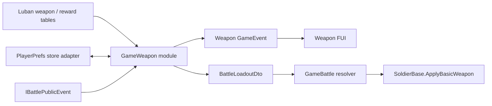

# 当前工程武器合成接入方案

> 方案日期：2026-08-28  
> 依据：`docs/原工程武器合成实现调查.md` 与当前 `GameBattle` / `GameCommon` / `GameFUI` / `GameLogic` / Luban 配置实现  
> 目标：在不破坏现有战斗生命周期的前提下，落地“碎片累计解锁、武器背包、装备、提示、回收、存档、战斗生效”的首期闭环

## 1. 结论

当前工程不能只在 `BattleRuntimeFactory` 中补一个合成函数。武器合成是局外长期状态，至少包含配置、玩家进度、装备选择、奖励结算、持久化和 UI 六部分；`GameBattle` 只应消费进入本局时冻结的武器装载，不应拥有玩家武器存档。

建议新增一个 `GameWeapon` 热更程序集，把武器配置快照、碎片累计、装备、回收、提示与存档收敛为一个深模块；`GameLogic` 只负责注册，`GameBattle` 通过 `BattleLoadoutDto` 消费四类兵种的已装备 `weaponId`。

首期只开放当前已有运行时能力的四把 Basic 武器：

| 兵种槽 | 武器类型 | 默认武器 ID |
|---|---|---:|
| 弓兵 | Bow | 1 |
| 枪兵 | Spear | 11 |
| 刀兵 | Knife | 21 |
| 骑兵 | Sword | 32 |

其余 40 条武器配置可以先补齐碎片阈值和展示数据，但保持 `obtainable=false`、`enabled=false`，等对应战斗行为和表现完成后再逐条开放。这样不会出现“背包中已合成，但战斗无法装备/攻击”的半成品状态。

## 2. 已确认的现状与缺口

### 2.1 可复用能力

- `ConfigSystem.Instance.Load()` 已在热更入口、模块注册前完成，`GameWeapon` 可在 `OnInit` 阶段读取 `ConfigSystem.Instance.Tables`。
- Luban 已有 `weapon.xlsx`、`TbWeapon` 和 44 条武器目录；当前字段为 `id/type/addAttPower/enabled/handlerKey`。
- `WeaponDefinitionSnapshot`、`WeaponCatalogSnapshot` 已提供不可变目录和按 ID 查询能力。
- `UnitRegistry` 已在玩家士兵创建时通过 resolver 调用 `SoldierBase.ApplyBasicWeapon(id, power)`，武器 ID 和攻击力已经进入局内运行时。
- `GameFUI` 已采用业务 owner 注册描述、组合根统一 `FreezeBindings()` 的模式，可新增武器 UI owner。
- `IBattlePublicEvent` 已提供 `OnBattleStarted(BattleLoadoutDto)` 和 `OnBattleFinished(BattleResultDto)`，可作为局外奖励模块的输入。

### 2.2 必须补齐的缺口

- `weapon.xlsx` 没有 `fragmentNum`、品级、展示名、图标、是否可掉落、回收价值等字段。
- 当前没有玩家武器进度、背包、装备和新武器提示数据。
- 当前没有业务存档模块；只有框架级 `Utility.PlayerPrefs` 和 JSON helper。
- `BattleLoadoutDto` 没有装备武器信息，`BasicWeaponResolver` 固定解析四把默认武器。
- `BattleResultDto` 明确排除了 `weaponFragments`；不应直接把可变碎片集合重新塞回该 DTO。
- 当前没有武器背包或新武器弹窗 FUI 包。
- 普通敌人击杀回调并不是可靠的通用奖励入口；原工程的具体掉落概率也尚未还原。

## 3. 业务语义与不变量

首期严格保留原工程核心语义，并补充当前工程必须明确的边缘规则。

### 3.1 唯一持久化事实

每个武器只保存累计总碎片：

```text
completedCount = totalFragments / fragmentNum
remainder      = totalFragments % fragmentNum
```

不要同时持久化“完整武器数量”和“剩余碎片”。完整数量、余数和背包展示全部从累计总数派生。

### 3.2 碎片变更

统一入口为 `ChangeFragments(weaponId, delta, reason)`：

```text
beforeCompleted = floor(beforeTotal / required)
afterTotal      = beforeTotal + delta
afterCompleted  = floor(afterTotal / required)
newCount        = max(0, afterCompleted - beforeCompleted)
```

- `required` 必须来自配置，且大于 0。
- `afterTotal` 不得为负。
- 正增量每跨过一个阈值，待提示数量加一。
- 负增量不产生新武器提示。
- 变更必须按“校验 → 内存副本变更 → 存档成功 → 替换当前状态 → 发布事件”的顺序提交；存档失败时内存状态和 UI 均不变化。

### 3.3 装备

- 首期使用四个稳定装备槽：Bow、Spear、Knife、Sword。
- 存档保存 `slot -> weaponId`，不保存运行时碎片堆 ID。
- 装备要求：配置存在、`enabled=true`、类型匹配、`completedCount >= 1`。
- 进入战斗前把四个槽冻结进 `BattleLoadoutDto`；战斗期间修改背包装备只影响下一局。
- 没有有效存档时使用 1/11/21/32 四把 Basic 默认武器，且初始化存档时保证它们各有一件完整数量。

原工程 12 槽依赖其具体武器栏布局；当前工程只有四类玩家兵种和一条 `SoldierType -> Weapon` 解析链。首期采用四槽是当前运行时可验证的最小闭环，12 槽不直接照搬。

### 3.4 回收

- 首期支持原工程的白/绿/蓝三档，是否可回收和每碎片金币价值放在配置中，不在代码写死。
- 已装备武器至少保留一件完整数量：

```text
recyclableFragments = totalFragments - equippedCopyCount * fragmentNum
```

- 回收通过同一个 `ChangeFragments` 入口传负数。
- 回收后待提示数量钳制到 `afterCompleted`，避免已经不存在的完整武器继续弹窗。
- 回收与金币增加必须由一个事务结果驱动：先完成武器存档，再发布金币奖励；若当前金币尚无局外持久化 owner，首期可以先隐藏回收入口，不能只扣碎片不发金币。

### 3.5 新武器提示

- 存档使用 `weaponId -> pendingCount`，语义等价于原工程允许重复 ID 的 `_newWeaponIds`，但数据更紧凑。
- 打开武器界面时按 ID 聚合显示；“收下”只清提示，不扣碎片。
- 新武器弹窗关闭或确认后再清除对应 pending；UI 打开失败不得丢提示。

## 4. 目标模块与数据流



`GameWeapon` 对调用者只暴露少量命令和只读快照；配置行、JSON 结构、字典和 FUI 节点都留在实现内部。存档接缝由两个适配器证明：生产用 PlayerPrefs，测试用内存适配器。

## 5. 代码落点

### 5.1 新增 `GameWeapon` 热更程序集

建议目录：

```text
Assets/GameScripts/HotFix/GameWeapon/
├─ GameWeapon.asmdef
├─ Config/
│  ├─ WeaponCatalog.cs
│  ├─ WeaponConfigFactory.cs
│  └─ WeaponRewardCatalog.cs
├─ Domain/
│  ├─ WeaponCollectionState.cs
│  ├─ WeaponProgressSnapshot.cs
│  ├─ WeaponMutationResult.cs
│  └─ WeaponEquipSlot.cs
├─ Persistence/
│  ├─ IWeaponProgressStore.cs
│  ├─ PlayerPrefsWeaponProgressStore.cs
│  ├─ WeaponProgressSaveData.cs
│  └─ WeaponProgressMigration.cs
├─ Module/
│  ├─ IWeaponModule.cs
│  └─ WeaponModule.cs
├─ Reward/
│  └─ WeaponBattleRewardPolicy.cs
└─ Presentation/
   ├─ WeaponFuiOwner.cs
   ├─ WeaponInventoryPanel.cs
   └─ NewWeaponDialog.cs
```

职责划分：

- `WeaponCatalog`：承接 44 条 Luban 武器配置的不可变快照，成为碎片阈值、品级和装备能力的唯一配置入口。
- `WeaponCollectionState`：集中实现累计、跨阈值、装备、回收和提示不变量。
- `WeaponModule`：唯一公共模块入口，负责初始化、事务提交、事件发布和生命周期清理。
- `IWeaponProgressStore`：仅负责读取/写入版本化存档；不得包含合成规则。
- `WeaponBattleRewardPolicy`：消费已冻结的战斗开始/结束事实，根据奖励表产生碎片增量。

`GameWeapon.asmdef` 建议引用 `GameCommon`、`GameProto`、`GameFUI`、TEngine、UniTask；不要引用 `GameBattle`。`GameBattle.asmdef` 可引用 `GameWeapon` 的武器配置领域类型，但不得访问玩家进度或存档。

### 5.2 调整现有武器配置领域

现有 `GameBattle/Config/WeaponConfigDomain.cs` 同时包含通用武器目录和局内固定 resolver，职责混在同一文件。

- 把 `WeaponType`、`WeaponDefinitionSnapshot`、`WeaponCatalogSnapshot` 和 Luban 行转换迁到 `GameWeapon/Config`。
- `GameBattle` 保留 `BattleWeaponResolver`，只做 `BattleWeaponLoadoutDto + WeaponCatalog -> SoldierType 对应定义`。
- `LubanBattleConfigProvider.BuildWeaponCatalogFromLuban` 改为调用 `WeaponConfigFactory`，不再复制字段转换规则。
- `BattleConfigValidator` 保留局内能力校验：装备 ID 存在、启用、类型匹配、handler 支持；碎片数量是否合法由 `GameWeapon` 负责。

### 5.3 扩展战斗装载契约

在 `GameCommon/Battle` 新增：

```text
BattleWeaponLoadoutDto
  BowWeaponId
  SpearWeaponId
  KnifeWeaponId
  SwordWeaponId
```

并在 `BattleLoadoutDto` 增加一个只读字段 `Weapons`。

需要同步修改：

- `BattleLoadoutDto` 构造、默认工厂和所有测试调用点；
- `BattleStartupContext.Matches`，避免重试时错误复用旧装备上下文；
- `BattleRuntimeFactory` 的 resolver 创建；
- `BasicWeaponResolver` 改为 `BattleWeaponResolver`，取消固定 1/11/21/32 的生产解析；
- `WeaponConfigTests`、`WeaponRuntimeTests` 和运行时工厂测试。

不要把玩家碎片总数放进 `BattleLoadoutDto`。战斗只需要本局已装备 ID，不能修改局外进度。

### 5.4 组合根和模块访问

修改 `GameLogic/Module/HotFixModules.cs` 的生产注册顺序：

```text
FUI.RegisterModule
→ Register IWeaponModule
→ Register IBattleModule
→ FUI.FreezeBindings
```

这样退出时按逆序先销毁战斗，再销毁武器业务，最后销毁 FUI 基础设施。

在 `GameLogic/GameModule.cs` 增加缓存访问 `GameModule.Weapon`，并在 `Shutdown()` 清空缓存。业务代码通过 `GameModule.Weapon` 访问，不直接调用 `ModuleSystem.GetModule<IWeaponModule>()`。

`GameApp` 创建战斗入口 loadout 时，由 `GameModule.Weapon` 把当前四槽装备冻结进去，不再直接使用不含装备的默认 loadout。

### 5.5 战斗奖励接入

首期不修改普通敌人 `_onEnemyKilled` 回调。原因：

- 原工程已确认的是“战斗奖励调用统一碎片入口”，但具体候选、概率和保底没有还原；
- 当前普通敌人回调刻意不重复发奖，直接接入容易破坏现有金币去重和 Boss 奖励链；
- 武器碎片是局外奖励，应该在战斗结果冻结后一次提交。

`WeaponModule` 监听：

- `OnBattleStarted(BattleLoadoutDto)`：记录本局 map、seed 和本地 reward generation；
- `OnBattleFinished(BattleResultDto)`：按 `weapon_reward.xlsx` 计算一次奖励，并调用 `ChangeFragments`；同一 generation 只允许提交一次。

首期建议规则：胜利才掉落一次；候选仅包含 `obtainable=true` 的四把 Basic 武器；权重和碎片数量全部来自配置。失败奖励、Boss 特殊池、保底和多段掉落后续追加，不进入首期硬编码。

### 5.6 FUI 接入

新增 `UIWeapon` FairyGUI 包，至少包含：

- `WeaponInventoryPanel`：四类筛选、完整数量、余数进度、装备状态、装备按钮；
- `WeaponItem`：图标、品级、`remainder/fragmentNum`、完整数量；
- `NewWeaponDialog`：按武器 ID 聚合数量，“收下”确认；
- `RecycleWeaponDialog`：首期若局外金币尚无持久化 owner，则不开放入口。

生成的 UI 基类放在 `GameFUI/UIBase/UIWeapon`；业务类放在 `GameWeapon/Presentation`。`WeaponFuiOwner` 在 `WeaponModule.OnInit` 中注册描述，必须发生在组合根 `FreezeBindings()` 前。

武器界面通过 `AddUIEvent` 监听进度事件，窗口关闭时自动清理；`WeaponModule` 对全局 `IBattlePublicEvent` 的监听必须在 `Shutdown` 对称注销。

当前没有独立主界面，可在 `BattleStartPanel` 增加“武器”按钮，通过 `GameEvent` 发送打开请求，由 `WeaponModule` 打开 `WeaponInventoryPanel`。`GameBattle` 不直接引用 `GameWeapon` 的 UI 类型。

## 6. Luban 变更

### 6.1 扩展 `weapon.xlsx`

建议新增字段：

| 字段 | 类型 | 约束 | 用途 |
|---|---|---|---|
| `rarity` | `int` 或枚举 | 0..4 | 品级与排序 |
| `fragmentNum` | `int` | `> 0` | 单件阈值 |
| `obtainable` | `bool` | — | 是否进入奖励候选池 |
| `displayName` | `string` | 非空 | 首期展示；后续可换本地化 key |
| `iconLocation` | `string` | 非空且资源存在 | FUI 图标地址 |
| `recyclable` | `bool` | — | 是否允许回收 |
| `recycleGoldPerFragment` | `int` | `>= 0` | 每碎片回收金币 |

`enabled` 保持“是否具备战斗运行时处理能力”的现有语义，不要改成“是否可掉落”；两者必须分开。

### 6.2 新增 `weapon_reward.xlsx`

建议一行代表一个候选：

| 字段 | 说明 |
|---|---|
| `id` | 主键 |
| `mapId` | 当前工程零基地图 ID |
| `weaponId` | 引用 `TbWeapon.id` |
| `winOnly` | 是否仅胜利生效 |
| `weight` | 正整数权重 |
| `minFragments` | 最小碎片数 |
| `maxFragments` | 最大碎片数，且不小于 min |

在 `Datas/__tables__.xlsx` 正式注册，不使用 `#` 自动表。修改后使用：

```bat
cmd /c "set AI_MODE=1 && Configs\GameConfig\gen_code_bin_to_project_lazyload.bat"
```

验收生成物：

- `GameProto/GameConfig` 中生成/更新的 C# 文件；
- `AssetRaw/Configs/bytes/battle_tbweapon.bytes`；
- 新增的 `battle_tbweaponreward.bytes`；
- `Tables.cs` 可懒加载新表。

禁止手工修改 `GameProto/GameConfig` 下的生成代码。

## 7. 存档格式

首期使用一个版本化 JSON blob，键建议为 `PLAYER_WEAPON_PROGRESS_V1`：

```text
WeaponProgressSaveData
  schemaVersion
  revision
  fragmentRecords[]  { weaponId, totalFragments }
  equipRecords[]     { slot, weaponId }
  pendingRecords[]   { weaponId, pendingCount }
```

使用数组记录而不是字典，兼容 Unity `JsonUtility`。生产适配器使用 `Utility.PlayerPrefs`；测试适配器使用内存字符串。

加载策略：

1. 无存档：创建四把 Basic 默认完整数量和默认装备；
2. JSON 无法解析或版本不支持：记录错误并尝试备份键；
3. 配置中不存在的旧 weaponId：保留原始记录但不进入 UI/装备，输出诊断，禁止静默删除玩家数据；
4. 配置只允许新增字段和新增 ID，不删除/复用已有 weaponId；
5. 每次成功迁移后立即写回当前 schemaVersion。

## 8. 分阶段实施顺序

### 阶段 A：配置与纯领域闭环

1. 扩展 `weapon.xlsx`，新增 `weapon_reward.xlsx` 并导表。
2. 新建 `GameWeapon.asmdef` 和通用 `WeaponCatalog`。
3. 实现 `WeaponCollectionState`、快照和 mutation result。
4. 完成纯 EditMode 测试。

完成标准：无需 Scene/FUI/PlayerPrefs，即可在内存中验证累计、跨多阈值、负增量、装备和回收。

### 阶段 B：存档与模块生命周期

1. 实现 `IWeaponProgressStore` 的内存/PlayerPrefs 两个适配器。
2. 实现 `WeaponModule` 初始化、事务提交、事件和 Shutdown。
3. 接入 `HotFixModules`、`GameModule.Weapon`。

完成标准：重启 Play Mode 后碎片、装备和 pending 保持；重复注册不产生重复监听；Shutdown 后无残留事件。

### 阶段 C：战斗装备生效

1. 新增 `BattleWeaponLoadoutDto` 并扩展 `BattleLoadoutDto`。
2. 将固定 `BasicWeaponResolver` 改为按 loadout 解析。
3. `GameApp` 从 `GameModule.Weapon` 冻结本局装备。
4. 更新配置校验和现有测试。

完成标准：切换同类型武器后，下一局新生成士兵的 `WeaponId` 和 `WeaponAttackPower` 来自装备配置；当前局不热切换。

### 阶段 D：奖励与新武器提示

1. `WeaponModule` 监听战斗开始/结束事件。
2. 按奖励表生成一次碎片奖励，执行幂等提交。
3. 实现 pending 聚合与确认。

完成标准：一局结算最多发一次；一次跨两个阈值产生 pending=2；失败/重复结束事件不重复发奖。

### 阶段 E：武器 UI

1. 制作/导出 `UIWeapon` 包和生成基类。
2. 注册 `WeaponFuiOwner`，接入背包与新武器弹窗。
3. 在战斗入口增加武器按钮，通过事件请求打开。
4. 待局外金币 owner 明确后再开放回收 UI。

完成标准：窗口反复打开/关闭无重复监听；进度、完整数量、装备状态与模块快照一致；确认弹窗后只清 pending。

## 9. 必测用例

### 9.1 纯领域 EditMode

- `0 + 1/required` 不形成完整武器。
- 恰好跨阈值时 pending 增加 1。
- 一次跨多个阈值时 pending 增加对应数量。
- 正常累计不扣 `fragmentNum`。
- 负增量不产生 pending，且不得低于 0。
- 未完成、类型不匹配、disabled 武器均不能装备。
- 回收不得扣除已装备武器所需的完整数量。
- 回收导致完整数下降时，pending 不得指向不存在的完整武器。

### 9.2 存档 EditMode

- 空存档初始化四把默认装备。
- 保存/加载 round-trip 等价。
- active 损坏时回退 backup。
- 未知 weaponId 不丢数据且不进入装备。
- schemaVersion 迁移成功并写回。
- 存档写入失败时内存和事件均不提交。

### 9.3 战斗集成 EditMode/PlayMode

- 四个装备槽分别映射正确的 SoldierType/WeaponType。
- 战斗开始快照冻结，局外改装只影响下一局。
- 非法 loadout 在世界加载前返回结构化 `ConfigInvalid`。
- Restart 使用新 loadout，不复用旧武器上下文。
- 同一战斗结束事件只结算一次碎片奖励。

### 9.4 FUI PlayMode

- owner 在 FreezeBindings 前注册完整。
- 背包窗口打开、隐藏、关闭的事件数量稳定。
- 新武器弹窗打开失败不清 pending。
- “收下”后清 pending，不改变 totalFragments。
- Shutdown 释放窗口、事件和资源 handle。

## 10. 风险与明确不做

### 10.1 主要风险

- 40 把非 Basic 武器尚无运行时 handler；首期必须通过 `obtainable/enabled` 双门禁隔离。
- 原工程掉落权重、保底和具体关卡候选尚未还原；首期采用当前工程自有奖励表，不声称复刻概率。
- 当前没有局外金币持久化 owner；在该 owner 落地前不开放回收按钮。
- 工作区当前已有大量未提交战斗与 AI 修改，实施时需按阶段限制写集，避免覆盖现有改动。

### 10.2 首期不做

- 不实现两把不同武器的配方合成。
- 不把武器碎片写入 `BattleResultDto` 可变集合。
- 不在普通敌人死亡回调中直接写 PlayerPrefs。
- 不支持战斗中热切换武器。
- 不直接照搬原工程 12 个运行时堆 ID 装备槽。
- 不开放尚无 handler 的 40 把武器。

## 11. 建议的首个实现切片

先完成阶段 A，不碰 Scene、FUI、BattleRuntime 或 PlayerPrefs：

1. 扩展武器配置并导表；
2. 新建 `GameWeapon` 目录、目录快照和纯领域状态；
3. 用内存数据覆盖全部合成不变量测试。

该切片能最早冻结 `fragmentNum`、累计总数、pending、装备与回收语义。只有纯领域测试稳定后，再接存档和战斗装载，可显著降低在当前脏工作区中同时修改多个承重模块的风险。
